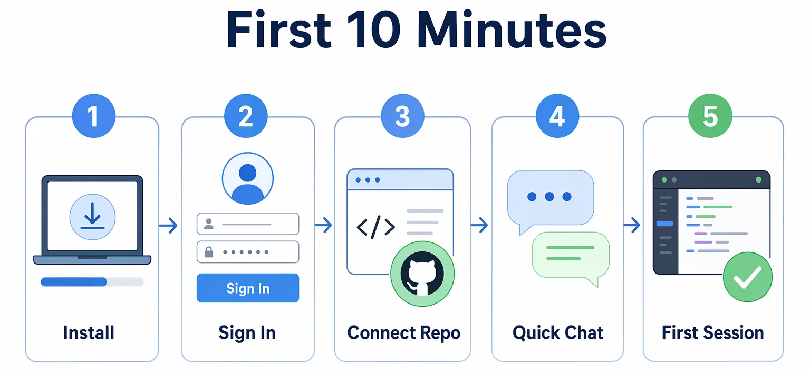
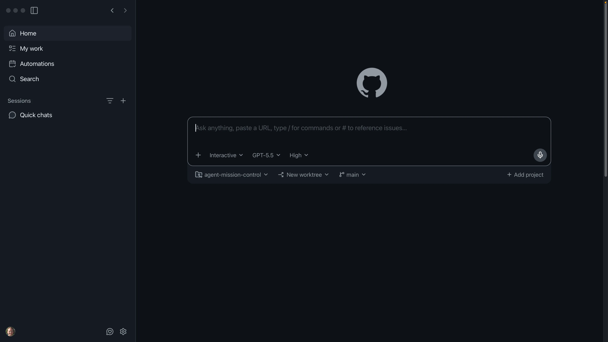
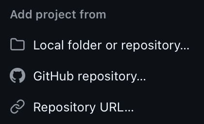

<!--
---
id: CopilotApp-00
title: !translate Quick Start
description: !translate Install the GitHub Copilot App, sign in, connect the course repository, and verify a read-only Quick chat overview.
audience: Developers / Students / Desktop users
slug: quick-start
weight: 1
---
-->


> **What if your first setup pass ended with a prepared training repo, a read-only Quick chat overview, and a first session you can inspect?**

Welcome! This chapter gets the basics out of the way: Install the GitHub Copilot App, sign in, fork and clone the course repository, run the training setup script if you plan to complete the GitHub workflow chapters, connect the repository, and verify that Quick chat can explain the project without changing files. Once the app can see the repository, the hands-on agent workflows begin in Chapter 01.

## 🎯 Learning Objectives

By the end of this chapter, you'll be able to:

- Confirm the required account, Git, operating system, and Copilot access prerequisites
- Install, open, and sign in to the GitHub Copilot App
- Fork, clone, and prepare the course repository for later GitHub workflow chapters
- Connect the repository to the app
- Use Quick chat for a read-only repository overview
- Create a first project session in Interactive mode

> ⏱️ **Estimated Time**: ~35 minutes (20 min setup + 15 min hands-on)

---

## ✅ Prerequisites

- A [GitHub account](https://github.com/signup) with [GitHub Copilot](https://github.com/features/copilot/plans) access
- [Git](https://git-scm.com/install) installed
- A fork of the [course repository][course-repository] if you plan to complete the GitHub issue and PR chapters
- [Node.js LTS and npm](https://nodejs.org) for later chapters that use `samples/book-app-web`
- [GitHub CLI (`gh`)](https://cli.github.com) for the setup script used in the course
- [Python 3](https://www.python.org/downloads) for the macOS, Linux, or Git Bash setup script. The Windows PowerShell script does not need Python.
- Permission to use the app if your account belongs to a GitHub Copilot Business or Enterprise organization

> Note: A paid Copilot plan is required for the app. Business or Enterprise users may also need an administrator to enable the Copilot CLI policy or related app policies.

---

## 🧩 Real-World Analogy: Setting Up the Recording Studio

Before you record anything, you get the recording studio ready. You sign in for access, plug in your gear, load the song you'll work on, and run a quick soundcheck to make sure everything sounds right before you commit a single take.


The Copilot App setup is the same idea. In the following examples you'll do the following:

1. Install the GitHub Copilot App
2. Sign in to the app
3. Fork and clone the course repository
4. Run a setup script
5. Connect the course repository to the app
6. Ask a first question about the repository
7. Start a small session



## Core Concepts

| Concept | Description |
|---|---|
| GitHub Copilot App | A desktop app for supervising agent-driven development work |
| Quick chat | A conversation for exploration that does not create a branch or worktree |
| Project | A connected repository or folder the app can work with |
| Session | A focused agent workspace for a task |
| Interactive mode | A session mode where you steer the agent step by step |

---

## Hands-On Exercises

In these exercises, you'll:

- Install the GitHub Copilot App and sign in
- Fork, clone, and prepare the course repository with the setup script
- Connect the repository to the app
- Ask a read-only question in Quick chat, then create your first project session

### 1. Install and Sign In

1. [Download and install the GitHub Copilot App][getting-started] for your operating system.
2. Open the app.
3. Select *Sign in to GitHub*.
4. Sign in with your [GitHub account][github-signup], or enter your GitHub Enterprise Server URL if your organization uses one.
5. Complete any first-run choices such as theme or repository access.

#### Expected Output

You'll see the main app window with navigation areas such as Home, My work, Automations, Search, and Sessions, and Quick chats.



#### How It Works

The app uses your GitHub identity and repository permissions to show work you can access. If a repository or issue is missing, the first thing to check is account access and organization policy.

---

### 2. Fork, Clone, and Prepare the Course Repository

Forking gives you your own copy of the course repository so the setup script can add the issues, branches, and pull requests used in later chapters.

1. Fork this [course's repository on GitHub][course-repository] by selecting the `Fork` button on the repository page. 

2. Clone the forked repository (make sure you have [Git installed][git-install]):

    ```bash
    git clone https://github.com/YOUR-USER/copilot-app-for-beginners.git
    cd copilot-app-for-beginners
    ```

3. Install the [GitHub CLI (`gh`)][github-cli] if needed, then sign in:

    ```bash
    gh auth login
    ```

4. Run the setup script.

    > Note: Before running the setup script, review [appendices/training-github-scenarios.md](../appendices/training-github-scenarios.md) to see the issues, branches, pull requests, comments, and failing-check scenario it creates.
    >
    > If you only want to complete Chapters 01 through 03, you can skip the script and connect a local clone instead.

    **Do a dry run of the setup script**

    *MacOS, Linux, or Git Bash (requires Python 3)*

    ```bash
    .github/scripts/setup-training-scenarios.sh --dry-run
    ```

    *Windows PowerShell*

    ```powershell
    powershell -ExecutionPolicy Bypass -File .\.github\scripts\setup-training-scenarios.ps1 -DryRun
    ```

    **Run the Script**

    *MacOS, Linux, or Git Bash*

    ```bash
    .github/scripts/setup-training-scenarios.sh
    ```

    *Windows PowerShell*

    ```powershell
    powershell -ExecutionPolicy Bypass -File .\.github\scripts\setup-training-scenarios.ps1
    ```

    The setup script for your shell creates the GitHub issues, branches, pull requests, comments, and failing-check scenario used in later chapters. It is safe to rerun if needed because it reuses items that already exist.

#### Success Check

You've got a local clone of your fork, and the setup script completed or you intentionally chose the local-only path.

---

### 3. Connect the Course Repository

In the app sidebar, select the **+** button next to **Sessions** to open the **Add project from** dialog. It offers several options for connecting a project.

| If you've got... | Use this app option |
|---|---|
| A cloned copy on your machine | **Local folder or repository**, then select your local `copilot-app-for-beginners` folder |
| A repository on GitHub | **GitHub repository**, then search for your fork |
| A repository URL | **Repository URL**, then paste the fork URL |



Select **Local folder or repository** and navigate to your clone of the course repository.

```text
copilot-app-for-beginners
```

#### Success Check

You'll see the course repository in the app, and the app sidebar will show the project as available.

---

### 4. Ask Your First Quick Chat

Select the **+** next to `Quick chats` in the sidebar and submit the following prompt:

```text
Give me an overview of the copilot-app-for-beginners course repository. Focus on the learning path and the samples/book-app-web folder.
```

#### Expected Output

Copilot should summarize the course structure and identify `samples/book-app-web` as the web sample used for later exercises.

#### How It Works

Quick chat is useful for exploration because it does not create a session branch or worktree. Use it when you're asking questions before changing code.

---

### 5. Create Your First Project Session

Create a new project session in Interactive mode by selecting the **+** next to `copilot-app-for-beginners` in the sidebar. In the session composer, choose **Interactive** from the mode selector and submit the following prompt.

```text
Explain the app structure and suggest one beginner-friendly improvement. Do not edit files yet.
```

#### Expected Output

Copilot should explain the repository at a high level and suggest a small possible improvement without making changes.

#### Success Check

You're able to answer these questions:

- Where do Quick chats appear?
- Where do project sessions appear?
- Which sample app path will this course use?
- Did Copilot avoid editing files when asked?

---

## Notes and Tips

- Quick chat is best for orientation and questions.
- A project session is best when you want the agent to plan, inspect, or make changes to a repository.

<details>
<summary>Troubleshooting: Setup and access problems</summary>

### I Cannot Sign In

Check:

- You're using the expected GitHub account
- Your Copilot plan is active
- Your organization allows the app and related Copilot policies
- You entered the correct GitHub Enterprise Server URL if required

### I Cannot See the Repository

Check:

- You've got access to the repository on GitHub
- You selected the correct account or organization
- You tried the local folder option if the repository is already cloned
- You tried the repository URL option if search does not find it

### Quick Chat Cannot Explain the Repository

Check:

- The correct repository is connected
- The prompt mentions `copilot-app-for-beginners`
- The app has permission to read the project folder

</details>

---

## 🔑 Key Takeaways

1. The GitHub Copilot App is a desktop control center for agentic coding work
2. Quick chat is safe for exploration since it doesn't create a branch or worktree
3. Project sessions are where focused repository work begins
4. This course uses `samples/book-app-web` as the main sample app path

---

## ➡️ What's Next

In Chapter 01, you'll tour the app interface, compare Quick chat with sessions, and learn when to use Interactive, Plan, and Autopilot modes.

**[← Back to course README](../README.md)** | **[Continue to Chapter 01 →](../01-first-steps/README.md)**

---

## Source References

- [Getting started with the GitHub Copilot App][getting-started]
- [About the GitHub Copilot App][about-app]
- [Working with agent sessions][agent-sessions]

[course-repository]: https://github.com/github/copilot-app-for-beginners
[getting-started]: https://docs.github.com/copilot/how-tos/github-copilot-app/getting-started
[about-app]: https://docs.github.com/copilot/concepts/agents/github-copilot-app
[agent-sessions]: https://docs.github.com/copilot/how-tos/github-copilot-app/agent-sessions
[github-signup]: https://github.com/signup
[git-install]: https://git-scm.com/install
[github-cli]: https://cli.github.com
