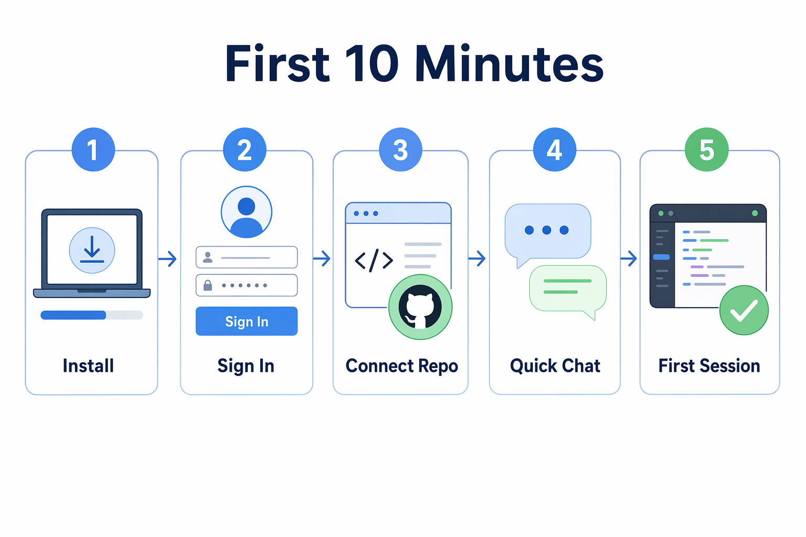

# Chapter 00: Quick Start

> **What if your first ten minutes in the app ended with a connected repository, a safe Quick chat, and a first session you can inspect?**

Welcome! In this chapter, you will install the GitHub Copilot App, sign in, connect this course repository, and verify that Quick chat can explain the project without changing files. This is the fast setup chapter. Once the app can see the course repository, the hands-on agent workflows begin in Chapter 01.

## 🎯 Learning objectives

By the end of this chapter, you will be able to:

- Confirm the required account, Git, operating system, and Copilot access prerequisites
- Install and open the GitHub Copilot App
- Sign in with GitHub or GitHub Enterprise Server
- Connect a local folder, GitHub repository, or repository URL
- Start a Quick chat for a harmless repository overview
- Create a first project session in Interactive mode

> ⏱️ **Estimated time**: ~20 minutes (10 min setup + 10 min hands-on)

## Suggested visuals and screenshots



- [app-screenshot: First-run or setup screen showing sign-in and onboarding flow, with any personal account details hidden or blurred.]
- [app-screenshot: Add project flow showing options for local folder or repository, GitHub repository, and repository URL.]
- [app-screenshot: Quick chat composer with a harmless repository overview prompt typed but no sensitive data visible.]

---

## ✅ Prerequisites

- A GitHub account with Copilot access
- Git installed
- The course repository available on your machine or GitHub account
- Node.js 20.19+ or 22.12+ and npm for later chapters that use `samples/book-app-web`
- Permission to use the app if your account belongs to a GitHub Copilot Business or Enterprise organization

> Note: A paid Copilot plan is required for the app. Business or Enterprise users may also need an administrator to enable the Copilot CLI policy or related app policies.

---

## 🧩 Real-world analogy: checking into a workshop

Before you use a shared workshop, you check in, prove you are allowed to use the tools, choose a workbench, and make sure the lights turn on.

The Copilot App setup is the same idea:

1. Install the app
2. Sign in
3. Connect a repository
4. Ask a safe first question
5. Start a small session

## Core concepts

| Concept | Beginner explanation |
|---|---|
| GitHub Copilot App | A desktop app for supervising agent-driven development work |
| Quick chat | A conversation for exploration that does not create a branch or worktree |
| Project | A connected repository or folder the app can work with |
| Session | A focused agent workspace for a task |
| Interactive mode | A session mode where you steer the agent step by step |

---

## Hands-on example 1: install and sign in

1. Download and install the GitHub Copilot App for your operating system.
2. Open the app.
3. Choose the sign-in option.
4. Sign in with GitHub, or enter your GitHub Enterprise Server URL if your organization uses one.
5. Complete any first-run choices such as theme or repository access.

### Expected output

You should see the main app window with navigation areas such as My Work, Automations, Search, Sessions, and Quick chats.

### How it works

The app uses your GitHub identity and repository permissions to show work you can access. If a repository or issue is missing, the first thing to check is account access and organization policy.

---

## Hands-on example 2: connect the course repository

Choose the option that matches your setup:

| If you have... | Use this app option |
|---|---|
| A cloned copy on your machine | Add local folder |
| A repository on GitHub | Add GitHub repository |
| A repository URL | Add repository URL |

Use this repository as the connected project:

```text
github-copilot-app-for-beginners
```

The main sample app used later is:

```text
samples/book-app-web
```

### Success check

You can see the course repository in the app, and the app sidebar shows the project as available.

---

## Hands-on example 3: ask your first Quick chat

Open a Quick chat and enter this exact learner prompt:

```text
Give me an overview of this book app course repository. Focus on the learning path and the samples/book-app-web folder.
```

### Expected output

Copilot should summarize the course structure and identify `samples/book-app-web` as the web sample used for later exercises.

> Demo output varies. Your response may use different wording depending on model, app version, repository state, and available context.

### How it works

Quick chat is useful for exploration because it does not create a session branch or worktree. Use it when you want to ask questions before changing code.

---

## Hands-on example 4: create your first project session

Create a new project session in Interactive mode and use this exact learner prompt:

```text
Explain the app structure and suggest one beginner-friendly improvement. Do not edit files yet.
```

### Expected output

Copilot should explain the repository at a high level and suggest a small possible improvement without making changes.

### Success check

You can answer these questions:

- Where do Quick chats appear?
- Where do project sessions appear?
- Which sample app path will this course use?
- Did Copilot avoid editing files when asked?

---

## Notes and tips

- Quick chat is best for orientation and questions.
- A project session is best when you want the agent to plan, inspect, or change work in a repository.
- Keep first prompts harmless. Ask for explanations before asking for edits.
- If your app screens look different, check your app version and platform.

### Common beginner mistakes

- Starting with an edit prompt before confirming the app can see the right repository
- Connecting a private or work repository when a safe training repository would be better
- Skipping the no-edit prompt and then being surprised when a session proposes file changes

<details>
<summary>Troubleshooting: setup and access problems</summary>

### I cannot sign in

Check:

- You are using the expected GitHub account
- Your Copilot plan is active
- Your organization allows the app and related Copilot policies
- You entered the correct GitHub Enterprise Server URL if required

### I cannot see the repository

Check:

- You have access to the repository on GitHub
- You selected the correct account or organization
- You tried the local folder option if the repository is already cloned
- You tried the repository URL option if search does not find it

### Quick chat cannot explain the repository

Check:

- The correct repository is connected
- The prompt mentions `samples/book-app-web`
- The app has permission to read the project folder

</details>

---

## 🔑 Key takeaways

1. The GitHub Copilot App is a desktop control center for agent work.
2. Quick chat is safe for exploration because it does not create a branch or worktree.
3. Project sessions are where focused repository work begins.
4. This course uses `samples/book-app-web` as the main sample app path.

---

## 📝 Assignment

Before continuing:

1. Connect the course repository.
2. Run the Quick chat prompt from this chapter.
3. Create an Interactive session with the no-edit prompt.
4. Write down one thing Quick chat is good for and one thing a project session is good for.

---

## ➡️ What's next

In Chapter 01, you will tour the app interface, compare Quick chat with sessions, and learn when to use Interactive, Plan, and Autopilot modes.

**[Continue to Chapter 01: First Steps →](../01-first-steps/README.md)**

**[← Back to course README](../README.md)** | **[Continue to Chapter 01 →](../01-first-steps/README.md)**

---

## Source references

- [Getting started with the GitHub Copilot App][getting-started]
- [About the GitHub Copilot App][about-app]
- [Working with agent sessions][agent-sessions]

[getting-started]: https://docs.github.com/en/copilot/how-tos/github-copilot-app/getting-started
[about-app]: https://docs.github.com/en/copilot/concepts/agents/github-copilot-app
[agent-sessions]: https://docs.github.com/en/copilot/how-tos/github-copilot-app/agent-sessions
