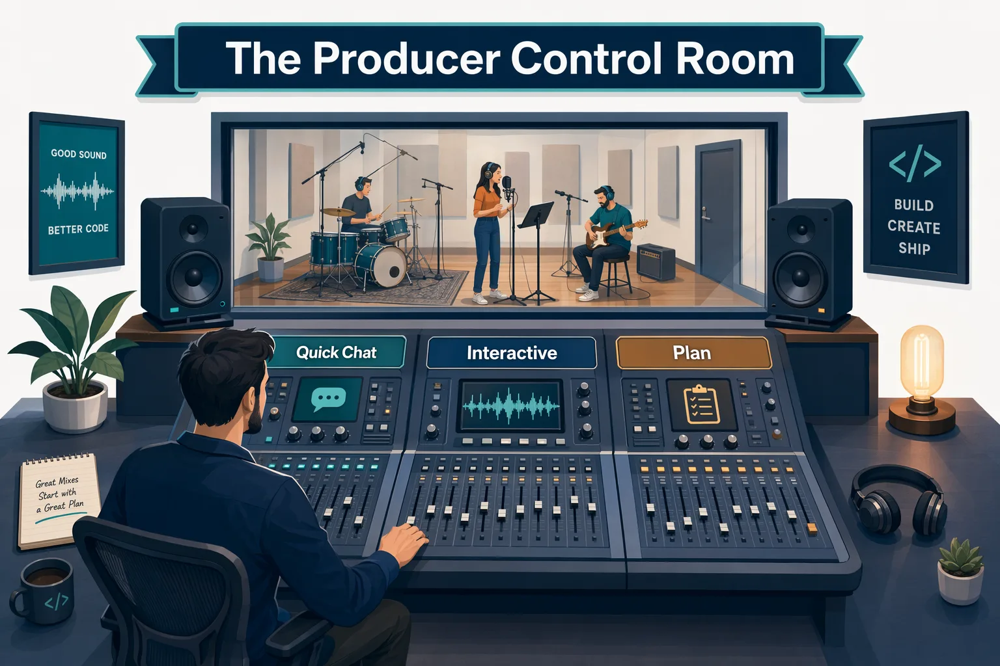

<!--
---
id: CopilotApp-01
title: !translate First Steps
description: !translate Tour the GitHub Copilot App interface, compare Quick chats with sessions, and learn when to use Interactive, Plan, and Autopilot modes.
audience: Developers / Students / Desktop users
slug: first-steps
weight: 2
---
-->


> **What if you knew which app surface to use before you typed your next prompt?**

Now that the app is installed and connected to the course repository, it's time for the control-room tour. You'll walk through the main navigation areas, compare Quick chats with project sessions, and see how session modes change Copilot's level of autonomy.

## 🎯 Learning Objectives

By the end of this chapter, you'll be able to:

- Navigate Home, My work, Automations, Search, Sessions, and Quick chats
- Locate major settings areas such as General, Accounts, Sessions, Themes, Accessibility, and Voice dictation
- Identify beginner-safe settings that affect safety, context, productivity, speed, and cost
- Explain Interactive, Plan, and Autopilot
- Select a model and reasoning effort based on task complexity
- Understand how to use voice dictation

> ⏱️ **Estimated Time**: ~35 minutes (15 min reading + 20 min hands-on)

---

## ✅ Prerequisites

Complete [Chapter 00](../00-quick-start/README.md) first. If you jumped straight here, pause and use Chapter 00 to fork and clone the course repository, run the training setup script, and connect the repository in the GitHub Copilot App.

---

## 🧩 Real-World Analogy: The Producer's Control Room

A producer in the control room doesn't handle every song the same way. Some takes need close direction. Some need the arrangement charted out first. Some quick questions just need a fast answer.



The Copilot App works the same way:

- Quick chat is like asking a session musician a quick question.
- Interactive mode is like directing a take with frequent check-ins.
- Plan mode is like charting the arrangement and approving it before the first take.
- Autopilot is like giving a clearly defined task to a trusted system and letting it complete it with minimal intervention.

## Core Concepts

### Quick Chat Versus Project Session

| Use this | When you're trying to... | Creates branch or worktree? |
|---|---|---|
| Quick chat | Ask questions, brainstorm, summarize, orient yourself | No |
| Project session | Plan, inspect, edit, test, or create PR-ready work | Usually yes, depending on session settings |

### Session Modes

| Mode | Beginner meaning | Use case |
|---|---|---|
| Interactive | Copilot works with you step by step | You'd like to be involved throughout the entire process |
| Plan | Copilot creates a plan before executing | The initial approach and project details matter |
| Autopilot | Copilot works independently | Tasks that are well defined and have clear outcomes |


---

## Hands-On Exercises

In these exercises, you'll:

- Tour the app's main surfaces
- Brainstorm with Quick chats
- Compare session modes to learn how you can use them
- Try search and voice dictation

### 1. Tour the App

Open GitHub Copilot App and notice these areas in the sidebar:

1. Home
2. My work
3. Automations
4. Search
5. Sessions
6. Quick chats


Now open **Settings** and locate:

- General
- Accounts
- Sessions
- Themes
- Accessibility
- Voice dictation


Here's a summary of the key settings areas:

| Setting area | What to notice now |
|---|---|
| General | Theme and notification preferences |
| Accounts | Personal and Enterprise account information |
| Sessions | Default model, reasoning effort, custom instructions, remote access, branch prefix, and session lifecycle settings |
| Themes | Theme settings for the app (dark/light mode themes) |
| Accessibility | Display zoom and keyboard shortcuts |
| Voice dictation | Microphone settings, shortcut setup, and transcription models |

Don't worry about changing any settings at this point - unless you want to. The goal is to know where key app settings live.

<details>
<summary>Additional settings</summary>

You'll also see Skills, Model Context Protocol (MCP) servers, Plugins, and Model providers.

- Skills are specific capabilities that can be used to extend the functionality of the app.
- MCP servers can connect the app to external tools or data.
- Plugins can add bundled capabilities (Skills, MCP servers, etc.).
- Model providers can be used to add custom models to the app.

</details>

### 2. Use Quick Chats for Brainstorming

Open Quick chats and try this prompt:

```text
I'm learning the GitHub Copilot App with the copilot-app-for-beginners repository. What are three safe things I can ask before changing code?
```

Now try the following prompt and notice the response:

```text
Can this quick chat modify code if I tell it to do that?
```

#### Expected Output

Copilot should suggest exploration tasks such as explaining structure, identifying test commands, or summarizing the sample app.

For the second prompt, the response may say something like the following:

> Not directly in your configured repositories.
>
> This quick chat can **read and inspect** your repos, but it should not modify files in those primary working copies. If you ask for code changes, I'll create or open a dedicated project session with its own isolated worktree and coding agent, then delegate the work there.

> Note: Demo output varies. Treat the response as guidance, not a reproducible script.

#### How It Works

Quick chats help you learn without starting a branch. It's a great way to explore and understand your codebase before making changes.

---

### 3. Compare Session Modes

You'll compare the session modes by starting from the course project in the sidebar. Keep these prompts read-only so you can focus on how the modes feel before asking Copilot to change files.


1. In the left sidebar, find the **copilot-app-for-beginners** project you connected in Chapter 00.
2. Click the **+** button next to the project name.
3. When the session composer opens, find the mode dropdown near the prompt box. It will show **Interactive**, **Plan**, or **Autopilot**. Next to it, you'll also see the model and reasoning effort dropdowns.
4. Choose the mode listed below, paste the matching prompt, and run it.
5. After you review the response, change the dropdown to the next mode and repeat.

> 💡 **Tip**: The model and reasoning effort controls sit beside the mode selector. Choose a faster model with lower reasoning for quick questions, and a stronger model with higher reasoning for complex changes. Use enough capability for the task, but not more than you need.

#### Plan Mode Prompt

Set the mode dropdown to **Plan**, then use this prompt:

```text
Plan how you'd investigate a hypothetical unread count bug in samples/book-app-web.
```

Once the plan is generated, review it and consider how you would implement the steps.

#### Interactive Mode Prompt

Set the mode dropdown to **Interactive**, then use this prompt:

```text
Walk me through the files you'd inspect for a hypothetical unread count bug in samples/book-app-web. Ask before suggesting any code change.
```

#### Autopilot Orientation Prompt

Set the mode dropdown to **Autopilot**, then use this prompt:

```text
Explain when Autopilot would be appropriate for a small documentation-only task in this repository. Do not edit files.
```

#### Expected Output

You'll notice that Plan mode emphasizes an approach, Interactive mode encourages step-by-step steering, and Autopilot is framed as higher autonomy.

#### Success Check

You're able to describe, in your own words, how Plan, Interactive, and Autopilot differ in how much you stay involved while Copilot works.

---

### 4. Search

Select **Search** from the sidebar. Notice that you can search for sessions, PRs, issues, or paste a URL. Type `copilot-app-for-beginners` into the textbox and you should be presented with the option to create a new session.

Close **Search** and reopen it. Scroll through the list to see what else it offers. Notice that several actions can be performed such as:

- New session
- Start from a canvas
- Add a project
- New issue

Experiment with some of the actions to learn how to use them.

#### Success Check

You're able to explain what the **Search** feature does and how it can be used.

---

### 5. Voice Dictation

Go back to the GitHub Copilot App's Settings dialog. Select **Voice dictation** and explore the available options:

- Input device
- Microphone privacy
- Test microphone
- Keyboard shortcut
- Push to talk
- Transcription models

Perform the following actions:

> Note: Microphone permission is granted at the operating-system level, so the exact screen differs by platform (for example, System Settings on macOS, or Settings → Privacy & security → Microphone on Windows). Follow your OS prompts to allow the GitHub Copilot App to use the microphone.

1. Select **Microphone privacy**, **Open preferences** and ensure the GitHub Copilot App has the necessary permissions to use the microphone.
2. Select **Test microphone** to verify that it's working correctly.
3. Note the keyboard shortcut for activating voice dictation. Try it out (you'll probably see a message saying that you need to use it with a text box).
4. Create a new **Quick chats** session and test voice dictation by using the keyboard shortcut.

#### How It Works

Voice dictation turns speech into editable prompt text which can save time and effort when creating prompts.

---

## Troubleshooting

<details>
<summary>First navigation problems</summary>

### I Cannot Find a Setting Shown in the Chapter

Settings can vary by app version, operating system, organization policy, and enabled features. Look for the closest matching category, then check the official docs if the screen still does not match.

### Voice Dictation Does Not Work

Check microphone permission, local transcription model download status, shortcut conflicts, and language support.

### A Mode or Model Option Is Missing

Check your plan, organization policy, project settings, and app version.

</details>

---

## 🔑 Key Takeaways

1. The app is organized around work surfaces: Home, My work, Search, Sessions, Quick chats, and Automations.
2. **Quick chats** are for exploration. **Sessions** are for focused repository work.
3. **Interactive**, **Plan**, and **Autopilot** change the level of autonomy.
4. Model and reasoning choices affect speed, quality, and cost. Use enough capability for the task, but not more than needed.

---

## 📝 Assignment


Create a small mode map for the Book App. The goal is to use the app surfaces from this chapter without changing files yet.

1. Open Quick chats and submit this prompt:

   ```text
   I'm learning the copilot-app-for-beginners course with samples/book-app-web. Give me a beginner-friendly overview of what the app does, which files look important, and one safe question I should ask before editing code.
   ```

   Write down one useful thing Quick chat taught you about the app.

2. Create a Plan-mode session and submit this prompt:

   ```text
   Plan how you would investigate why the Book App's reading stats might look wrong after filters are applied. Do not edit files. Tell me which files you would inspect and what evidence would prove the behavior.
   ```

   Write down the first file Copilot would inspect and one validation idea it suggested.

3. Switch to Interactive-mode and submit this prompt:

   ```text
   Walk me through how search and filters work in samples/book-app-web. Ask me before recommending any code changes, and do not edit files.
   ```

   Write down one question Copilot asked or one checkpoint where you stayed in control.

---

## ➡️ What's Next

In the next chapter, you'll start using project sessions, learn what worktrees are, and learn how to provide focused context with `@`, `#`, and `/`.

**[← Back to Chapter 00](../00-quick-start/README.md)** | **[Continue to Chapter 02 →](../02-sessions-worktrees-context/README.md)**

---

## Source References

- [Getting started with the GitHub Copilot App][getting-started]
- [Working with agent sessions][agent-sessions]
- [GitHub Copilot App changelog][app-changelog]
- [Voice input documentation (Copilot CLI, which the app is built on)][voice-input]
- [AI models reference][ai-models]

[getting-started]: https://docs.github.com/en/copilot/how-tos/github-copilot-app/getting-started
[agent-sessions]: https://docs.github.com/en/copilot/how-tos/github-copilot-app/agent-sessions
[app-changelog]: https://github.com/github/app/blob/main/changelog.md
[voice-input]: https://docs.github.com/en/copilot/how-tos/copilot-cli/use-copilot-cli/voice-input
[ai-models]: https://docs.github.com/en/copilot/reference/ai-models
