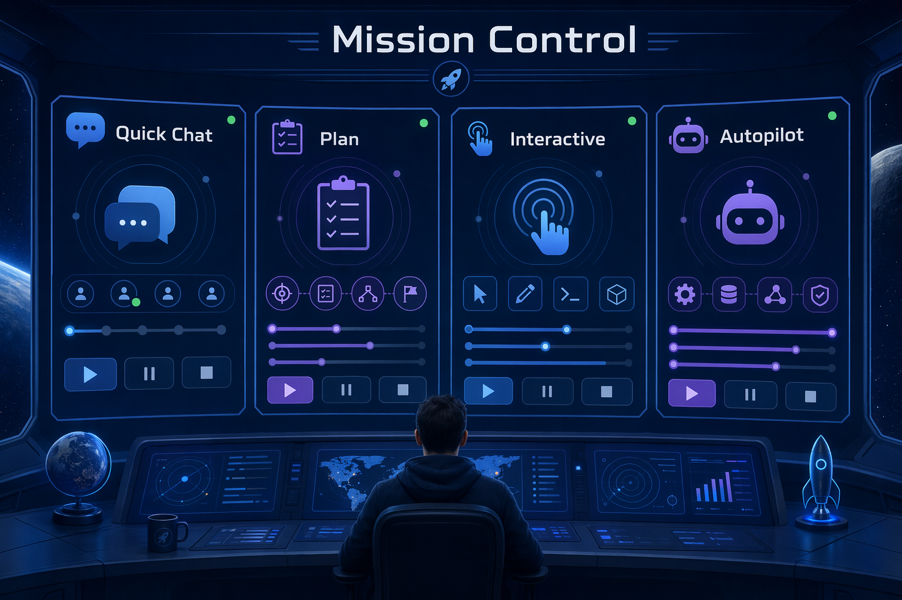

# Chapter 01: First Steps

> **What if you knew which app surface to use before you typed your next prompt?**

Now that the app is installed and connected to the course repository, it is time for the control-room tour. You will walk through the main navigation areas, compare Quick chats with project sessions, and see how session modes change Copilot's level of autonomy.

## 🎯 Learning objectives

By the end of this chapter, you will be able to:

- Navigate My Work, Automations, Search, Sessions, and Quick chats
- Locate major settings areas such as General, Sessions, Projects, Skills, Voice dictation, and accessibility or keyboard shortcuts
- Choose between Quick chat and a project session
- Explain Interactive, Plan, and Autopilot
- Select a model and reasoning effort based on task complexity
- Understand voice dictation at a beginner level

> ⏱️ **Estimated time**: ~35 minutes (15 min reading + 20 min hands-on)

---

## ✅ Prerequisites

Complete [Chapter 00](../00-quick-start/README.md) first. If you jumped straight here, pause and use Chapter 00 to fork and clone the course repository, run the training setup script if needed, and connect the repository in the app.

---

## 🧩 Real-world analogy: mission control

Mission control does not fly every spacecraft the same way. Some missions need close steering. Some need an approved flight plan. Some routine tasks can run mostly on their own.

The Copilot App works the same way:

- Quick chat is like asking a mission specialist a question.
- Interactive mode is like steering with frequent check-ins.
- Plan mode is like approving the route before launch.
- Autopilot is like giving a clear routine task to a trusted system.

## Core concepts

### Quick chat versus project session

| Use this | When you want to... | Creates branch or worktree? |
|---|---|---|
| Quick chat | Ask questions, brainstorm, summarize, orient yourself | No |
| Project session | Plan, inspect, edit, test, or create PR-ready work | Usually yes, depending on session settings |

### Session modes

| Mode | Beginner meaning | Good first use |
|---|---|---|
| Interactive | Copilot works with you step by step | Guided exploration or small edits |
| Plan | Copilot proposes before executing | Changes where approach matters |
| Autopilot | Copilot works more independently | Clear, low-risk tasks with obvious checks |


> Note: Session modes are autonomy settings, not skill levels. Beginners can use Plan mode early because it creates a review checkpoint before work starts.

---

## Hands-on example 1: tour the app

Find these areas in the sidebar:

1. My Work
2. Automations
3. Search
4. Sessions
5. Quick chats



- [app-screenshot: Main app sidebar with My Work, Automations, Search, Sessions, and Quick chats visible.]

Then open Settings and locate:

- General
- Sessions
- Projects
- Skills
- Voice dictation
- Accessibility or keyboard shortcuts

- [app-screenshot: Settings area showing the major categories such as General, Sessions, Projects, Skills, Voice dictation, and Accessibility or keyboard shortcuts. If Model Context Protocol (MCP) servers, Plugins, or Model providers are visible, label them as INTERMEDIATE orientation topics rather than required setup.]

<details>
<summary>Intermediate: settings you only need to recognize for now</summary>

You may also see Model Context Protocol (MCP) servers, Plugins, and Model providers. These are useful professional features, but they are not required for the beginner path.

For now, just remember:

- MCP servers can connect the agent to external tools or data.
- Plugins can add bundled capabilities.
- Model providers can affect which models are available.

You will revisit these later in the course.

</details>

---

## Hands-on example 2: use Quick chat for brainstorming

Open Quick chat and use this exact learner prompt:

```text
I'm learning the GitHub Copilot App with this repository. What are three safe things I can ask before changing code?
```

### Expected output

Copilot should suggest safe exploration tasks such as explaining structure, identifying test commands, or summarizing the sample app.

> Demo output varies. Treat the response as guidance, not a script.

### How it works

Quick chat helps you learn without starting a branch. It is a good first stop when you are unsure what to ask.

---

## Hands-on example 3: compare session modes safely

Create three small sessions or use one session with mode changes if your app version supports it. Do not ask Copilot to edit files.

### Plan mode prompt

```text
Plan how you would investigate the unread count bug in samples/book-app-web. Do not edit files.
```

### Interactive mode prompt

```text
Walk me through the files you would inspect for the unread count bug in samples/book-app-web. Ask before suggesting any code change.
```

### Autopilot orientation prompt

```text
Explain when Autopilot would be appropriate for a small documentation-only task in this repository. Do not edit files.
```

- [app-screenshot: Session composer dropdowns showing mode, model, and reasoning effort controls.]

### Expected output

You should notice that Plan mode emphasizes an approach, Interactive mode encourages step-by-step steering, and Autopilot is framed as higher autonomy.

---

## Hands-on example 4: search and shortcuts

Use the app Search view to find:

```text
samples/book-app-web
```

Then open keyboard shortcuts from Help and identify three shortcuts you want to practice.

### Success check

You can explain where to find a file, where to change settings, and where to start a new session.

---

## Hands-on example 5: voice dictation orientation

Open voice dictation settings and identify:

- The shortcut
- Microphone permission status
- Local transcription model setup
- The review-before-send behavior

- [app-screenshot: Voice dictation settings screen showing shortcut selection and local transcription model setup, with account details hidden.]

### How it works

Voice dictation turns speech into editable prompt text. You still review the text before sending it, which is important when prompts can start agent work.

---

## Notes and tips

- Use Quick chat when you want to learn before acting.
- Use Plan when the approach matters.
- Use Interactive when you want to steer closely.
- Use Autopilot only for clear, bounded tasks with safe validation.
- Model and reasoning choices affect speed, quality, and cost. Use enough capability for the task, but not more than needed.

### Common beginner mistakes

- Treating Quick chat and project sessions as interchangeable
- Using Autopilot for a vague task that should start in Plan mode
- Changing model or reasoning settings without noticing the effect on speed, cost, and output

<details>
<summary>Troubleshooting: first navigation problems</summary>

### I cannot find a setting shown in the chapter

Settings can vary by app version, operating system, plan, organization policy, and enabled features. Look for the closest matching category, then check the official docs if the screen still does not match.

### Voice dictation does not work

Check microphone permission, local transcription model download status, shortcut conflicts, and language support.

### A mode or model option is missing

Check your plan, organization policy, project settings, and app version.

</details>

---

## 🔑 Key takeaways

1. The app is organized around work surfaces: My Work, Search, Sessions, Quick chats, and Automations.
2. Quick chat is for exploration. Sessions are for focused repository work.
3. Interactive, Plan, and Autopilot change autonomy and review checkpoints.
4. Settings are part of safe agent use because they affect models, context, tools, and shortcuts.

---

## 📝 Assignment

Create a small mode decision note for yourself:

1. Write one task you would do in Quick chat.
2. Write one task you would do in Plan mode.
3. Write one task you would do in Interactive mode.
4. Write one task you would not give to Autopilot yet, and explain why.

---

## ➡️ What's next

In Chapter 02, you will start real sessions, learn what worktrees are, and practice giving Copilot focused context with `@`, `#`, and `/`.

**[← Back to Chapter 00](../00-quick-start/README.md)** | **[Continue to Chapter 02 →](../02-sessions-worktrees-context/README.md)**

---

## Source references

- [Getting started with the GitHub Copilot App][getting-started]
- [Working with agent sessions][agent-sessions]
- [GitHub Copilot App changelog][app-changelog]
- [Voice input documentation][voice-input]
- [AI models reference][ai-models]

[getting-started]: https://docs.github.com/en/copilot/how-tos/github-copilot-app/getting-started
[agent-sessions]: https://docs.github.com/en/copilot/how-tos/github-copilot-app/agent-sessions
[app-changelog]: https://github.com/github/app/blob/main/changelog.md
[voice-input]: https://docs.github.com/en/copilot/how-tos/copilot-cli/use-copilot-cli/voice-input
[ai-models]: https://docs.github.com/en/copilot/reference/ai-models
