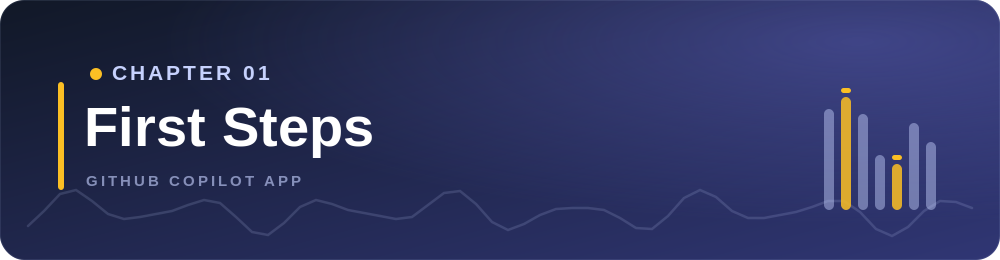
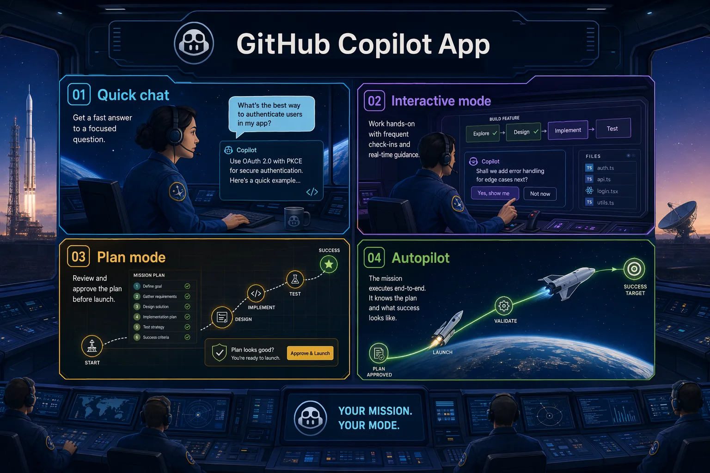
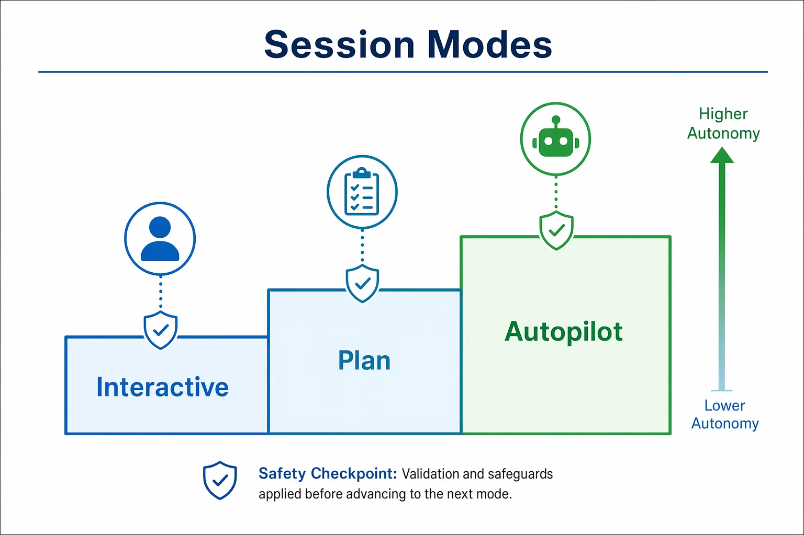
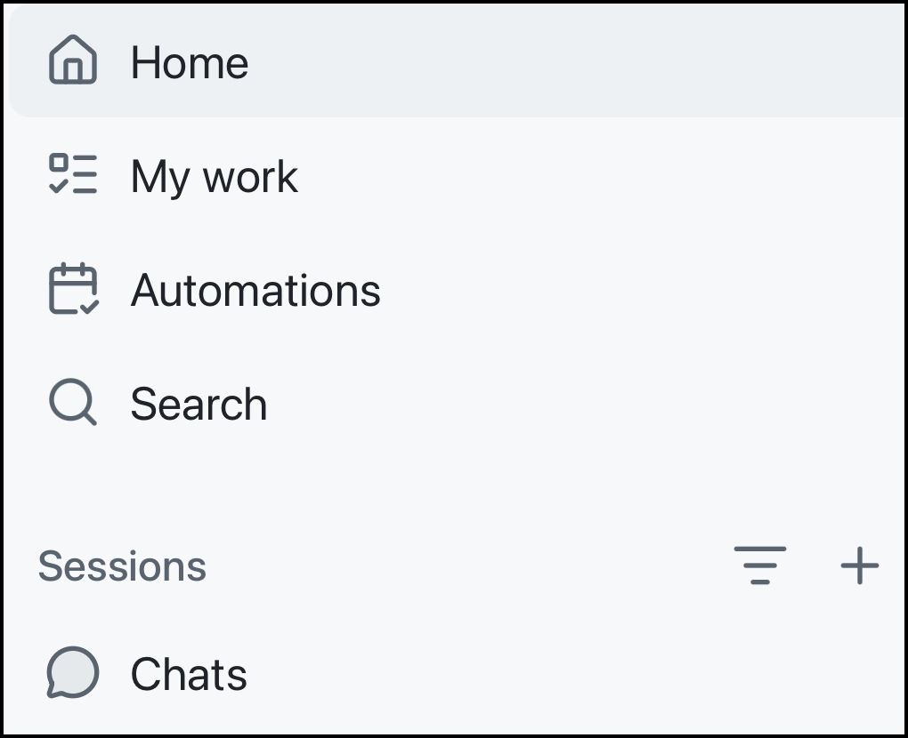
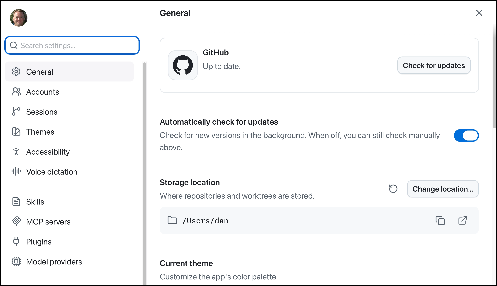
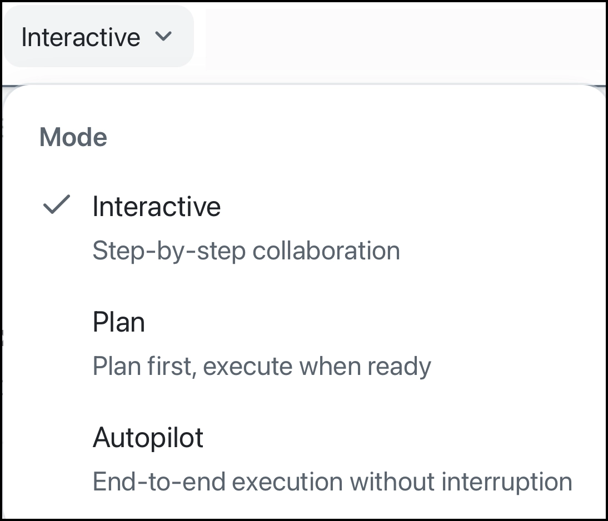

> **What if you knew which app surface to use before you typed your next prompt?**

Now that the app is installed and connected to the course repository, it's time for the control-room tour. You'll walk through the main navigation areas, compare Quick chats with project sessions, and see how session modes change Copilot's level of autonomy.

## 🎯 Learning objectives

By the end of this chapter, you'll be able to:

- Navigate My Work, Automations, Search, Sessions, and Quick chats
- Locate major settings areas such as General, Sessions, Projects, Skills, Voice dictation, and accessibility or keyboard shortcuts
- Identify beginner-safe settings that affect safety, context, productivity, speed, and cost
- Explain Interactive, Plan, and Autopilot
- Select a model and reasoning effort based on task complexity
- Understand how to use voice dictation

> ⏱️ **Estimated time**: ~35 minutes (15 min reading + 20 min hands-on)

---

## ✅ Prerequisites

Complete [Chapter 00](../00-quick-start/README.md) first. If you jumped straight here, pause and use Chapter 00 to fork and clone the course repository, run the training setup script, and connect the repository in the GitHub Copilot App.

---

## 🧩 Real-world analogy: Mission control

Mission control doesn't fly every spacecraft the same way. Some missions need close steering. Some need an adjusted flight plan. Some routine tasks can run mostly on their own.



The Copilot App works the same way:

- Quick chat is like asking a mission specialist a question.
- Interactive mode is like steering with frequent check-ins.
- Plan mode is like approving the route before launch.
- Autopilot is like giving a clearly defined task to a trusted system and letting it complete it with minimal intervention.

## Core concepts

### Quick chat versus project session

| Use this | When you're trying to... | Creates branch or worktree? |
|---|---|---|
| Quick chat | Ask questions, brainstorm, summarize, orient yourself | No |
| Project session | Plan, inspect, edit, test, or create PR-ready work | Usually yes, depending on session settings |

### Session modes

| Mode | Beginner meaning | Use case |
|---|---|---|
| Interactive | Copilot works with you step by step | Guided exploration or small edits |
| Plan | Copilot creates a plan before executing | Project changes where the initial approach and project details matter |
| Autopilot | Copilot works independently | Tasks that are well defined and have clear outcomes |



---

## Hands-on example 1: Tour the app

Find these areas in the sidebar:

1. My work
2. Automations
3. Search
4. Sessions



Now open **Settings** and locate:

- General
- Accounts
- Sessions
- Themes
- Accessibility
- Voice dictation



Here's a summary of the key settings areas:

| Setting area | What to notice now |
|---|---|
| General | Theme and notification preferences |
| Accounts | Personal and Enterprise account information |
| Sessions | Default model, reasoning effort, custom instructions, remote access, branch prefix, and session lifecycle settings |
| Themes | Theme settings for the app (dark/light mode themes) |
| Accessibility | Display zoom and keyboard shortcuts |
| Voice dictation | Microphone settings, shortcut setup, and transcription models |

Don't worry about changing any settings at this point - unless you want to. The goal is to know where key app settings live.

<details>
<summary>Additional settings</summary>

You'll also see Skills, Model Context Protocol (MCP) servers, Plugins, and Model providers.

- Skills are specific capabilities that can be used to extend the functionality of the app.
- MCP servers can connect the app to external tools or data.
- Plugins can add bundled capabilities (Skills, MCP servers, etc.).
- Model providers can be used to add custom models to the app.

</details>

## Hands-on example 2: Use Quick chat for brainstorming

Open Quick chat and try this prompt:

```text
I'm learning the GitHub Copilot App with the copilot-app-for-beginners repository. What are three safe things I can ask before changing code?
```

Now try the following prompt and notice the response:

```text
Can this quick chat modify code if I tell it to do that?
```

### Expected output

Copilot should suggest exploration tasks such as explaining structure, identifying test commands, or summarizing the sample app.

For the second prompts, the response may say something like the following:

> Not directly in your configured repositories.
>
> This quick chat can **read and inspect** your repos, but it should not modify files in those primary working copies. If you ask for code changes, I’ll create or open a dedicated project session with its own isolated worktree and coding agent, then delegate the work there.

> Note: Demo output varies. Treat the response as guidance, not a reproducible script.

### How it works

Quick chat helps you learn without starting a branch. It's a great way to explore and understand your codebase before making changes.

---

## Hands-on example 3: Compare session modes

You'll compare the session modes by starting from the course project in the sidebar. Keep these prompts read-only so you can focus on how the modes feel before asking Copilot to change files.



1. In the left sidebar, find the **copilot-app-for-beginners** project you connected in Chapter 00.
2. Click the **+** button next to the project name.
3. When the session composer opens, find the mode dropdown near the prompt box. It will show **Interactive**, **Plan**, or **Autopilot**.
4. Choose the mode listed below, paste the matching prompt, and run it.
5. After you review the response, change the dropdown to the next mode and repeat.

### Plan mode prompt

Set the mode dropdown to **Plan**, then use this prompt:

```text
Plan how you'd investigate a hypothetical unread count bug in samples/book-app-web.
```

Once the plan is generated, review it and consider how you would implement the steps.

### Interactive mode prompt

Set the mode dropdown to **Interactive**, then use this prompt:

```text
Walk me through the files you'd inspect for a hypothetical unread count bug in samples/book-app-web. Ask before suggesting any code change.
```

### Autopilot orientation prompt

Set the mode dropdown to **Autopilot**, then use this prompt:

```text
Explain when Autopilot would be appropriate for a small documentation-only task in this repository. Do not edit files.
```

### Expected output

You'll notice that Plan mode emphasizes an approach, Interactive mode encourages step-by-step steering, and Autopilot is framed as higher autonomy.

---

## Hands-on example 4: Search

Select **Search** from the sidebar. Notice that you can search for sessions, PRs, issues, or paste a URL. Type `copilot-app-for-beginners` into the textbox and you should be presented with the option to create a new session.

Close **Search** and reopen it. Scroll through the other options to see the other options it provides. Notice that several actions can be performed such as:

- New session
- Start from a canvas
- Add a project
- New issue

Experiment with some of the actions to learn how to use them.


### Success check

You're able to explain what the **Search** feature does and how it can be used.

---

## Hands-on example 5: Voice dictation

Go back to the GitHub Copilot App's Settings dialog. Select **Voice dictation** and explore the available options:

- Input device
- Microphone privacy
- Test microphone
- Keyboard shortcut
- Push to talk
- Transcription models

Perform the following actions:
1. Select **Microphone privacy**, **Open preferences** and ensure the GitHub Copilot App has the necessary permissions to use the microphone.
2. Select **Test microphone** to verify that it's working correctly.
3. Note the keyboard shortcut for activating voice dictation. Try it out (you'll probably see a message saying that you need to use it with a text box).
4. Create a new **Quick chat** session and test voice dictation by using the keyboard shortcut.

### How it works

Voice dictation turns speech into editable prompt text which can save time and effort when creating prompts.

---

## Notes and tips

- Use **Quick chat** when you're learning before acting.
- Use **Plan** when the approach matters and you need to plan out building an app or feature, fix a complex bug, etc.
- Use **Interactive** when you'd like to steer the agent at each step.
- Use **Autopilot** when you have a clear, bounded task with well defined success criteria that you'd like the agent to complete with minimal intervention.
- Model and reasoning choices affect speed, quality, and cost. Use enough capability for the task, but not more than needed.

<details>
<summary>Troubleshooting: First navigation problems</summary>

### I cannot find a setting shown in the chapter

Settings can vary by app version, operating system, plan, organization policy, and enabled features. Look for the closest matching category, then check the official docs if the screen still does not match.

### Voice dictation does not work

Check microphone permission, local transcription model download status, shortcut conflicts, and language support.

### A mode or model option is missing

Check your plan, organization policy, project settings, and app version.

</details>

---

## 🔑 Key takeaways

1. The app is organized around work surfaces: My Work, Search, Sessions, Quick chats, and Automations.
2. **Quick chat** is for exploration. **Sessions** are for focused repository work.
3. **Interactive**, **Plan**, and **Autopilot** change autonomy.


---

## 📝 Assignment

Create a small mode map for the Book App. The goal is to use the app surfaces from this chapter without changing files yet.

1. Open Quick chat and submit this prompt:

   ```text
   I'm learning this course with samples/book-app-web. Give me a beginner-friendly overview of what the app does, which files look important, and one safe question I should ask before editing code.
   ```

   Write down one useful thing Quick chat taught you about the app.

2. Create a Plan-mode session and submit this prompt:

   ```text
   Plan how you would investigate why the Book App's reading stats might look wrong after filters are applied. Do not edit files. Tell me which files you would inspect and what evidence would prove the behavior.
   ```

   Write down the first file Copilot would inspect and one validation idea it suggested.

3. Create an Interactive-mode session, or switch modes if your app version supports it, and submit this prompt:

   ```text
   Walk me through how search and filters work in samples/book-app-web. Ask me before recommending any code changes, and do not edit files.
   ```

   Write down one question Copilot asked or one checkpoint where you stayed in control.

4. Open Search in the app and search for:

   ```text
   samples/book-app-web
   ```

   Confirm you can find the sample app folder or an important file such as `src/App.tsx`.

5. Finish with this short decision:

   ```text
   I would not give Autopilot a Book App bug fix yet because...
   ```

   Your answer should mention one concrete reason from this chapter, such as needing a plan first, not knowing the right branch or worktree yet, or wanting to review tests before approving edits.

---

## ➡️ What's next

In Chapter 02, you'll start real sessions, learn what worktrees are, and practice giving Copilot App focused context with `@`, `#`, and `/`.

**[← Back to Chapter 00](../00-quick-start/README.md)** | **[Continue to Chapter 02 →](../02-sessions-worktrees-context/README.md)**

---

## Source references

- [Getting started with the GitHub Copilot App][getting-started]
- [Working with agent sessions][agent-sessions]
- [GitHub Copilot App changelog][app-changelog]
- [Voice input documentation][voice-input]
- [AI models reference][ai-models]

[getting-started]: https://docs.github.com/en/copilot/how-tos/github-copilot-app/getting-started
[agent-sessions]: https://docs.github.com/en/copilot/how-tos/github-copilot-app/agent-sessions
[app-changelog]: https://github.com/github/app/blob/main/changelog.md
[voice-input]: https://docs.github.com/en/copilot/how-tos/copilot-cli/use-copilot-cli/voice-input
[ai-models]: https://docs.github.com/en/copilot/reference/ai-models
