<!--
---
id: CopilotApp-02
title: !translate Sessions, Worktrees, and Context
description: !translate Start isolated worktree-backed sessions and give Copilot focused context with @, #, and / in the GitHub Copilot App.
audience: Developers / Students / Desktop users
slug: sessions-worktrees-and-context
weight: 3
---
-->


> **What if every task had its own workspace, branch, context, and history?**

Sessions are where the GitHub Copilot App stops feeling like ordinary chat. A session can have its own branch, working folder, plan, diff, terminal output, browser preview, and GitHub context. In this chapter, you'll start a session from a task, learn how worktrees keep work separated, and practice giving Copilot proper context.

## 🎯 Learning Objectives

By the end of this chapter, you'll be able to:

- Start a session from a prompt, issue, or pull request
- Explain what a git worktree is and why you'd use it
- Understand why isolated sessions protect your main branch
- Use `@` for file and folder context, `#` for issue or PR context, and `/` for app commands
- Decide between working directly with a local repository, an isolated worktree, or a cloud sandbox

> ⏱️ **Estimated Time**: ~50 minutes (25 min reading + 25 min hands-on)

---

## ✅ Prerequisites

Complete Chapters [00](../00-quick-start/README.md) and [01](../01-first-steps/README.md). At this point, you've connected the course repository and understand the difference between Quick chats and project sessions.

---

## 🧩 Real-World Analogy: One Studio, Many Recording Booths

Imagine one song that three musicians (vocalist, guitar, drums) need to record at the same time. To get the best results, you wouldn't crowd them around a single microphone and hope it works out. You'd put each one in their own soundproof booth to lay down a different part individually or possibly in parallel (to get more of that "live" feel), then mix the takes together later. This approach allows each recorded track to be edited and modified separately.

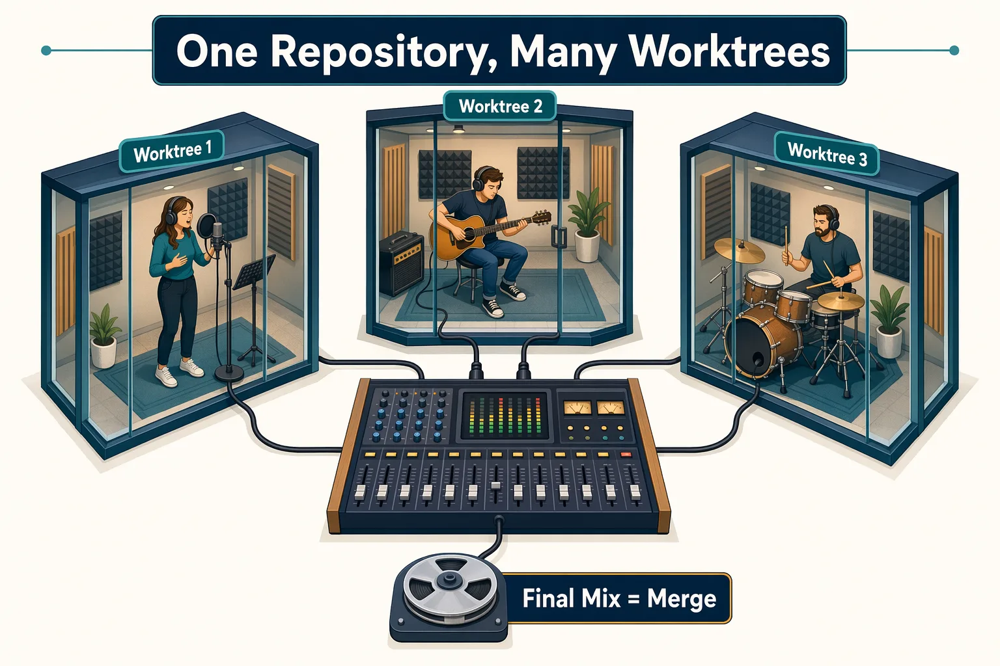

A worktree is like a separate recording booth. It's connected to the same repository (the same song), but it has its own folder and branch so parallel work doesn't collide.

## Core Concepts

### What Is a Git Worktree?

A **Git worktree** lets you create additional working directories for the same repository. Each worktree is usually checked out to a different branch (or commit). 

This allows you to work on multiple tasks or branches simultaneously without stashing changes or constantly switching branches in a single folder.

### Why Copilot App Uses Worktrees

| Without isolation | With a worktree-backed session |
|---|---|
| Multiple tasks can edit the same folder | Each task gets a separate folder |
| Easy to lose track of branch state | Session branch is visible in the app |
| Tests and diffs can mix together | Diffs stay tied to the session |
| Harder to compare work | Easier to inspect and approve |

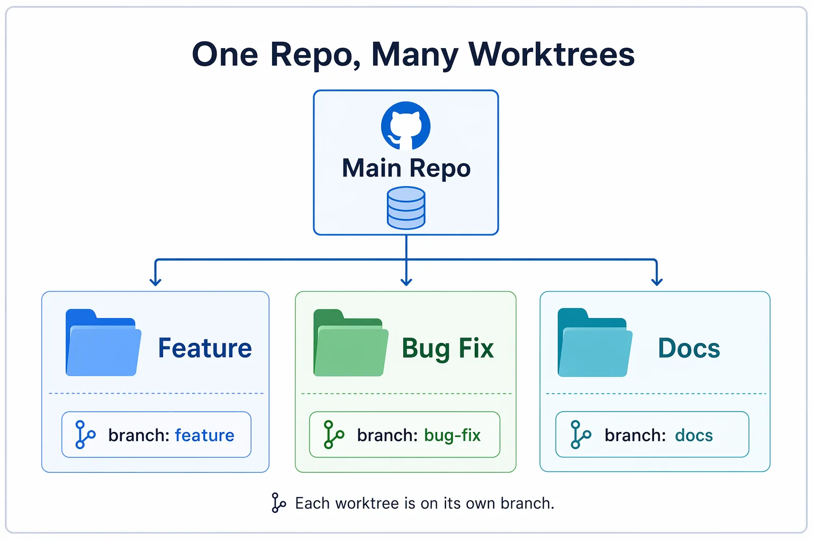

### Running Multiple Sessions in Parallel

Because each session works in its own worktree, you can run several at once without them colliding — one session fixing a bug while another explores a different branch, each with its own folder, branch, and diff. This is the real payoff of worktrees. You'll practice coordinating parallel work safely, including the `/orchestrate` command, in the [Chapter 03 advanced section](../03-development-workflows/README.md).

### Where a Session Runs

When you start a session, the composer's **Workspace** selector lets you choose *where* the work happens. 

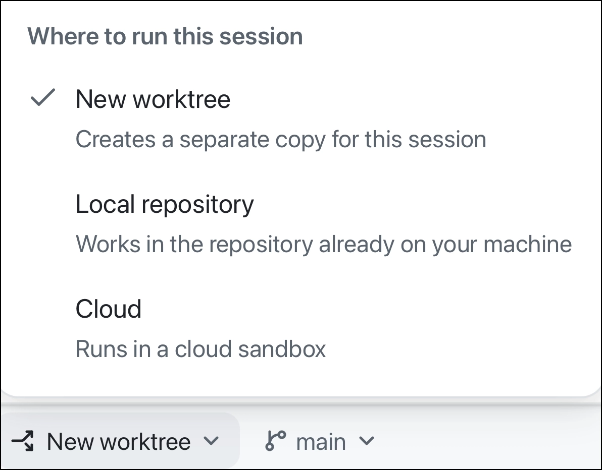

The choices trade off speed against isolation:

| Workspace | What it means | Choose it when... |
|---|---|---|
| New worktree | The session gets its own folder and branch beside your clone | You want changes, branches, and diffs kept separate from your main checkout (the safe default this course uses) |
| Local repo | The session works directly in your existing clone, with no separate folder | You want a quick, low-stakes look and don't mind the session touching your working folder |
| Cloud sandbox | The session runs on GitHub's hosted infrastructure instead of your machine | You want to offload the work or keep your local environment untouched |

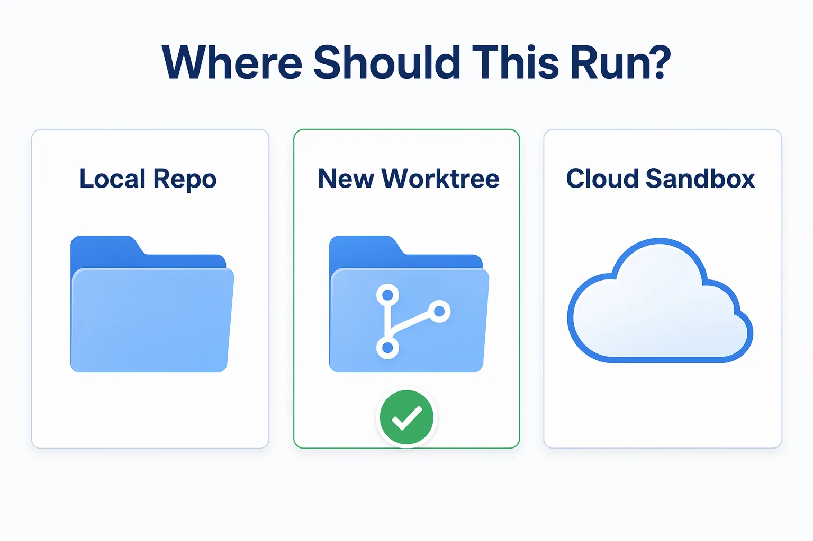

> Tip: When in doubt, choose a new worktree. It keeps your `main` checkout clean while still running on your machine, which is why the rest of this course leans on worktree-backed sessions. 

### Session Settings That Matter Here

Before you run multiple sessions, find the app's session settings you toured in Chapter 01:

| Setting | Why it matters |
|---|---|
| Default model and reasoning | Affects speed, quality, and cost for new sessions |
| Branch prefix | Makes app-created session branches easier to recognize |
| Instructions | Instructions for the agent to follow for every session across projects |

### Context Syntax

Copilot App provides a dedicated context syntax (`@` and `#`) that you can use to give a session the context it needs to understand the problem and generate helpful responses.

| Syntax | Use it for | Example |
|---|---|---|
| `@` | Files or folders | `@samples/book-app-web/src` |
| `#` | Issues or pull requests | `#12` |

> Tip: Provide the smallest amount of useful context - less is often more.

### Slash Commands

Slash commands are shortcuts you type in the composer. They can open app utilities, invoke agent behaviors, inspect usage, or trigger installed skills. The safest way to discover what your app supports is to type `/` in the composer and read the palette. Commands can vary by app version, enabled plugins, installed skills, and organization policy.

Here are some common slash commands you might use:

| Command | What it's for | Use it when... |
|---|---|---|
| `/chronicle` | Summarizes session history and past work | You want a session recap or standup-style summary |
| `/context` | Opens session context and token usage details when available | You want to see how much context the session is using |
| `/usage` | Opens usage, rate limit, or credit information when available | You want to understand cost or plan limits |
| `/research` | Conducts research on a topic or question | You want to gather detailed information or insights on a specific subject |
| `/review` | Requests a review of the current session or a specific piece of code | You want to get feedback on your work before finalizing it |
| `/rubber-duck` | Asks a critic agent to review a plan, diff, tests, or design | You want a second opinion before accepting work |

<details>
<summary>GitHub Copilot App Slash Commands Reference</summary>

| Command | Description |
|---|---|
| `/agent` | Select or switch the active agent for a session. |
| `/agent-merge` | Start or enable the Agent Merge workflow for PR merge-readiness automation. |
| `/chronicle` | Summarize session history, generate standups, search past work, or get workflow/cost tips. |
| `/collect-debug-logs` | Collect app logs for troubleshooting or filing GitHub Copilot App issues. |
| `/context` | Show session context details such as token usage, context window, and AI credit spend. |
| `/create-canvas` | Create a canvas from the current session for a richer editable/inspectable surface. |
| `/orchestrate` | Coordinate multi-session or multi-repo work by delegating to child sessions. |
| `/remote` | Work with remote-session/remote-control flows when available in your build. |
| `/research` | Conduct research on a topic or question and summarize the findings. |
| `/review` | Request a review of the current session or a specific piece of code. |
| `/rubber-duck` | Ask a critic agent to review a plan, diff, tests, design, or proposed approach. |
| `/skills` | Discover available skills; `/skills reload` reloads skills during a session. |
| `/usage` | Open usage, rate-limit, plan-limit, or credit information. |
| `/[skill-name]` | Invoke an installed skill directly, such as `/security-audit`; available commands depend on installed skills. |

When in doubt, type `/` and use the in-app palette to discover what's available.

</details>

### Branches Used in This Course

Back in [Chapter 00](../00-quick-start/README.md), the setup script added several *practice branches* to your forked repository. As a quick refresher, each practice branch is a copy of the sample app prepared for one specific exercise later in the course, usually with an intentional bug or issue for you to resolve. By using practice branches you get a safe, realistic way to inspect or fix without breaking the working app.

Each exercise names the branch it needs. For reference, here is the full set that you'll see in this course:

- `practice-search-case-bug`: book search is case-sensitive when it should match regardless of case
- `practice-unread-count-bug`: the unread stats count is wrong while a filter is active
- `practice-empty-state-copy`: the "no results" empty-state message needs clearer, friendlier copy
- `practice-card-polish`: a starting point for improving book card spacing and responsive layout
- `practice-failing-stats-check`: a stats test fails on purpose so you can practice fixing a failing CI check

When an exercise calls for you to use one of these branches, you'll use it to create your GitHub Copilot App session. You can do this by selecting the project's `Create from` icon in the sidebar (1) and then selecting the desired branch from the dialog (2).

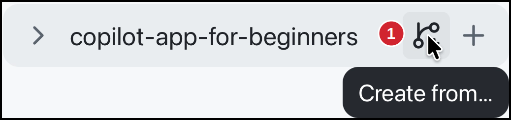

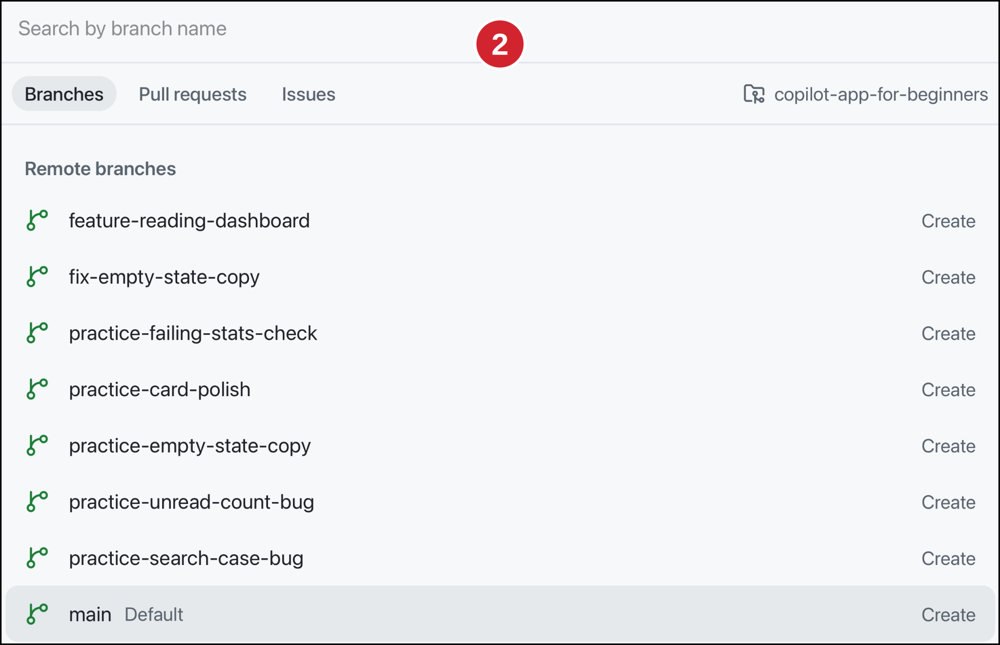

Try it out!
1. Locate the **copilot-app-for-beginners** project in the sidebar.
2. Select the `Create from` icon next to the project name.
3. Notice that branches, PRs, and issues are available to select from the dialog.

There's no need to select anything quite yet. You'll do that in later exercises.

> Don't see the branches? You may have skipped the setup script, or you're on a different clone. Run it now from [Chapter 00](../00-quick-start/README.md#2-fork-clone-and-prepare-the-course-repository), or follow the manual steps in [appendices/training-github-scenarios.md](../appendices/training-github-scenarios.md).

---

## Hands-On Exercises

In these exercises, you'll:

- Start a worktree-backed session from a task in Plan mode
- Give a session focused context with `@` or `#`
- Inspect the session's branch, diff, and terminal to confirm the work stays isolated
- Recap session history and check context usage with `/chronicle` and `/context`

### 1. Start a Session from a Task

The default sample app is stable, so this exercise uses a practice branch that contains a real task to plan against. The task is to improve the app's *empty state*: the message shown when a search or filter matches no books. Right now that message isn't very helpful, so the goal is to make it clearer and friendlier.

Perform these steps:

1. Read Issue 3 in your forked GitHub repository, to understand the task:

   ```text
   https://github.com/YOUR-USER/copilot-app-for-beginners/issues/3
   ```

   > Note: You can also find the issue in [`samples/app-course-issues.md`](../samples/app-course-issues.md#issue-3-improve-the-empty-state-copy) if you'd like to manually add it to your repository.

2. Make sure the `practice-empty-state-copy` branch is ready. The setup script from [Chapter 00](../00-quick-start/README.md#2-fork-clone-and-prepare-the-course-repository) created it for you. If you skipped that script, go back and run it now.
3. In the sidebar, locate the `copilot-app-for-beginners` project and select the **`Create from`** icon next to it.

   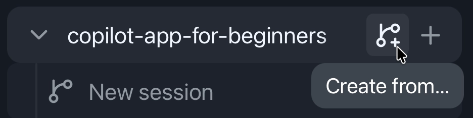

4. In the dialog, select the **Branches** tab, then choose `practice-empty-state-copy`. This starts a new session based on that branch and creates a new worktree.
5. In the session composer, set the **Mode** selector to **Plan**.
6. Submit the following prompt which includes details from the issue:

   ```text
   The empty state should be clear for beginners and screen reader users.
   Repro:
   - Search for text that matches no books.
   - Review the empty state.

   Expected result: The message explains that no matching books were found and suggests changing filters.

   Improve the message the book app shows when no books match a search or filter (its empty state) in samples/book-app-web. First inspect the relevant files and propose a plan. Do not edit files until I approve the plan.
   ```

   > Note: Later you'll learn different ways to reference an issue directly without having to manually open it and copy and paste details into the prompt.

#### Expected Output

Copilot should identify files to inspect, describe the current behavior, and propose a plan before editing. You'll see something *similar* to the following:

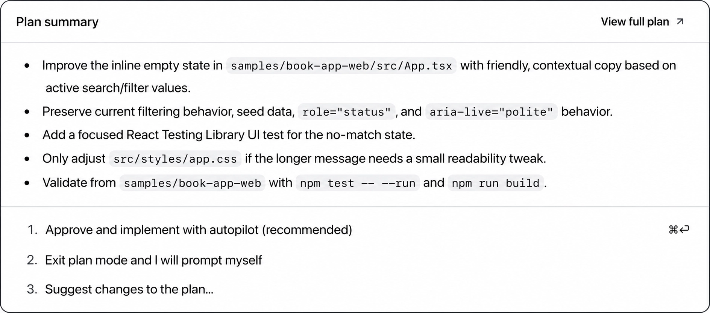

If you'd like to see the full plan, select **View full plan**.

Notice that you can then approve and implement the plan using autopilot, exit plan mode and add your own prompts, or suggest changes to the plan.

#### Success Check

You'll find the new project session in the app's sidebar. Mouse over the session to identify the branch being used.

Select `Exit plan mode and I will prompt myself` to exit plan mode and continue with your own prompts.

---

### 2. Give Focused Context using `@` and `#`

Now you'll narrow the session's focus using an `@` file reference or a `#` PR or issue reference, so Copilot knows what to focus on.

Perform these steps:

1. Start a new session in the `copilot-app-for-beginners` project.
2. In the session composer, submit this prompt:

   ```text
   Use @samples/book-app-web/src to focus on the React app code. Which files are most likely involved in the empty-state copy?
   ```

3. Switch to Plan mode in the composer. Although this session wasn't started from an existing issue or PR, you can use the `#` reference to access them.
4. Type `#` into the composer. Notice that all of the issues and PRs associated with the repository appear.
5. Select one of the issues from the list. You should see something like `#1` (depending on the issue you selected) appear in the composer. 
6. Submit it and a plan will be created to fix the issue.

   > Note: Depending on the issue you selected, you may be prompted to change to a different branch. Press escape to exit if asked. 

#### Expected Output

Copilot will focus on the sample app source folder instead of referencing unrelated files or folders and show a list of files that are likely involved in the empty-state copy. When you use the `#` reference, Copilot App will focus on the selected issue or PR.

#### How It Works

The `@` and `#` references narrow context. It helps Copilot App focus on the files, issues, or PRs that matter and saves on overall token usage.

---

### 3. Start from an Issue

Up to this point you've started a session from a branch. This time you'll start a new session directly from a GitHub issue, without leaving the app - a big time saver! Your forked repository already has seeded issues if you ran the setup script in [00 - Quick Start](../00-quick-start/README.md).

Perform these steps:

1. In the sidebar, locate the `copilot-app-for-beginners` project and select the **`Create from`** icon next to it.
2. In the dialog, select the **Issues** tab.
3. Select `Issue #3` from the list. The app starts a new session, reads the issue, and begins planning how to address it automatically.

   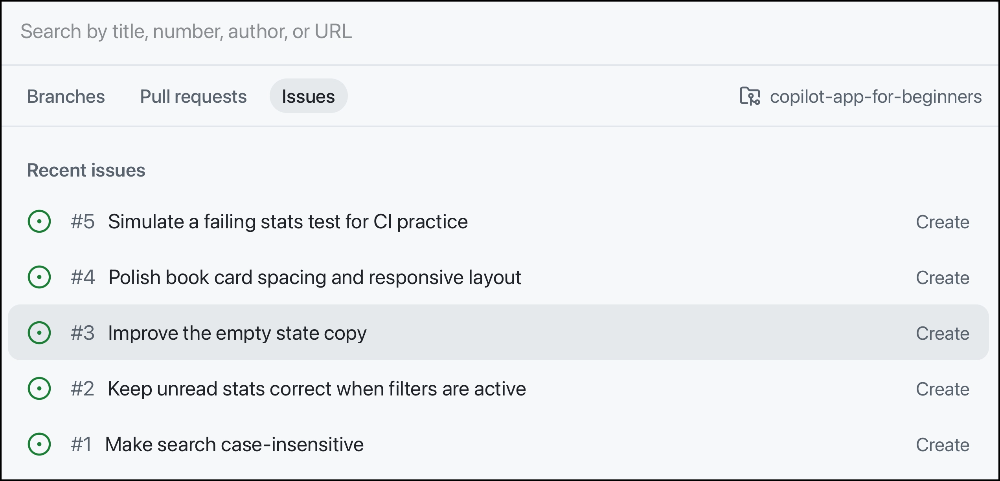

#### Expected Output

Copilot should analyze the issue and generate a plan that you can then review and approve before making any changes.

---

### 4. Inspect the Branch and Worktree

A session keeps its evidence in a few places. In this exercise you'll open those surfaces and connect them to the git concepts you're learning. As a result, you'll know exactly where to look when you start making changes in upcoming chapters.

Perform these steps:

1. In the sidebar, return to the session you started in Exercise 1 (the one on the `practice-empty-state-copy` branch) and select the session.
2. At the top of the session window, you'll see its **branch name** and **worktree name**. It'll look something like:

   ```text
   practice-empty-state-copy · [your-prefix]-practice-empty-state-copy
   ```
3. Select the **branch name** or **worktree name** to open a dialog that provides more information about the session, the worktree path, and other relevant details. An example of the dialog is shown here: 

   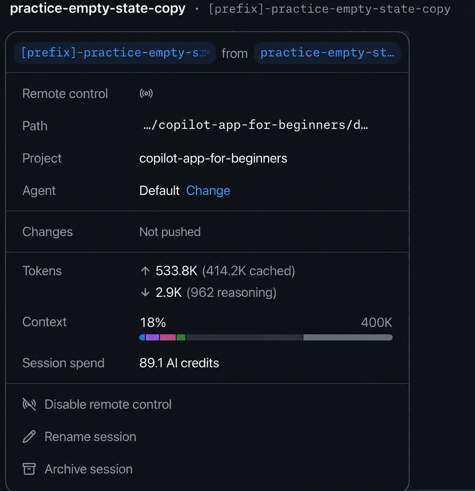

   > Note: [your-prefix] will be replaced with your personal prefix that's defined in the app settings.

4. Select the **Review panel** toggle in the upper-right corner of the app. This is where a session's diff, terminal surfaces, and other tools live.

   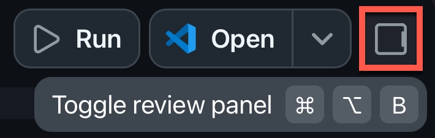

5. Select the **Changes** tab to see the diff. You haven't approved any edits yet so the **Changes** tab should be empty. That's expected. In a later chapter you'll make real changes and watch diffs appear here.
6. If no terminal exists yet, press **+** to start one.
7. In the terminal, run this command to check the git status:

   ```bash
   git status
   ```

#### Expected Output

Git should show the current branch and whether files are modified.

Example clean output looks something like this:

```text
On branch practice-empty-state-copy
nothing to commit, working tree clean
```

---

### 5. Use a Slash Command to Recap the Session

Slash commands are shortcuts you run in the composer. Here you'll use `/chronicle` to get a quick recap of what the session has done so far. Adding the `standup` argument formats that recap as a short, standup meeting-style summary.

Perform these steps:

1. Make sure you're in the `practice-empty-state-copy` session.
2. In the session composer, submit the following slash command:

   ```text
   /chronicle standup
   ```

#### Expected Output

Copilot should summarize what happened in the session and what decisions or changes were made.

---

### 6. Check Session Context with `/context`

In this final exercise, you'll check how much context the session is using.

Perform these steps:

1. Stay in the same session.
2. Submit the following:

   ```text
   /context
   ```

#### Expected Output

Copilot App opens the session dialog to display session context details and usage information.

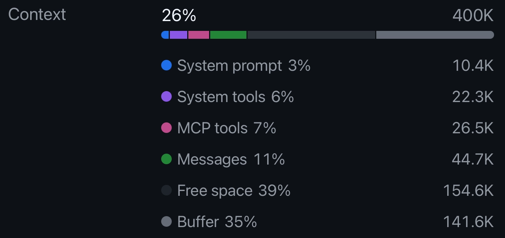

#### How It Works

Context is the content Copilot App is using for the current session. Checking it helps you know when a session's context is getting overloaded before you add more files, issues, or instructions.

---

## 🔑 Key Takeaways

1. Sessions are focused agent workspaces.
2. Worktrees keep session changes separate from your main checkout.
3. The workspace selector lets a session run in your local clone, a new worktree, or a cloud sandbox; a new worktree is the safe default.
4. Worktrees isolate files and branches, but not ports, databases, or background processes, so run parallel sessions on different ports.
5. `@`, `#`, and `/` help you control context and commands.
6. Slash commands can be used to quickly access features and information within the app.

---

## 📝 Assignment


Start a new Plan mode session for the following task:

```text
Investigate how samples/book-app-web calculates reading stats. Do not edit files. Explain which files are involved and what tests would prove the behavior.
```

Then answer:

1. What branch or worktree did the session use?
2. Which files did Copilot inspect or recommend inspecting?
3. What validation did Copilot suggest?
4. Did you keep the context focused?

---

## ➡️ What's Next

In the next chapter, you'll use the app for common development workflows: Review, debugging, tests, terminal validation, browser preview, and UI polish.

**[← Back to Chapter 01](../01-first-steps/README.md)** | **[Continue to Chapter 03 →](../03-development-workflows/README.md)**

---

## Source References

- [About the GitHub Copilot App][about-app]
- [Working with agent sessions][agent-sessions]
- [GitHub Copilot App repository][app-readme]
- [GitHub Copilot App changelog][changelog]
- [GitHub Copilot App product blog][app-blog]

[agent-sessions]: https://docs.github.com/en/copilot/how-tos/github-copilot-app/agent-sessions
[about-app]: https://docs.github.com/en/copilot/concepts/agents/github-copilot-app
[app-readme]: https://github.com/github/app
[changelog]: https://github.blog/changelog/2026-06-17-github-copilot-app-generally-available/
[app-blog]: https://github.blog/news-insights/product-news/github-copilot-app-the-agent-native-desktop-experience/