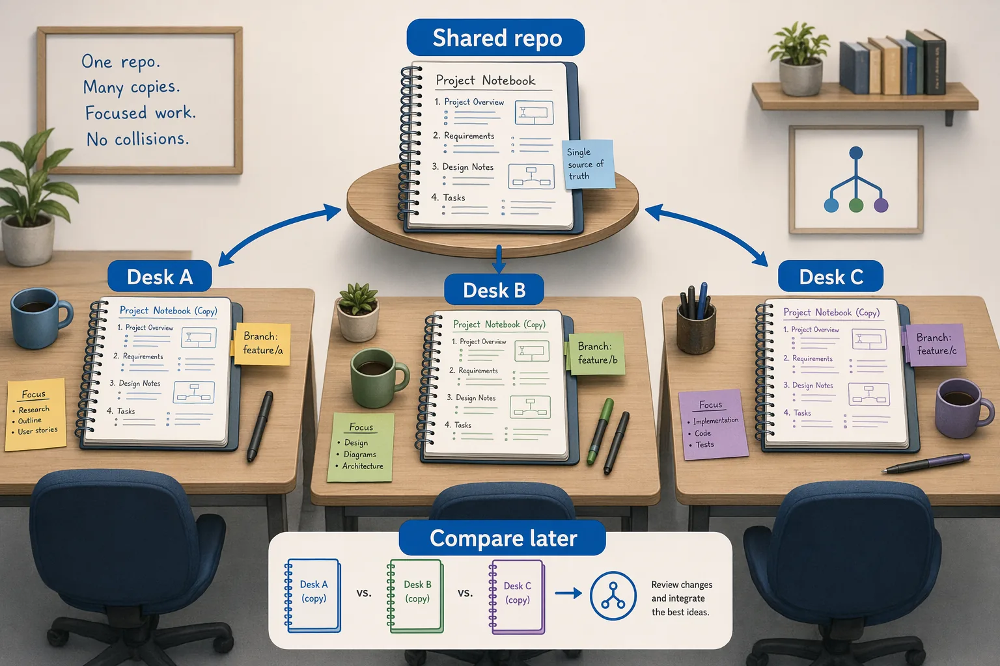

<!--
---
id: CopilotApp-02
title: !translate Sessions, Worktrees, and Context
description: !translate Start isolated worktree-backed sessions and give Copilot focused context with @, #, and / in the GitHub Copilot App.
audience: Developers / Students / Desktop users
slug: sessions-worktrees-and-context
weight: 3
---
-->


> **What if every task had its own safe desk, branch, context, and history?**

Sessions are where the GitHub Copilot App stops feeling like ordinary chat. A session can have its own branch, working folder, plan, diff, terminal output, browser preview, and GitHub context. In this chapter, you'll start a session from a task, learn why worktrees keep work separated, and practice giving Copilot just enough context.

## 🎯 Learning Objectives

By the end of this chapter, you'll be able to:

- Start a session from a prompt, issue, or pull request
- Explain a git worktree in beginner terms
- Understand why isolated sessions protect your main checkout
- Use `@` for file and folder context
- Use `#` for issue or PR context when available
- Use `/` for app commands and know where to check availability
- Decide between local repository, new worktree, and cloud sandbox options
- Recognize branch prefixes and session lifecycle settings
- Use `/chronicle` to summarize session history
- Use `/context` to inspect session context and token usage when available

> ⏱️ **Estimated Time**: ~50 minutes (25 min reading + 25 min hands-on)

---

## ✅ Prerequisites

Complete Chapters [00](../00-quick-start/README.md) and [01](../01-first-steps/README.md). At this point, you've connected the course repository and understand the difference between Quick chat and a project session.

---

## 🧩 Real-World Analogy: Separate Desks for Separate Projects

Imagine you've got one important notebook, but three people need to work on different ideas from it. You wouldn't ask everyone to write on the same page at the same time. You'd make separate working copies, label them, and compare the results later.



A worktree is like that separate working desk. It is connected to the same repository, but it has its own folder and branch so parallel work does not collide.

## Core Concepts

### What Is a Worktree?

A git worktree is a second working directory attached to the same repository. It usually uses a separate branch. This lets you work on more than one task without mixing files in the same folder.

### Why the App Uses Worktrees

| Without isolation | With a worktree-backed session |
|---|---|
| Multiple tasks can edit the same folder | Each task gets a separate folder |
| Easy to lose track of branch state | Session branch is visible in the app |
| Tests and diffs can mix together | Diffs stay tied to the session |
| Harder to compare work | Easier to inspect and approve |


### Session Settings That Matter Here

Before you run multiple sessions, find the app's session settings you toured in Chapter 01:

| Setting | Why it matters |
|---|---|
| Branch prefix | Makes app-created session branches easier to recognize |
| Session lifecycle | Helps you understand when sessions, branches, or worktrees are reused or cleaned up |
| Default model and reasoning | Affects speed, quality, and cost for new sessions |

Keep the defaults unless your instructor or team has a reason to change them.

### Context Controls

| Syntax | Use it for | Example |
|---|---|---|
| `@` | Files or folders | `@samples/book-app-web/src` |
| `#` | Issues or pull requests | `#12` |
| `/` | Commands | `/chronicle` |

> Tip: Context controls are not a contest to attach the most information. Give the smallest useful context.

### Slash Commands in the App

Slash commands are shortcuts you type in the composer. They can open app utilities, invoke agent behaviors, inspect usage, or trigger installed skills. The safest way to discover what your app supports is to type `/` in the composer and read the palette. Commands vary by app version, plan, enabled plugins, installed skills, and organization policy.

Start with these beginner-safe commands:

| Command | What it's for | Use it when... |
|---|---|---|
| `/chronicle` | Summarizes session history and past work | You want a session recap or standup-style summary |
| `/context` | Opens session context and token usage details when available | You want to see how much context the session is using |
| `/usage` | Opens usage, rate limit, or credit information when available | You want to understand cost or plan limits |
| `/rubber-duck` | Asks a critic agent to review a plan, diff, tests, or design | You want a second opinion before accepting work |

<details>
<summary>Reference: Copilot CLI slash commands and GitHub Copilot App availability</summary>

The `copilot-cli-for-beginners` course lists many Copilot CLI commands. This table compares those commands with App-specific commands learners see in this course. The GitHub Copilot App is built on Copilot CLI, but the desktop app also has its own UI flows. Treat this table as a practical map, not a promise that every command appears in every app build.

| Command | App status | Course placement |
|---|---|---|
| `/agent` | Confirmed in the app changelog for selecting custom, user, plugin, project, and remote agents | Chapter 05 |
| `/ask` | CLI command. Use Quick chat in the app for the same beginner need | Chapter 01 concept |
| `/chronicle` | Confirmed in GitHub Docs for app sessions | This chapter and Chapter 08 |
| `/context` | Confirmed in the app changelog for session context, token count, context window, and credit spend | This chapter |
| `/usage` | Confirmed in the app changelog for usage, rate limits, and plan limits | This chapter |
| `/rubber-duck` | Confirmed in GitHub Docs and the app changelog | Chapter 03 |
| `/orchestrate` | Confirmed in the app changelog for coordinating child sessions and multi-repo work | Chapter 08, advanced |
| `/skills` | Confirmed in the app changelog command palette examples | Chapter 05 |
| `/collect-debug-logs` | Confirmed in the app README and changelog examples | Chapter 00 troubleshooting |
| `/agent-merge` | Confirmed in the app changelog as an Agent Merge loop command | Chapter 04 and Chapter 08, advanced |
| `/create-canvas` | Confirmed in GitHub Docs as a built-in skill for creating a canvas from a session | Chapter 06, advanced |
| `/remote` | Mentioned in the app changelog command palette examples, but primarily a Copilot CLI remote-control workflow | Advanced appendix or Chapter 08 note only |
| `/model` | Prefer the app model picker. The CLI command may not be the right teaching path in the app | Chapter 01 via UI |
| `/plan` | Prefer the app Plan mode selector. The CLI command is not the beginner app path | Chapter 01 via mode selector |
| `/review` | CLI code-review agent command. In the app, teach review prompts, diff review, Fix actions, and `/rubber-duck` | Chapter 03 |
| `/pr` | CLI PR command. In the app, use My Work and PR surfaces | Chapter 04 via UI |
| `/diff` | CLI diff command. In the app, use the Changes or diff surface | Chapter 03 via UI |
| `/clear`, `/new`, `/resume`, `/rename`, `/session`, `/rewind`, `/share`, `/compact` | CLI session-management commands. The app has visible session, history, and sharing surfaces, so teach the UI first | Chapter 02 concept only |
| `/env`, `/init`, `/mcp` | CLI configuration commands. The app exposes settings, instructions, MCP, skills, and plugins through settings and project files | Chapters 05 and 06 |
| `/add-dir`, `/list-dirs`, `/cwd`, `/cd` | CLI directory-permission and working-directory commands. The app uses project/session workspace choices instead | Chapter 02 concept only |
| `/allow-all`, `/yolo` | CLI permission commands. Do not teach on the beginner app path because they bypass review habits | Not recommended |
| `/delegate`, `/fleet`, `/tasks` | CLI subagent/cloud-agent commands. The app equivalent is sessions, child sessions, background agents, and `/orchestrate` when available | Chapter 08, advanced |
| `/memory`, `/keep-alive`, `/statusline`, `/footer`, `/theme`, `/terminal-setup`, `/changelog`, `/feedback`, `/voice`, `/help`, `/exit` | CLI convenience commands. The app has settings, menus, command palette, voice settings, feedback controls, and window/session UI for these needs | Mention only if the app palette shows them |
| `/research` | CLI deep-research command. Use normal prompts, installed skills, or approved web/documentation tools when available in the app | Optional, not required |
| `/skill-name` such as `/security-audit` or `/generate-tests` | Skill-provided commands vary by installed skills. Use `/skills` or the slash palette to discover them | Chapter 05 |

When in doubt, type `/` and trust the in-app palette over a printed list.

</details>

### Practice Branches in This Course

Some later exercises use setup-script branches such as `practice-empty-state-copy`, `practice-unread-count-bug`, and `practice-search-case-bug`. Those branches contain intentional regressions or training changes.

Before starting one of those exercises, make sure the session is based on the named branch:

1. If the app lets you choose a branch or worktree base, choose the named practice branch.
2. If the app uses your local checkout, switch your local clone first:

   ```bash
   git switch practice-empty-state-copy
   git status
   ```

3. Confirm `git status` shows the expected branch before asking Copilot to inspect or fix the scenario.

Use the branch name shown in the chapter you're working through.

---

## Hands-On Example 1: Start a Session from a Task

The default sample app is stable. To practice a real planning workflow without overlapping the Chapter 03 debugging example, first read Issue 3 in [`samples/app-course-issues.md`](../samples/app-course-issues.md#issue-3-improve-the-empty-state-copy). This issue asks for clearer empty-state copy. Use the `practice-empty-state-copy` branch created by the setup script, or manually apply Issue 3's training-branch setup before this exercise. Follow the practice branch note above before starting the session.

Create a new session in Plan mode, then try this prompt:

```text
Improve the empty-state copy in samples/book-app-web. First inspect the relevant files and propose a plan. Do not edit files until I approve the plan.
```

<!-- app-screenshot: New session composer showing the choice between local repository, new worktree, and cloud sandbox if available. -->

### Expected Output

Copilot should identify likely files to inspect, describe the current behavior, and propose a plan before editing.

> Demo output varies. The exact files and wording may differ.

### Success Check

You'll find the session in the app and identify whether it's using a worktree, local repository, or cloud sandbox.

---

## Hands-On Example 2: Give Focused File Context

In the same session, try this prompt:

```text
Use @samples/book-app-web/src to focus on the React app code. Which files are most likely involved in the empty-state copy?
```

### Expected Output

Copilot should focus on the sample app source folder instead of discussing unrelated course chapters.

### How It Works

The `@` reference narrows context. It helps Copilot spend attention on the files that matter.

---

## Hands-On Example 3: Start from an Issue

If your training repository includes seeded issues, open Issue 3 from [`samples/app-course-issues.md`](../samples/app-course-issues.md#issue-3-improve-the-empty-state-copy) and start a session from it. If you skipped the setup script, paste the issue text into the session prompt instead.

After the issue context loads, try this prompt:

```text
Use the issue details as the source of truth. Summarize the task, identify likely files in samples/book-app-web, and propose a safe validation plan before making changes.
```

### Expected Output

Copilot should summarize the issue, connect it to sample app files, and suggest checks such as tests and browser validation.

---

## Hands-On Example 4: Inspect the Branch and Worktree Safely

From the app, locate:

- Session name
- Branch name
- Worktree or workspace path
- Diff view

<!-- app-screenshot: Session details or sidebar area showing the generated branch/worktree name so learners can connect the app UI to git concepts. -->

If you open the folder in an editor, confirm the branch and path before making any edits.

Use this safe terminal check from the session terminal or your local terminal if the folder is open:

```bash
git status
```

### Expected Output

Git should show the current branch and whether files are modified.

Example clean output looks like this:

```text
On branch practice-empty-state-copy
nothing to commit, working tree clean
```

> Note: Do not delete an active worktree from Finder, Explorer, or terminal. Clean up sessions through the app when possible.

---

## Hands-On Example 5: Use `/chronicle`

After a small completed session or plan, type:

```text
/chronicle
```

### Expected Output

Copilot should summarize what happened in the session and what decisions or changes were made.

> Demo output varies. Use `/chronicle` as a reflection aid, not as the only record of truth.

---

## Hands-On Example 6: Check Session Context with `/context`

Type:

```text
/context
```

### Expected Output

If your app version supports it, Copilot opens or summarizes session context details such as token count, context window, and usage information.

If `/context` is not available, open the slash command palette and look for a similar usage or context command. App commands change over time, so the palette is the source of truth.

### How It Works

Context is the material Copilot is using for the current session. Checking it helps you notice when a session is getting too broad before you add more files, issues, or instructions.

<details>
<summary>Intermediate: Local repository, new worktree, and cloud sandbox tradeoffs</summary>

| Option | Good for | Watch out for |
|---|---|---|
| Local repository | Very small work in the current folder | Edits touch your main checkout directly |
| New worktree | Most course exercises and parallel work | Ports, databases, and background processes are still shared |
| Cloud sandbox | Isolated GitHub-hosted work when available | Requires plan, policy, repository settings, and possible billing awareness |


</details>

<details>
<summary>Advanced: Session settings that change agent behavior</summary>

Some settings affect default model behavior, custom instructions, branch prefixes, session lifecycle, auto-approve behavior, Agent Merge attribution, and remote access.

For beginner work, focus on:

- Clear branch prefixes
- Safe default model and reasoning choices
- Review checkpoints before edits

<!-- app-screenshot: Settings screen where branch prefix or session lifecycle settings are visible, with sensitive details hidden. -->

Treat auto-approve, Agent Merge attribution, and remote access as optional advanced settings that depend on policy and team workflow.

</details>

---

## Notes and Tips

- Worktrees are real directories and branches, not disposable chat history.
- Do not manually edit or delete a worktree while a session is active unless you understand the consequences.
- Worktrees isolate files and branches, but they do not automatically isolate ports, databases, containers, caches, or background processes.
- If two sessions run the sample app, use different ports.

### Common Beginner Mistakes

- Opening the wrong worktree folder in an editor and editing the main checkout by accident
- Attaching the whole repository when `@samples/book-app-web/src` is enough
- Assuming worktrees isolate ports, containers, databases, or background services

<details>
<summary>Troubleshooting: Sessions and worktrees</summary>

### Two Sessions Cannot Run the Web App at the Same Time

They may both be trying to use the same port. For later chapters, run one session on `5173` and another on a different safe port such as `5174`.

### A Session Behaves Differently from the Main Checkout

Check:

- Branch name
- Worktree path
- Dependency install status
- Environment variables
- Uncommitted changes

### The App Lost Track of a Worktree

This can happen if the folder was moved or deleted outside the app. Prefer app-managed cleanup whenever possible.

</details>

---

## 🔑 Key Takeaways

1. Sessions are focused agent workspaces.
2. Worktrees keep session changes separate from your main checkout.
3. `@`, `#`, and `/` help you control context and commands.
4. Cloud sandboxes are useful when available, but they are not required for the beginner path.
5. `/chronicle`, `/context`, and `/usage` help summarize session history and inspect context or usage when available.

---

## 📝 Assignment

Start a Plan-mode session for this safe task:

```text
Investigate how samples/book-app-web calculates reading stats. Do not edit files. Explain which files are involved and what tests would prove the behavior.
```

Then answer:

1. What branch or worktree did the session use?
2. Which files did Copilot inspect or recommend inspecting?
3. What validation did Copilot suggest?
4. Did you keep the context focused?

---

## ➡️ What's Next

In Chapter 03, you'll use the app for real development workflows: Review, debugging, tests, terminal validation, browser preview, and UI polish.

**[← Back to Chapter 01](../01-first-steps/README.md)** | **[Continue to Chapter 03 →](../03-development-workflows/README.md)**

---

## Source References

- [Working with agent sessions][agent-sessions]
- [About the GitHub Copilot App][about-app]
- [GitHub Copilot App repository][app-readme]
- [GitHub Copilot App GA changelog][ga-changelog]
- [GitHub Copilot App product blog][app-blog]
- [Cloud and local sandboxes][sandboxes]

[agent-sessions]: https://docs.github.com/en/copilot/how-tos/github-copilot-app/agent-sessions
[about-app]: https://docs.github.com/en/copilot/concepts/agents/github-copilot-app
[app-readme]: https://github.com/github/app
[ga-changelog]: https://github.blog/changelog/2026-06-17-github-copilot-app-generally-available/
[app-blog]: https://github.blog/news-insights/product-news/github-copilot-app-the-agent-native-desktop-experience/
[sandboxes]: https://docs.github.com/en/copilot/concepts/about-cloud-and-local-sandboxes
