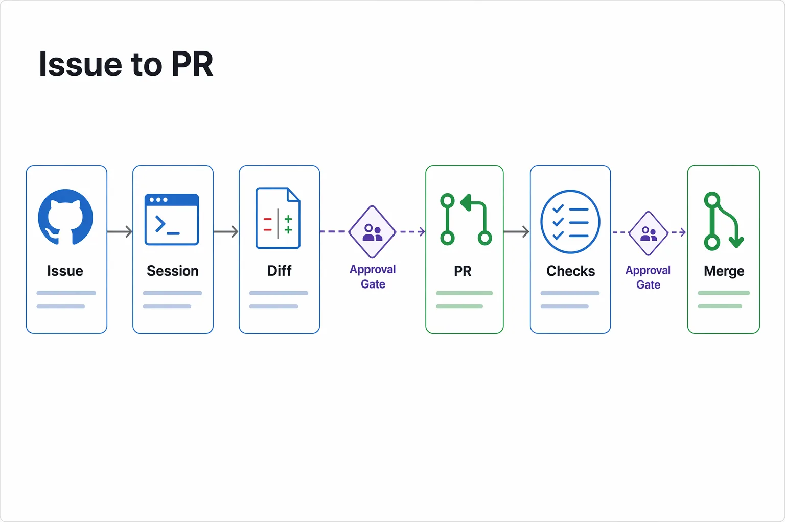
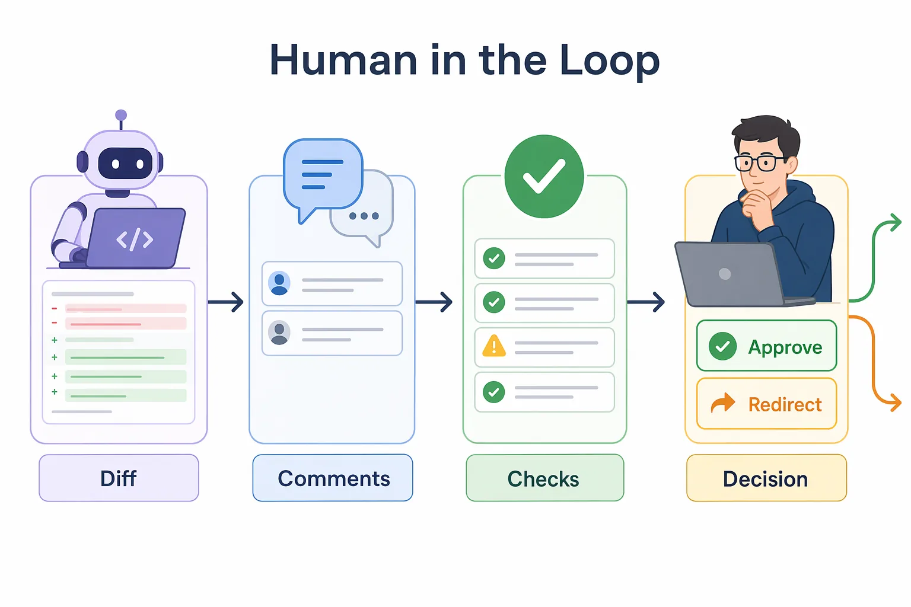
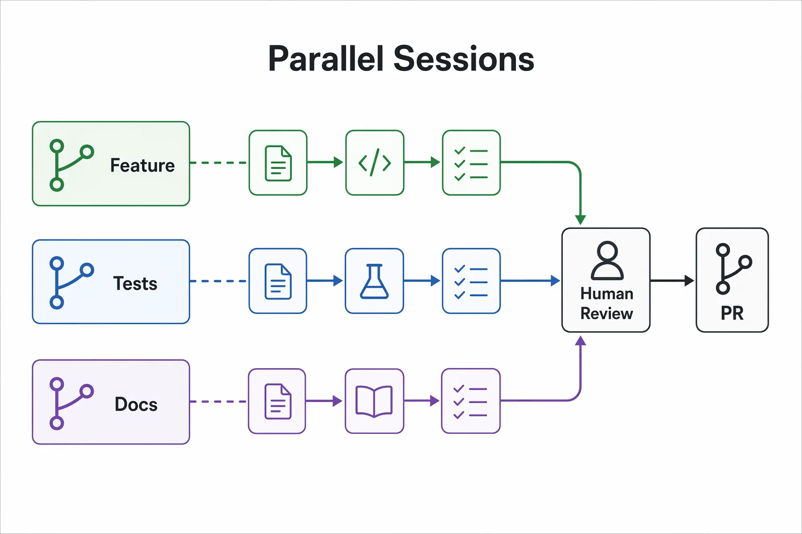

<!--
---
id: CopilotApp-03
title: !translate Development and GitHub Workflows
description: !translate Use the GitHub Copilot App for the full workflow: review, debug, test, and preview a change, then move it through issues, pull requests, review comments, and checks.
audience: Developers / Students / Desktop users
slug: development-workflows
weight: 4
---
-->


> **What if one supervised workflow carried a change from first edit all the way to a merge-ready pull request?**

The GitHub Copilot App is strongest when you use it as a loop. In this chapter you'll work that loop in two halves. **Part A** is the inner loop on your machine: review, debug, test, and preview a change in `samples/book-app-web` with the evidence kept visible. **Part B** is the outer loop on GitHub: use My work as an inbox, start sessions from issues, open and review pull requests, and use Fix actions on review comments and failing checks. Both halves live in the same app, so you supervise the whole path without switching tools.

## 🎯 Learning Objectives

By the end of this chapter, you'll be able to:

- Use repository instructions and the Review panel (diff, terminal, browser) as your evidence surfaces
- Review, debug, and fix a small bug with tests and browser preview as proof
- Ask Copilot to add tests and refactor safely behind them
- Use rubber duck to critique work before you ship it
- Use My work as an issue and pull request inbox
- Start sessions from issues and open a pull request from the app
- Use Fix actions to address review comments and failing checks
- Explain why Agent Merge still needs human judgment

> ⏱️ **Estimated Time**: ~90 minutes (30 min reading + 60 min hands-on). The Intermediate (Pick and Polish) and Advanced (Agent Merge) sections are optional and not counted in this estimate.

---

## ✅ Prerequisites

Complete Chapters [00](../00-quick-start/README.md), [01](../01-first-steps/README.md), and [02](../02-sessions-worktrees-context/README.md). You should have a session for the course repository and know where the Review panel's diff and terminal surfaces live.

**Part B** works best with a GitHub-backed fork that has the seeded issues, branches, and PR scenarios. If you skipped the setup script, run it from [Chapter 00](../00-quick-start/README.md#2-fork-clone-and-prepare-the-course-repository) or follow [appendices/training-github-scenarios.md](../appendices/training-github-scenarios.md). If you can't create PRs, read the steps and use the screenshots or instructor examples.

---

## 🧩 Real-World Analogy: From Take to Final Mix

A good musician doesn't keep the first take just because it's finished. They record a take, play it back, listen for anything off, and re-record until it's right. That's **Part A**: lay down the change, then listen back to the evidence (diff, tests, terminal, browser).


But a take isn't an album. A producer's review desk tracks briefs, approvals, notes for the players, quality checks, and the final call on what ships. That's **Part B**: My work shows what needs attention, and pull requests carry the change through review and checks before it's merged.


## Core Concepts

| Concept | Beginner explanation |
|---|---|
| Diff | The visible set of code changes in a session |
| Validation evidence | Proof the change works: tests, build output, and browser behavior |
| Integrated terminal | A terminal inside the app for running project commands |
| Integrated browser | A web preview surface for checking the running app |
| Rubber duck | A critic agent that reviews a plan, diff, or tests before you accept them |
| My work | An app view for GitHub issues, pull requests, review requests, and checks |
| Fix action | A guided action that asks Copilot to address a review comment or failing check |
| CI check | An automated validation run, often from GitHub Actions |
| Agent Merge | An advanced finishing workflow that helps carry a PR to merge-readiness |


> The most important idea in this chapter: **a confident chat response is not validated software.** Treat the diff, tests, terminal output, and browser behavior as the evidence.

---

## Prepare Repository Instructions and the Sample App

**Repository instructions** give Copilot stable project guidance before it edits anything. This repo already includes `.github/copilot-instructions.md`. Open it and confirm it mentions `samples/book-app-web`; React, TypeScript, Vite, and Vitest; small beginner-readable changes; and validation with install, test, build, and browser preview.


> Where these live in the app: open **Settings**, then set **global** instructions under **General**, and **repository-specific** instructions under the repository name in the **Projects** section. The committed `.github/copilot-instructions.md` file is the git-reviewable form of repository instructions that Copilot reads automatically.

Next, confirm the sample app builds and tests cleanly. This is also where you'll learn to open the session terminal.

1. In the sidebar, open a session for the `copilot-app-for-beginners` project, or create one with the **New session** (**+**) icon next to the project name.
2. Open the **Review panel** with the toggle in the upper-right corner of the app (or **View → Toggle Terminal**). This is where the session's terminal, diff, and browser surfaces live.
3. Select the **Terminal** tab. If no terminal exists yet, press **+** to start one.
4. Run these commands from the repository root:

   ```bash
   cd samples/book-app-web
   npm install
   npm test -- --run
   npm run build
   ```

> Note: Each practice-branch exercise below opens its **own worktree** (a separate folder), so you'll run `npm install` again the first time you use that worktree's terminal.

You'll see dependencies install, tests run, and a production build complete. Tests and builds are evidence; a confident chat response is not.

---

## Hands-On Exercises

In these exercises, you'll:

- **Part A (inner loop):** review, debug, test, refactor, and preview a change with the evidence visible
- **Part B (outer loop):** find work in My work, start from an issue, open a pull request, and use Fix actions on comments and checks

**Part A — Develop and validate in a session.** Work the inner loop: review, fix, test, and preview a change while the evidence stays visible.

### 1. Review and Fix a Bug

Start on a practice branch that already contains a real bug so the review has something to find and the fix is meaningful. You'll review in **Plan** mode, then switch to **Interactive** to apply the fix while staying in control.

Perform these steps:

1. Make sure the `practice-unread-count-bug` branch is ready (the [Chapter 00](../00-quick-start/README.md#2-fork-clone-and-prepare-the-course-repository) setup script created it). Prefer to set it up manually? See the [Issue 2 training-branch steps](../samples/app-course-issues.md#issue-2-keep-unread-stats-correct-when-filters-are-active).
2. In the sidebar, select the **`Create from`** icon next to the `copilot-app-for-beginners` project, choose the **Branches** tab, and select `practice-unread-count-bug`. This starts a session on that branch in a new worktree.
3. In the composer, set the **Mode** selector to **Plan**, then submit:

   ```text
   Review @samples/book-app-web/src for issues related to filtering, unread counts, and reading statistics. Create a short checklist grouped by high, medium, and low risk. Do not edit files yet.
   ```

4. Read the review, then switch the **Mode** selector to **Interactive** and submit:

   ```text
   Fix the unread count when filters are active in samples/book-app-web. Keep the change small, explain the root cause, and run the relevant tests.
   ```

5. Open the **Changes** tab in the Review panel to see each proposed edit as a diff. Read it, then select **Keep** on each change you want to apply. Applying writes the edits to this worktree.

#### Expected Output

Copilot should produce a specific, testable review, then make a focused fix, explain the cause, and run or suggest a test command.

> Demo output varies. Focus on whether the review is specific and whether the fix is small and explained.

#### Success Check

1. In the session terminal, install this worktree's dependencies (a new worktree starts without them) and run the tests:

   ```bash
   cd samples/book-app-web
   npm install
   npm test -- --run
   ```

   Passing tests are your evidence that the fix works.

2. To see the change in the running app, start the dev server:

   ```bash
   npm run dev -- --host 127.0.0.1 --port 5173
   ```

   This keeps running so the browser can preview the app. Leave it open, then press `Ctrl+C` when finished.

3. Open the integrated browser preview: in the **Review panel**, select the browser/preview surface (next to **Terminal** and **Changes**), then enter:

   ```text
   http://127.0.0.1:5173
   ```

   Apply a filter and confirm the unread count stays correct while the filter is active.

---

### 2. Lock the Fix in with Tests

Tests lock in the fix so it can't silently regress. Ask Copilot to add a test that fails on the old behavior and passes on your fix.

1. Stay in the same **Interactive** session on the `practice-unread-count-bug` branch.
2. Submit:

   ```text
   Add or update tests for the unread count behavior so the bug would fail before the fix and pass after the fix. Keep the tests focused on samples/book-app-web.
   ```

3. Review the new or updated test files in the **Changes** tab before you approve them.
4. In the session terminal, confirm both commands complete:

   ```bash
   cd samples/book-app-web
   npm test -- --run
   npm run build
   ```

#### Success Check

Both `npm test -- --run` and `npm run build` complete cleanly, and the new test targets the unread-count behavior so it would have failed before your fix.

<details>
<summary>Optional: Refactor safely behind the tests</summary>

With a green baseline, a refactor is safe: if tests pass before and after, the behavior held. The `filterBooks` function in `samples/book-app-web/src/App.tsx` combines the search, genre, and status checks inline, which makes it a good extract-function candidate.

In the same Interactive session, submit:

```text
Refactor filterBooks in @samples/book-app-web/src/App.tsx to extract the search, genre, and status checks into small, clearly named helper functions. Do not change behavior, keep the signature the same, then run the tests to prove the behavior is unchanged.
```

If a test fails after the refactor, the change altered behavior — revert or adjust until tests pass again without editing the test expectations.

</details>

---

### 3. Rubber Duck Before You Ship

Before you open a pull request, ask a critic agent to poke holes in your work. The `/rubber-duck` command reviews your current plan, diff, or tests.

1. Stay in the same session, which now has your fix and tests.
2. In the composer, type `/` to open the slash-command palette, then submit:

   ```text
   /rubber-duck Critique the plan, diff, tests, and browser validation for this session. What should I double-check before creating a pull request?
   ```

   > The rubber duck agent runs on a different model from your session and is currently available only when the main agent uses a Claude or GPT model. If `/rubber-duck` isn't available, switch the session's model to a Claude or GPT option, or submit the same prompt without the slash command.

#### Expected Output

Copilot should point out review areas, missing validation, or confidence checks.

> Demo output varies. Use the critique to improve your review, not to skip it.

<details>
<summary>Intermediate: Pick and Polish for UI work</summary>

Pick and Polish is the course name for a visible UI iteration loop: preview the running app, ask Copilot to improve a specific area, then review the diff and validate.


1. Start a session from the `practice-card-polish` branch (**`Create from`** → **Branches**).
2. In the session terminal, install dependencies and start the app:

   ```bash
   cd samples/book-app-web
   npm install
   npm run dev -- --host 127.0.0.1 --port 5173
   ```

3. Open the integrated browser preview at `http://127.0.0.1:5173`.
4. In **Interactive** mode, submit:

   ```text
   Polish the book card UI in samples/book-app-web for spacing, visual hierarchy, accessible copy, and responsive behavior. Keep the design consistent with the existing app and show me the diff before I accept it.
   ```

5. Preview the result, review the diff in the **Changes** tab, apply the changes, and run the tests before you treat the work as done.

Remember: visual polish can change accessibility and behavior. Always finish with diff review, tests, build, and browser validation.

</details>

---

**Part B — Move work through GitHub.** Part A validated a change end to end. Part B practices the same loop on a fresh, GitHub-tracked issue: find the work in My work, start a session from the issue, open a pull request, and finish it with Fix actions.



### 4. Find Work in My work

Open **My work** — your in-app inbox for GitHub issues, pull requests, review requests, and checks.

1. Open My work and find issues assigned to you, pull requests you authored, review requests, and PRs with failing checks.
2. Narrow the view with search qualifiers:

   ```text
   repo:your-org-or-user/copilot-app-for-beginners is:issue is:open
   ```

   ```text
   repo:your-org-or-user/copilot-app-for-beginners is:pr is:open
   ```

<!-- app-screenshot: My work view showing issue and pull request sections with filters, using a safe sample repository. -->

#### Success Check

You're able to explain whether a missing issue or PR is more likely caused by filters, permissions, repository selection, or organization policy.

---

### 5. Start from an Issue and Open a Pull Request

Starting from an issue attaches its context automatically, so Copilot plans against the real task instead of a pasted summary.

1. Choose Issue 1 (make search case-insensitive) — read it in My work, or see [`samples/app-course-issues.md`](../samples/app-course-issues.md#issue-1-make-search-case-insensitive). Use the `practice-search-case-bug` branch created by the setup script. If you skipped the script, apply Issue 1's training-branch diff first ([Chapter 02 practice branch note](../02-sessions-worktrees-context/README.md#branches-used-in-this-course)).
2. Start a **Plan**-mode session from the issue and submit:

   ```text
   Use this issue as the source of truth. Plan a small fix in samples/book-app-web, list the files you expect to change, and name the tests or browser checks that should prove the issue is fixed. Do not edit until I approve the plan.
   ```

<!-- app-screenshot: Issue detail page with New session button visible. -->

3. Approve the plan, switch to **Interactive**, apply and validate the fix (tests + browser) as you did in Part A.
4. Use the app's PR flow to open a pull request. Before opening it, confirm the diff is focused, tests and build passed, browser behavior was checked if the UI changed, and the description explains the change and its validation.

<!-- app-screenshot: Pull request Files changed tab or diff review surface inside the app. -->

#### Prompt for PR Description Help

```text
Draft a pull request summary for this session. Include what changed, why it changed, and validation performed. Do not claim checks passed unless you saw the terminal or CI output.
```

> Demo output varies. Always review PR text before publishing it.

#### Expected Output

Copilot plans against the issue, applies a focused fix after you approve the plan, and the app opens a pull request that carries your validated change.

#### Success Check

The PR shows a focused diff, passing tests and build, and a description that matches the validation you actually performed.

---

### 6. Use Fix Actions for Comments and Checks

A **Fix action** is a guided way to ask Copilot to address a specific review comment or failing check, with the diff and validation kept visible.

**Respond to a review comment.** Open the PR conversation comment from [PR scenario 1](../samples/app-course-pr-scenarios.md#pr-scenario-1-review-comment-asks-for-clearer-empty-state-copy), which asks for clearer empty-state copy, then submit:

```text
Review this PR conversation comment and propose the smallest change that addresses it. Show me the diff and validation plan before I accept the fix.
```

<!-- app-screenshot: PR conversation comment or failing CI check, with a Copilot Fix action visible if your app exposes one. -->

**Fix a failing check.** Open [PR scenario 2](../samples/app-course-pr-scenarios.md#pr-scenario-2-failing-ci-points-to-the-stats-test), which fails the `Book app web` workflow, then submit:

```text
Analyze the failing check. Explain the failure, identify the likely file in samples/book-app-web, propose a minimal fix, and tell me which command should pass afterward.
```

When the failure is related to the sample app, confirm it locally before marking the PR ready:

```bash
cd samples/book-app-web
npm test -- --run
npm run build
```

> Do not mark a PR ready until local validation and CI evidence agree.

#### Expected Output

Copilot connects the comment to the right file and the failing check to its likely cause, proposing a minimal fix for each with the diff kept visible.

#### Success Check

The review comment is fully addressed, the failing check passes after your fix, and neither change touches anything unrelated.

<details>
<summary>Advanced: Agent Merge</summary>

Agent Merge is an advanced finishing workflow that can help carry a PR through review comments, checks, and merge requirements. It is not a substitute for understanding the work.



Use Agent Merge only when the PR is small and well-scoped, you reviewed the diff, required checks are meaningful, review comments are understood, branch protection and merge rules are clear, and the repository is safe for training or your team approved the workflow.

Do **not** use it when you don't understand the diff; checks are missing, flaky, or unrelated; the PR touches secrets, auth, permissions, billing, production data, or deployment logic; your org policy disallows it; or you lack merge rights.

If your app exposes `/agent-merge`, treat it as an advanced entry point to that workflow, and run it only in the training fork after you've reviewed the diff, checks, comments, branch protection, and merge rules.

> Demo output varies. Treat any response as a checklist, not permission to merge.

</details>

<details>
<summary>Advanced: Parallel sessions and /orchestrate</summary>

Once you're comfortable with a single session, you can run several at once — each isolated in its own worktree (see [Chapter 02](../02-sessions-worktrees-context/README.md#running-multiple-sessions-in-parallel)). Parallel sessions save time, but they collide if two of them edit the same files.



Delegate to parallel sessions only when the tasks are genuinely independent — for example, one session fixes a bug while another drafts documentation. Keep them safe with clear boundaries:

1. Separate files or clearly separate responsibilities.
2. Separate branches or worktrees.
3. Clear session names.
4. Distinct validation steps.
5. Human review before combining the work.

The `/orchestrate` command, when available, lets the agent coordinate this by delegating to child sessions instead of doing everything inline. Use it with explicit pause points: start the feature session in **Plan** mode and approve its file scope, start a second session only for tests or docs, pause before either session edits overlapping files, validate each worktree separately, then compare the diffs before combining.

```text
/orchestrate Split this work into two independent child sessions: one may inspect and fix the bug, and one may draft documentation notes. Do not let either child session edit files until I approve the scopes.
```

Use `/orchestrate` only after you can describe the child-session boundaries yourself. If it isn't available, create separate sessions manually and keep the same pause points. If two sessions touch the same files, expect conflicts — pause one, review diffs, and decide which branch is the source of truth.

</details>

---

## Troubleshooting

<details>
<summary>Development and GitHub workflow issues</summary>

### Browser Preview Does Not Update

Check that the dev server is running in the correct worktree, the browser points to the correct port, hot reload is active, and you're not viewing a different session's app.

### Tests Fail Only in One Session

Compare dependency install status, branch contents, environment variables, generated files, and whether another session changed the same files.

### I Cannot See an Issue or PR

Check filters and search qualifiers, repository selection, your permissions, and organization policy.

### A Check Fails Only Locally or Only in CI

Compare Node versions, dependency install state, environment variables, and generated files between your worktree and the CI runner.

### A PR Is Still Blocked After the Fix

Confirm required checks re-ran, review comments are resolved, and branch protection or merge rules aren't waiting on an approval you can't give yourself.

### Parallel Sessions Collide or Duplicate Work

If two sessions edited the same files, pause one, compare the diffs, and pick one branch as the source of truth before combining. Delegate to parallel sessions only when the tasks are genuinely independent.

</details>

---

## 🔑 Key Takeaways

1. Use the app as a loop: ask, plan, change, test, preview, review, iterate.
2. The Review panel's diff, terminal, and browser surfaces make agent work inspectable.
3. A passing agent response is not validated software; tests and builds are the required evidence.
4. Tests are the guardrail that makes refactors safe.
5. My work is your issue and pull request inbox; start sessions straight from GitHub context.
6. Fix actions keep review-comment and failing-check work small and visible.
7. Agent Merge is a finishing aid, not a replacement for human judgment.

---

## 📝 Assignment


Run the full loop end to end on a safe issue, from code to pull request:

```text
Improve the empty-state copy in samples/book-app-web so it is clearer and more accessible. Propose a plan first, make the smallest useful change, run tests, run the build, and tell me what changed. Then draft a pull request summary describing the change and the validation you performed.
```

Then check:

1. Did Copilot explain the plan before editing?
2. Did the diff stay focused?
3. Did tests and the build pass?
4. Did the browser preview show the intended copy?
5. Does the PR summary describe real, verified validation?

---

## ➡️ What's Next

In the next chapter, you'll extend the app with reusable expertise and optional tool integrations: skills, Model Context Protocol (MCP) servers, and plugins.

**[← Back to Chapter 02](../02-sessions-worktrees-context/README.md)** | **[Continue to Chapter 04 →](../04-skills-mcp-plugins/README.md)**

---

## Source References

- [GitHub Copilot App GA changelog][ga-changelog]
- [GitHub Copilot App product blog][app-blog]
- [Working with agent sessions][agent-sessions]
- [Managing issues and pull requests][issues-prs]
- [About the rubber duck agent][rubber-duck]
- [Working with canvas extensions][canvas-docs]

[ga-changelog]: https://github.blog/changelog/2026-06-17-github-copilot-app-generally-available/
[app-blog]: https://github.blog/news-insights/product-news/github-copilot-app-the-agent-native-desktop-experience/
[agent-sessions]: https://docs.github.com/en/copilot/how-tos/github-copilot-app/agent-sessions
[issues-prs]: https://docs.github.com/en/copilot/how-tos/github-copilot-app/managing-issues-and-pull-requests
[rubber-duck]: https://docs.github.com/en/copilot/concepts/agents/copilot-cli/rubber-duck
[canvas-docs]: https://docs.github.com/en/copilot/how-tos/github-copilot-app/working-with-canvas-extensions
