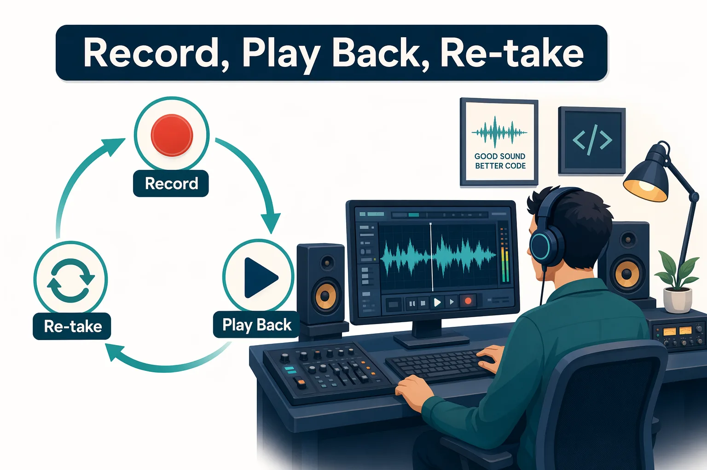
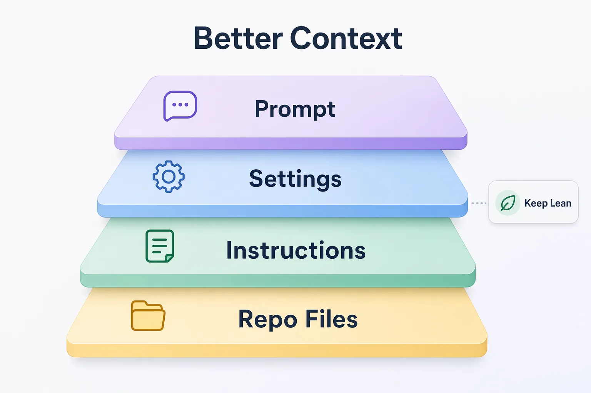
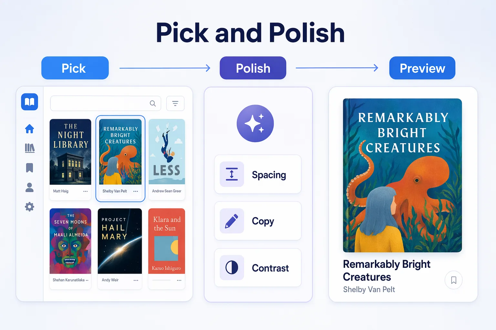

<!--
---
id: CopilotApp-03
title: !translate Development Workflows
description: !translate Use the GitHub Copilot App to review, debug, test, preview, and polish changes in the sample web app with visible validation evidence.
audience: Developers / Students / Desktop users
slug: development-workflows
weight: 4
---
-->


> **What if the app could help you review, debug, test, preview, and polish a change without losing the evidence?**

In this chapter, you'll use the GitHub Copilot App as a development loop for `samples/book-app-web`: Ask, plan, change, test, preview, review the diff, and iterate.

## 🎯 Learning Objectives

By the end of this chapter, you'll be able to:

- Run code review workflows inside the app
- Debug a failing test or small behavior bug with agent help
- Ask Copilot to generate or update tests
- Refactor code safely using tests as a guardrail
- Use integrated terminal output as validation evidence
- Use the integrated browser or browser canvas to inspect runtime behavior
- Use rubber duck review to critique a plan or change

> ⏱️ **Estimated Time**: ~60 minutes (25 min reading + 35 min hands-on)

---

## ✅ Prerequisites

Complete Chapters [00](../00-quick-start/README.md), [01](../01-first-steps/README.md), and [02](../02-sessions-worktrees-context/README.md).

At this point, you've got a session for the course repository and know where to find the session diff and terminal surfaces.

---

## 🧩 Real-World Analogy: Record, Play Back, Re-take

A good musician doesn't keep the first take just because it's finished. They record a take, play it back, listen closely for anything off, and re-record until it's right.



Copilot can help you lay down the take, but you still listen back to the evidence:

- Plan
- Diff
- Tests
- Terminal output
- Browser behavior
- Pull request review

## Core Concepts

| Concept | Beginner explanation |
|---|---|
| Diff | The visible set of code changes made in a session |
| Validation | Evidence that the change works, usually tests, build output, and browser behavior |
| Integrated terminal | A terminal surface inside the app for running project commands |
| Integrated browser | A visible web preview surface for checking the running app |
| Rubber duck | Asking Copilot to critique or explain a plan or change before you accept it |


---

## Prepare Repository Instructions

Repository instructions give Copilot stable project guidance before it starts editing. This course repository already includes `.github/copilot-instructions.md`. Open it before the first coding workflow and confirm it mentions:

- `samples/book-app-web`
- React, TypeScript, Vite, and Vitest
- small beginner-readable changes
- validation with install, test, build, and browser preview commands



If your own repository does not have instructions yet, keep them short and project-specific. Put personal preferences in global instructions, but put shared build, test, style, and safety rules in repository instructions so teammates can review them in git.

### Try the Comparison

See how repository instructions change Copilot's answers by running a broad prompt and a scoped one in the same session.

Perform these steps:

1. In the sidebar, start a new session for the `copilot-app-for-beginners` project.
2. In the session composer, set the **Mode** selector to **Plan** so Copilot answers without editing files.
3. Submit this broad prompt and read the response:

   ```text
   Review the sample web app structure and suggest one beginner-friendly improvement.
   ```

4. Submit this more scoped prompt in the same session, then compare the two responses:

   ```text
   Using the repository instructions, review @samples/book-app-web and suggest one small accessibility improvement. Do not change files yet.
   ```

Demo output varies. Look for signs that Copilot used the validation commands and project boundaries from the instructions.

---

## Prepare the Sample App

Before the exercises, install the sample app's dependencies and confirm it builds and tests cleanly. You'll run these commands in a session's integrated terminal, so this is also where you'll learn to open that terminal.

Perform these steps:

1. In the sidebar, open a session for the `copilot-app-for-beginners` project, or create one by selecting the **New session** (**+**) icon next to the project name.
2. Select the **Review panel** toggle in the upper-right corner of the app. This is where the session's terminal and diff surfaces live. (You can also use **View → Toggle Terminal** from the menu bar.)
3. Select the **Terminal** tab. If no terminal exists yet, press **+** to start one.
4. In the terminal, run these commands from the repository root:

   ```bash
   cd samples/book-app-web
   npm install
   npm test -- --run
   npm run build
   ```

> Note: This baseline runs in the session's current workspace. Each practice-branch exercise below opens its **own worktree** (a separate folder), so you'll run `npm install` again the first time you use that worktree's terminal.

<!-- app-screenshot: Integrated terminal showing a test command running or completed, with project-specific secrets and paths cropped if needed. -->

### Expected Output

You'll see dependencies install, tests run, and a production build complete. If the training repo includes an intentionally failing scenario, record the failing test name and continue with the debugging exercise.

### How It Works

Tests and builds are evidence. A confident chat response is not enough.

---

## Hands-On Exercises

In these exercises, you'll:

- Review a buggy area and debug a small fix with agent help
- Ask Copilot to generate or update tests
- Refactor safely using tests as a guardrail
- Critique the work with a rubber duck review before you finalize

### 1. Review a Buggy Area

Before you change anything, ask Copilot to review the app and point out risky areas. Starting on a practice branch that already contains a bug gives the review something real to find, and sets up the fix you'll make in Exercise 2.

Perform these steps:

1. Make sure the `practice-unread-count-bug` branch is ready. The setup script from [Chapter 00](../00-quick-start/README.md#2-fork-clone-and-prepare-the-course-repository) created it. If you skipped that script, go back and run it now.

   > Note: Prefer to set the scenario up manually? See the [Issue 2 training-branch steps](../samples/app-course-issues.md#issue-2-keep-unread-stats-correct-when-filters-are-active).

2. In the sidebar, locate the `copilot-app-for-beginners` project and select the **`Create from`** icon next to it.
3. In the dialog, select the **Branches** tab, then choose `practice-unread-count-bug`. This starts a new session based on that branch and creates a new worktree.
4. In the session composer, set the **Mode** selector to **Plan** so Copilot reviews without editing files.
5. Submit the following prompt:

   ```text
   Review @samples/book-app-web/src for issues related to filtering, unread counts, and reading statistics. Create a short checklist grouped by high, medium, and low risk. Do not edit files yet.
   ```

#### Expected Output

Copilot should produce a review checklist that points to likely files and behaviors, including the unread-count behavior you'll fix next.

> Demo output varies. Focus on whether the checklist is specific and testable.

#### Success Check

The review should mention behavior that you can verify with tests or browser interaction.

---

### 2. Debug and Fix a Small Issue

Now fix the unread-count bug the review surfaced. This time Copilot will edit files, so you'll switch the session to **Interactive** mode and stay in control of each change.

Perform these steps:

1. Stay in the same session you started in Exercise 1 (the one on the `practice-unread-count-bug` branch).

   > Note: Starting here without Exercise 1? Base a new session on the `practice-unread-count-bug` branch first, using the [Chapter 02 practice-branch steps](../02-sessions-worktrees-context/README.md#practice-branches-in-this-course).

2. In the session composer, change the **Mode** selector from **Plan** to **Interactive** so Copilot can propose and apply edits while you steer.
3. Submit the following prompt:

   ```text
   Fix the unread count when filters are active in samples/book-app-web. Keep the change small, explain the root cause, and run the relevant tests.
   ```

4. Open the **Review panel** with the toggle in the upper-right corner of the app, then select the **Changes** tab to see each proposed edit as a diff.
5. Read the diff, then apply the edits you want to keep using the diff's approve control (look for a **Keep** or **Approve** action on the change or in the composer). Applying the edits writes them to the files in this session's worktree.

   <!-- MANUAL STEP TO VERIFY: Confirm the exact affordance to approve/apply Copilot's proposed edits in Interactive mode (for example a "Keep" or "Approve" button on the diff or in the composer), then add a screenshot. -->

#### Expected Output

Copilot should make a focused change, explain the cause, and run or suggest a test command.

#### Success Check

1. In the session terminal, install this worktree's dependencies (a new worktree starts without them), then run the tests from the repository root:

   ```bash
   cd samples/book-app-web
   npm install
   npm test -- --run
   ```

   The tests should pass, which is your evidence that the fix works.

2. To see the change in the running app, start the dev server in the same terminal:

   ```bash
   npm run dev -- --host 127.0.0.1 --port 5173
   ```

   This command keeps running so the browser can preview the app. Leave that terminal open while you test, then press `Ctrl+C` when you're finished.

3. Open the app's integrated browser preview: in the **Review panel**, select the browser/preview surface (next to the **Terminal** and **Changes** tabs), then enter the app address:

   ```text
   http://127.0.0.1:5173
   ```

   Apply a filter and confirm the unread count stays correct while the filter is active.

   <!-- MANUAL STEP TO VERIFY: Confirm how to open the integrated browser/preview in the current app build (for example Review panel → Browser tab, or a Preview / Open in browser button), then add a screenshot. -->

   <!-- app-screenshot: Integrated browser or browser canvas showing the sample web app preview. -->

---

### 3. Ask for Tests

Tests lock in the fix so it can't silently regress later. You'll ask Copilot to add a test that fails on the old behavior and passes on your fix.

Perform these steps:

1. Stay in the same **Interactive** session on the `practice-unread-count-bug` branch.
2. In the session composer, submit the following prompt:

   ```text
   Add or update tests for the unread count behavior so the bug would fail before the fix and pass after the fix. Keep the tests focused on samples/book-app-web.
   ```

3. Review the new or updated test files in the **Changes** tab before you approve them.

#### Expected Output

Copilot should add or update tests in the sample app test area.

#### Success Check

In the session terminal, run:

```bash
cd samples/book-app-web
npm test -- --run
npm run build
```

Both commands should complete before you treat the change as ready.

---

### 4. Refactor Safely with Tests

Refactoring changes the shape of code without changing what it does. Tests are what make that safe: if they pass before and after, you have evidence the behavior held.

Perform these steps:

1. Stay in the same session. With the fix and tests from Exercises 2 and 3 in place, this branch's tests now pass, which is the green baseline a safe refactor needs.
2. In the session terminal, confirm the baseline is green:

   ```bash
   cd samples/book-app-web
   npm test -- --run
   ```

3. The `filterBooks` function in `samples/book-app-web/src/App.tsx` combines the search, genre, and reading-status checks inline, which makes it a good candidate for a small extract-function refactor. In the session composer (still in **Interactive** mode), submit the following prompt:

   ```text
   Refactor filterBooks in @samples/book-app-web/src/App.tsx to extract the search, genre, and status checks into small, clearly named helper functions. Do not change behavior, and keep the filterBooks signature the same. Then run the tests to prove the behavior is unchanged.
   ```

4. Review the refactor in the **Changes** tab, then apply it using the same approve control (**Keep** / **Approve**) you used in Exercise 2.

#### Expected Output

Copilot should propose a behavior-preserving refactor, such as small `matchesSearch`, `matchesGenre`, and `matchesStatus` helpers, and then run the existing tests.

> Demo output varies. The goal is the same behavior with clearer structure, proven by tests.

#### Success Check

In the session terminal, run the tests and the build again, and confirm both still pass:

```bash
cd samples/book-app-web
npm test -- --run
npm run build
```

If a test fails after the refactor, the change altered behavior. Revert or adjust until the tests pass again without editing the test expectations.

---

### 5. Rubber Duck Review

Before you would open a pull request, ask a critic agent to poke holes in your work. The `/rubber-duck` slash command reviews your current plan, diff, tests, or design, which is especially useful when the session made code changes.

Perform these steps:

1. Stay in the same session, which now has your fix, tests, and refactor.
2. In the session composer, type `/` to open the slash-command palette, then submit the following:

   ```text
   /rubber-duck Critique the plan, diff, tests, and browser validation for this session. What should I double-check before creating a pull request?
   ```

   > If `/rubber-duck` is not available in your app build, submit the same prompt without the slash command.

<!-- app-screenshot: Diff view showing code changes alongside the conversation or validation output. -->

#### Expected Output

Copilot should point out review areas, missing validation, or confidence checks.

> Demo output varies. Use the critique to improve your review, not to skip it.

<details>
<summary>Intermediate: Pick and Polish for UI work</summary>

Pick and Polish is the course name for a visible UI iteration loop:



Perform these steps:

1. In the sidebar, select the **`Create from`** icon next to the `copilot-app-for-beginners` project, choose the **Branches** tab, and select `practice-card-polish` to start a session for UI work.
2. In the session terminal (Review panel → **Terminal** tab), install this worktree's dependencies and start the app:

   ```bash
   cd samples/book-app-web
   npm install
   npm run dev -- --host 127.0.0.1 --port 5173
   ```

3. Open the app's integrated browser preview: in the **Review panel**, select the browser/preview surface (next to the **Terminal** and **Changes** tabs), then enter `http://127.0.0.1:5173` to preview the running app.

   <!-- MANUAL STEP TO VERIFY: Confirm how to open the integrated browser/preview and, if available, the Pick and Polish live-select mode in the current app build, then add a screenshot. -->

4. Set the **Mode** selector to **Interactive**, then submit this prompt to polish a visible area such as a book card:

   ```text
   Polish the book card UI in samples/book-app-web for spacing, visual hierarchy, accessible copy, and responsive behavior. Keep the design consistent with the existing app and show me the diff before I accept it.
   ```

5. Preview the result in the browser, then review the diff in the **Changes** tab, apply the changes with the approve control, and run the tests before you treat the work as done.

<!-- app-screenshot: Pick and Polish live mode or relevant app UI showing selected browser element and polish options, with any user data hidden. -->

Remember: Visual polish can change accessibility and behavior. Always finish with diff review, tests, build, and browser validation.

</details>

---

## Troubleshooting

<details>
<summary>Development workflow issues</summary>

### Browser Preview Does Not Update

Check:

- The dev server is running in the correct worktree
- The browser points to the correct port
- Hot reload is active
- You're not viewing a different session's app

### Tests Fail Only in One Session

Check:

- Dependency install status
- Branch contents
- Environment variables
- Generated files
- Whether another session changed the same files

### App Windows Must Be Visible to Capture Them

If you capture images for your notes, capture visible app windows only. Hidden or background sessions do not produce visible pixels for normal screenshot tools. Remove account names, private repository names, secrets, and organization-specific data.

</details>

---

## 🔑 Key Takeaways

1. Use the app as a loop: Ask, plan, change, test, preview, review, iterate.
2. Terminal and browser surfaces make agent work inspectable.
3. A passing agent response is not validated software; tests and builds are the required evidence.
4. Refactor with tests as a guardrail so the behavior stays the same.
5. Rubber duck review helps you pause before accepting or shipping.
6. Pick and Polish is useful for UI work, but it still needs validation.

---

## 📝 Assignment


Practice the full loop on a safe issue:

```text
Improve the empty-state copy in samples/book-app-web so it is clearer and more accessible. Propose a plan first, make the smallest useful change, run tests, run the build, and tell me what changed.
```

Then check:

1. Did Copilot explain the plan?
2. Did the diff stay focused?
3. Did tests pass?
4. Did the build pass?
5. Did the browser preview show the intended copy?

---

## ➡️ What's Next

In the next chapter, you'll connect the development loop to GitHub work: Issues, pull requests, review comments, failing checks, Fix actions, and advanced Agent Merge.

**[← Back to Chapter 02](../02-sessions-worktrees-context/README.md)** | **[Continue to Chapter 04 →](../04-github-workflows/README.md)**

---

## Source References

- [GitHub Copilot App GA changelog][ga-changelog]
- [GitHub Copilot App product blog][app-blog]
- [Working with canvas extensions][canvas-docs]
- [Working with agent sessions][agent-sessions]

[ga-changelog]: https://github.blog/changelog/2026-06-17-github-copilot-app-generally-available/
[app-blog]: https://github.blog/news-insights/product-news/github-copilot-app-the-agent-native-desktop-experience/
[canvas-docs]: https://docs.github.com/en/copilot/how-tos/github-copilot-app/working-with-canvas-extensions
[agent-sessions]: https://docs.github.com/en/copilot/how-tos/github-copilot-app/agent-sessions
