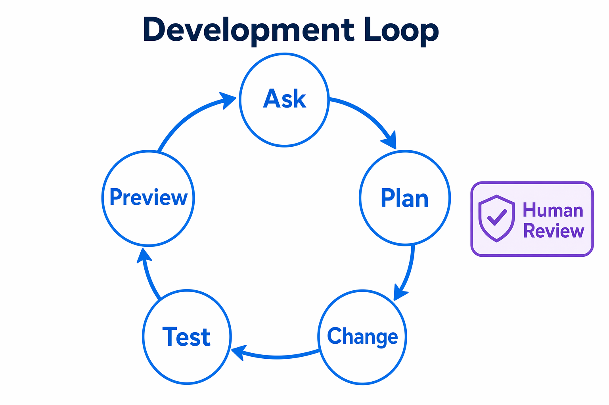
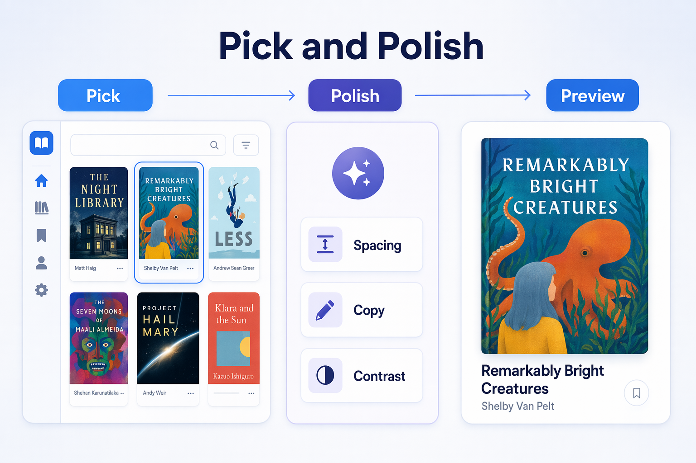

# Chapter 03: Development Workflows

> **What if the app could help you review, debug, test, preview, and polish a change without losing the evidence?**

In this chapter, you will use the GitHub Copilot App as a development loop for `samples/book-app-web`: ask, plan, change, test, preview, review the diff, and iterate.

## 🎯 Learning objectives

By the end of this chapter, you will be able to:

- Run code review workflows inside the app
- Debug a failing test or small behavior bug with agent help
- Ask Copilot to generate or update tests
- Use integrated terminal output as validation evidence
- Use the integrated browser or browser canvas to inspect runtime behavior
- Use rubber duck review to critique a plan or change

> ⏱️ **Estimated time**: ~60 minutes (25 min reading + 35 min hands-on)

---

## ✅ Prerequisites

Complete Chapters [00](../00-quick-start/README.md), [01](../01-first-steps/README.md), and [02](../02-sessions-worktrees-context/README.md).

You should have a session for the course repository and know where to find the session diff, terminal, and browser surfaces.

---

## 🧩 Real-world analogy: a builder's inspection loop

A careful builder does not hammer boards together and call the job done. They measure, build, test the fit, inspect the result, and adjust.

Copilot can help with the building, but you still inspect the evidence:

- Plan
- Diff
- Tests
- Terminal output
- Browser behavior
- Pull request review

## Core concepts

| Concept | Beginner explanation |
|---|---|
| Diff | The visible set of code changes made in a session |
| Validation | Evidence that the change works, usually tests, build output, and browser behavior |
| Integrated terminal | A terminal surface inside the app for running project commands |
| Integrated browser | A visible web preview surface for checking the running app |
| Rubber duck | Asking Copilot to critique or explain a plan or change before you accept it |



---

## Prepare the sample app

Use the session terminal for these commands:

```bash
cd samples/book-app-web
npm install
npm test -- --run
npm run build
```

- [app-screenshot: Integrated terminal showing a test command running or completed, with project-specific secrets and paths cropped if needed.]

### Expected output

You should see dependencies install, tests run, and a production build complete. If the training repo includes an intentionally failing scenario, record the failing test name and continue with the debugging exercise.

### How it works

Tests and builds are evidence. A confident chat response is not enough.

---

## Hands-on workflow 1: review a buggy area

Use this exact learner prompt in a session:

```text
Review @samples/book-app-web/src for issues related to filtering, unread counts, and reading statistics. Create a short checklist grouped by high, medium, and low risk. Do not edit files yet.
```

### Expected output

Copilot should produce a review checklist that points to likely files and behaviors.

> Demo output varies. Focus on whether the checklist is specific and testable.

### Success check

The review should mention behavior that you can verify with tests or browser interaction.

---

## Hands-on workflow 2: debug and fix a small issue

The default app passes tests. Before this workflow, follow the Issue 2 training-branch setup in [`samples/app-course-issues.md`](../samples/app-course-issues.md#issue-2-keep-unread-stats-correct-when-filters-are-active) so there is a real unread-count regression to fix.

Use this exact learner prompt:

```text
Fix the unread count when filters are active in samples/book-app-web. Keep the change small, explain the root cause, and run the relevant tests.
```

### Expected output

Copilot should make a focused change, explain the cause, and run or suggest a test command.

### Check the result

Run:

```bash
cd samples/book-app-web
npm test -- --run
```

If the app has a browser-visible behavior change, also run:

```bash
npm run dev -- --host 127.0.0.1 --port 5173
```

Then open the integrated browser to:

```text
http://127.0.0.1:5173
```

- [app-screenshot: Integrated browser or browser canvas showing the sample web app preview.]

---

## Hands-on workflow 3: ask for tests

Stay on the same training branch from the previous workflow.

Use this exact learner prompt:

```text
Add or update tests for the unread count behavior so the bug would fail before the fix and pass after the fix. Keep the tests focused on samples/book-app-web.
```

### Expected output

Copilot should add or update tests in the sample app test area.

### Success check

Run:

```bash
cd samples/book-app-web
npm test -- --run
npm run build
```

Both commands should complete before you treat the change as ready.

---

## Hands-on workflow 4: rubber duck review

Use this exact learner prompt:

```text
Act as a rubber duck reviewer for this session. Critique the plan, diff, tests, and browser validation. What should I double-check before creating a pull request?
```

- [app-screenshot: Diff view showing code changes alongside the conversation or validation output.]

### Expected output

Copilot should point out review areas, missing validation, or confidence checks.

> Demo output varies. Use the critique to improve your review, not to skip it.

<details>
<summary>Intermediate: Pick and Polish for UI work</summary>

Pick and Polish is the course name for a visible UI iteration loop:



1. Run `samples/book-app-web`.
2. Open the browser preview.
3. Pick or describe a visible area, such as a book card, filter panel, or reading stats area.
4. Ask Copilot to polish spacing, hierarchy, contrast, copy, accessibility, or responsive layout.
5. Preview the result.
6. Review the diff and run tests.

Use this exact learner prompt:

```text
Polish the book card UI in samples/book-app-web for spacing, visual hierarchy, accessible copy, and responsive behavior. Keep the design consistent with the existing app and show me the diff before I accept it.
```

- [app-screenshot: Pick and Polish live mode or relevant app UI showing selected browser element and polish options, with any user data hidden.]

Remember: visual polish can change accessibility and behavior. Always finish with diff review, tests, build, and browser validation.

</details>

---

## Notes and tips

- A passing agent response is not the same thing as validated software.
- The best evidence is visible: diff, tests, build output, browser behavior, and PR checks.
- Keep changes small when learning. It is easier to review and recover.
- Ask Copilot to explain the root cause instead of only producing a patch.

### Common beginner mistakes

- Accepting a fix because the chat response sounds confident
- Running tests in the wrong session worktree
- Treating visual polish as harmless without checking accessibility, responsive layout, and tests

<details>
<summary>Troubleshooting: development workflow issues</summary>

### Browser preview does not update

Check:

- The dev server is running in the correct worktree
- The browser points to the correct port
- Hot reload is active
- You are not viewing a different session's app

### Tests fail only in one session

Check:

- Dependency install status
- Branch contents
- Environment variables
- Generated files
- Whether another session changed the same files

### App windows must be visible to capture them

If you capture images for your notes, capture visible app windows only. Hidden or background sessions do not produce visible pixels for normal screenshot tools. Remove account names, private repository names, secrets, and organization-specific data.

</details>

---

## 🔑 Key takeaways

1. Use the app as a loop: ask, plan, change, test, preview, review, iterate.
2. Terminal and browser surfaces make agent work inspectable.
3. Tests and builds are required evidence.
4. Rubber duck review helps you pause before accepting or shipping.
5. Pick and Polish is useful for UI work, but it still needs validation.

---

## 📝 Assignment

Practice the full loop on a safe issue:

```text
Improve the empty-state copy in samples/book-app-web so it is clearer and more accessible. Propose a plan first, make the smallest useful change, run tests, run the build, and tell me what changed.
```

Then check:

1. Did Copilot explain the plan?
2. Did the diff stay focused?
3. Did tests pass?
4. Did the build pass?
5. Did the browser preview show the intended copy?

---

## ➡️ What's next

In Chapter 04, you will connect the development loop to GitHub work: issues, pull requests, review comments, failing checks, Fix actions, and advanced Agent Merge.

**[← Back to Chapter 02](../02-sessions-worktrees-context/README.md)** | **[Continue to Chapter 04 →](../04-github-workflows/README.md)**

---

## Source references

- [GitHub Copilot App GA changelog][ga-changelog]
- [GitHub Copilot App product blog][app-blog]
- [Working with canvas extensions][canvas-docs]
- [Working with agent sessions][agent-sessions]

[ga-changelog]: https://github.blog/changelog/2026-06-17-github-copilot-app-generally-available/
[app-blog]: https://github.blog/news-insights/product-news/github-copilot-app-the-agent-native-desktop-experience/
[canvas-docs]: https://docs.github.com/en/copilot/how-tos/github-copilot-app/working-with-canvas-extensions
[agent-sessions]: https://docs.github.com/en/copilot/how-tos/github-copilot-app/agent-sessions
