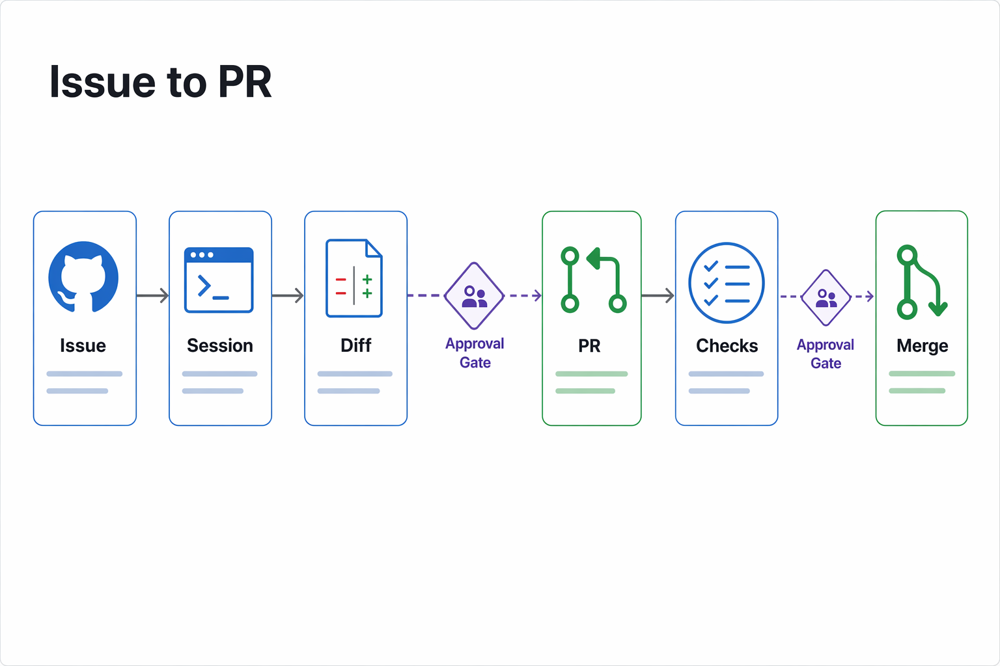
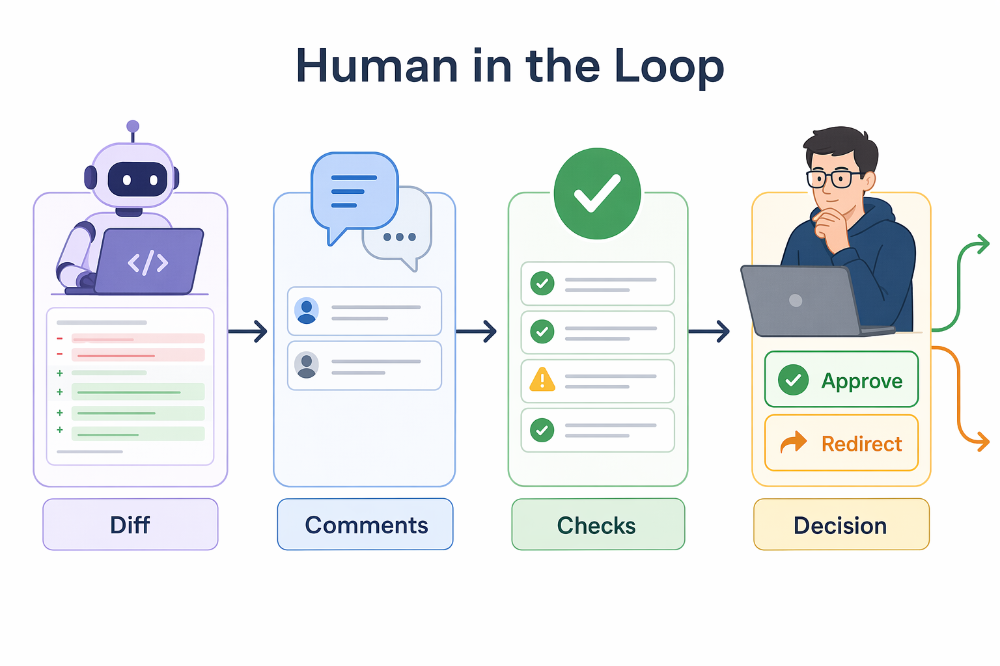

# Chapter 04: GitHub Workflows

> **What if issues, pull requests, review comments, checks, and merge readiness lived in the same supervised workflow?**

The GitHub Copilot App also helps you move work through GitHub: issues, pull requests, review comments, failing checks, and merge readiness. In this chapter, you will use My Work as your issue and pull request inbox, start sessions from GitHub context, review diffs, and use Fix actions safely.

## 🎯 Learning objectives

By the end of this chapter, you will be able to:

- Use My Work as an issue and pull request inbox
- Filter issues and PRs with search qualifiers
- Start sessions from issues and pull requests
- Review diffs and comments in the app
- Use Fix actions for review comments and failing CI
- Know when to open a PR in the external browser
- Understand why advanced Agent Merge still needs human judgment

> ⏱️ **Estimated time**: ~55 minutes (25 min reading + 30 min hands-on)

---

## ✅ Prerequisites

Complete Chapters [00](../00-quick-start/README.md) through [03](../03-development-workflows/README.md).

For the full hands-on flow, use a GitHub-backed training repository with seeded issues and PR scenarios. If you are self-paced, follow the [Training GitHub Scenarios setup guide](../appendices/training-github-scenarios.md) before starting this chapter. If you do not have permission to create PRs, read the steps and use screenshots or instructor-provided examples.

---

## 🧩 Real-world analogy: an airport control tower

An airport control tower does more than launch planes. It tracks incoming flights, runway status, weather, maintenance checks, and final clearance.

My Work is similar. It helps you see what needs attention before you launch, review, fix, or merge work.

## Core concepts

| Concept | Beginner explanation |
|---|---|
| My Work | An app view for GitHub issues, pull requests, review requests, and checks |
| Issue session | A session started with issue context already attached |
| Pull request session | A session connected to a PR so Copilot can inspect diff, comments, and checks |
| Fix action | A guided action that asks Copilot to address a review comment or failing check |
| CI check | An automated validation run, often from GitHub Actions |



---

## Hands-on workflow 1: find work in My Work

Open My Work and find:

- Issues assigned to you
- Pull requests authored by you
- Review requests
- Pull requests with failing checks

- [app-screenshot: My Work view showing issue and pull request sections with filters, using a safe sample repository.]

Try search qualifiers such as:

```text
repo:your-org-or-user/github-copilot-app-for-beginners is:issue is:open
```

```text
repo:your-org-or-user/github-copilot-app-for-beginners is:pr is:open
```

### Success check

You can explain whether a missing issue or PR is more likely caused by filters, permissions, repository selection, or organization policy.

---

## Hands-on workflow 2: start from an issue

Open a seeded issue for the sample app. Choose Issue 1 from [`samples/app-course-issues.md`](../samples/app-course-issues.md#issue-1-make-search-case-insensitive) and use its training-branch setup before asking Copilot to fix it:

```text
Search should be case-insensitive in samples/book-app-web
```

Start a Plan-mode session from the issue and use this exact learner prompt:

```text
Use this issue as the source of truth. Plan a small fix in samples/book-app-web, list the files you expect to change, and name the tests or browser checks that should prove the issue is fixed. Do not edit until I approve the plan.
```

- [app-screenshot: Issue detail page with New session button visible.]

### Expected output

Copilot should summarize the issue, propose a small plan, and identify validation steps.

> Demo output varies. Do not expect exact wording.

---

## Hands-on workflow 3: create or review a pull request

After completing and validating a small session, use the app's PR flow to open or inspect a pull request.

Before opening a PR, check:

- Diff is focused
- Tests passed
- Build passed
- Browser behavior was checked if UI changed
- PR description explains the change and validation

- [app-screenshot: Pull request Files changed tab or diff review surface inside the app.]

### Exact learner prompt for PR description help

```text
Draft a pull request summary for this session. Include what changed, why it changed, and validation performed. Do not claim checks passed unless you saw the terminal or CI output.
```

### Expected output

Copilot should draft a PR summary that you can edit before submitting.

> Demo output varies. Always review PR text before publishing it.

---

## Hands-on workflow 4: respond to a review comment

Open a PR with a safe review comment, such as clearer empty-state copy.

Use this exact learner prompt:

```text
Review this PR comment and propose the smallest change that addresses it. Show me the diff and validation plan before I accept the fix.
```

- [app-screenshot: Review comment or failing CI check with Copilot Fix action visible.]

### Expected output

Copilot should connect the comment to the relevant file, propose a focused fix, and suggest validation.

### Success check

You can explain whether the comment is fully addressed and whether the fix changes anything unrelated.

---

## Hands-on workflow 5: fix a failing check safely

Open a PR with a failing check or use an instructor-provided example.

Use this exact learner prompt:

```text
Analyze the failing check. Explain the failure, identify the likely file in samples/book-app-web, propose a minimal fix, and tell me which command should pass afterward.
```

### Expected output

Copilot should summarize the failing check and suggest a minimal fix.

### Check the result

When the failure is related to the sample app, run:

```bash
cd samples/book-app-web
npm test -- --run
npm run build
```

Do not mark the PR ready until local validation and CI evidence agree.

<details>
<summary>Advanced: Agent Merge</summary>

Agent Merge is an advanced finishing workflow. It can help carry a pull request through review comments, checks, and merge requirements in a safe training scenario, but it is not a substitute for understanding the work.



- [app-screenshot: ADVANCED: Agent Merge control or merge drawer in a safe training repository before enabling it.]

Use Agent Merge only when:

- The PR is small and well-scoped
- You reviewed the diff
- Required checks are meaningful
- Review comments are understood
- Branch protection and merge rules are clear
- The repository is safe for training or your team has approved the workflow

Do not use Agent Merge when:

- You do not understand the diff
- Checks are missing, flaky, or unrelated
- The PR touches secrets, auth, permissions, billing, production data, or deployment logic
- Your organization policy does not allow it
- You are working in a public or upstream repository where you lack merge rights

Exact learner prompt for a safe orientation:

```text
Explain whether this training PR is a good candidate for Agent Merge. Consider diff size, tests, review comments, branch protection, and what I should inspect before enabling it.
```

> Demo output varies. Treat the response as a checklist, not permission to merge.

</details>

---

## Notes and tips

- My Work reflects GitHub data and permissions.
- If a learner cannot see an issue, PR, review request, or check, verify repository access and filters first.
- Fix actions are helpers, not approvals.
- Open the PR in the browser when you need GitHub settings, branch protection details, full Actions logs, or repository administration controls.

### Common beginner mistakes

- Assuming My Work shows every issue or PR regardless of filters and permissions
- Letting a Fix action change more than the failing check or review comment requires
- Treating Agent Merge as a shortcut before understanding the diff, checks, and branch rules

<details>
<summary>Troubleshooting: GitHub workflow issues</summary>

### I cannot see an issue or PR

Check:

- Repository access
- Current account
- Organization membership
- My Work filters
- Search qualifiers
- Whether the issue or PR is in a fork

### A check fails locally or in CI only

Check:

- GitHub Actions secrets
- Hosted service dependencies
- Node version differences
- Branch protection
- Whether the failing workflow is unrelated to your change

### A PR is still blocked after the fix

Triage in this order:

1. Failing checks
2. Merge conflicts
3. Required reviews
4. Stale approvals
5. Branch protection
6. Agent Merge configuration if using the advanced flow

### I cannot push to the repository

Public or shared training repositories may require forks. Ask your instructor or repository owner which workflow is expected.

</details>

---

## 🔑 Key takeaways

1. My Work turns GitHub issues and PRs into an app workflow surface.
2. Starting from an issue gives Copilot better task context.
3. PR review still belongs to the human.
4. Fix actions can help with comments and failing checks, but you inspect the diff and validation.
5. Agent Merge is advanced and should be used only after clear review checkpoints.

---

## 📝 Assignment

Use a training issue or instructor-provided scenario:

```text
Start from an issue in My Work, create a Plan-mode session, propose a fix for samples/book-app-web, validate it locally, and draft a PR summary that only claims evidence you actually saw.
```

Then answer:

1. What issue did you start from?
2. What changed?
3. What tests or checks passed?
4. What would make this PR unsafe to merge automatically?

---

## ➡️ What's next

Chapter 05 will show how settings and instructions make app sessions safer, more consistent, and easier to review.

**[← Back to Chapter 03](../03-development-workflows/README.md)** | **[Continue to Chapter 05 →](../05-settings-and-instructions/README.md)**

---

## Source references

- [Managing issues and pull requests in the GitHub Copilot App][issues-prs]
- [Getting started with the GitHub Copilot App][getting-started]
- [GitHub Copilot App GA changelog][ga-changelog]
- [GitHub Copilot App product blog][app-blog]

[issues-prs]: https://docs.github.com/en/copilot/how-tos/github-copilot-app/managing-issues-and-pull-requests
[getting-started]: https://docs.github.com/en/copilot/how-tos/github-copilot-app/getting-started
[ga-changelog]: https://github.blog/changelog/2026-06-17-github-copilot-app-generally-available/
[app-blog]: https://github.blog/news-insights/product-news/github-copilot-app-the-agent-native-desktop-experience/
