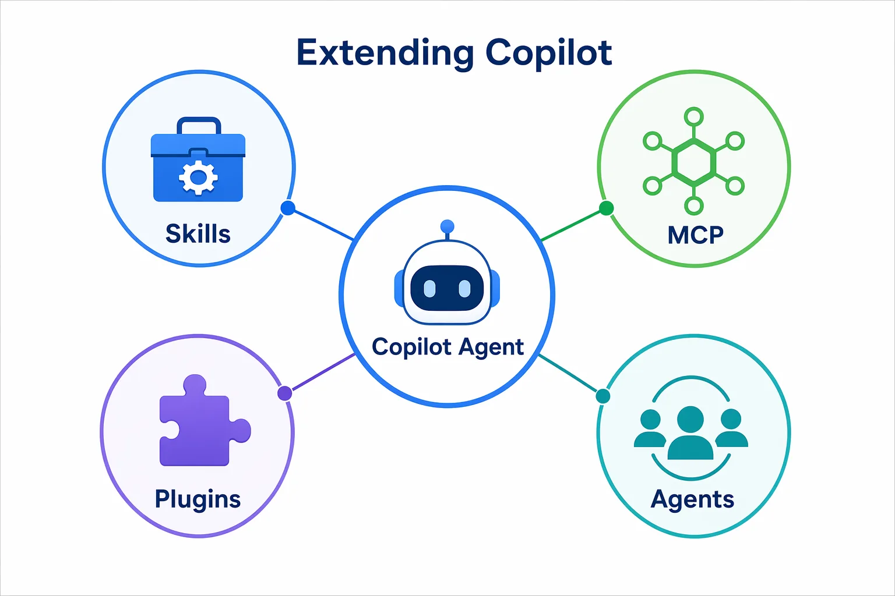
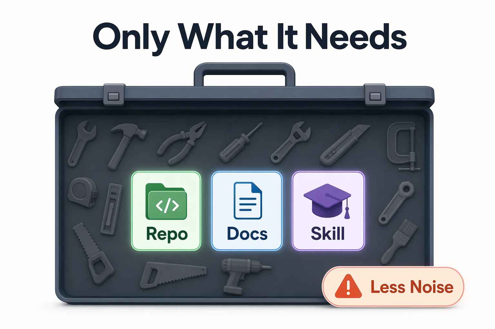

<!--
---
id: CopilotApp-05
title: !translate Skills, MCP Servers, and Plugins
description: !translate Extend the GitHub Copilot App with repo-local skills, and learn where optional MCP servers, plugins, and custom agents fit.
audience: Developers / Students / Desktop users
slug: skills-mcp-servers-and-plugins
weight: 6
---
-->


> **What if Copilot could reuse your team's review checklist without gaining any new external access?**

This chapter starts with the safest extension point: Repo-local skills. A skill is reusable guidance stored in the repository. It helps Copilot approach a task consistently while keeping the beginner path local, reviewable, and credential-free.

Model Context Protocol (MCP) servers, plugins, model providers, and custom agents are useful too, but they introduce extra setup, permissions, or policy decisions. You'll see them later in collapsible optional sections.

## 🎯 Learning Objectives

By the end of this chapter, you'll be able to:

- Explain when skills are useful
- Inspect the repo-local `book-app-reviewer` skill included with the course
- Use a skill-guided review prompt in a Copilot app session
- Use `/skills` or the slash palette to discover available skills when supported
- Explain the difference between reusable expertise and optional external tool access
- Choose least-context and least-tool setups
- Locate, but not depend on, optional MCP server, plugin, model provider, and custom agent settings

> ⏱️ **Estimated Time**: ~55 minutes (20 min reading + 35 min hands-on)

---

## ✅ Prerequisites

Before starting:

- Complete Chapter 04
- Have the course repository open in the GitHub Copilot app
- Use `samples/book-app-web` for all hands-on prompts
- Keep the beginner path repo-local

---

## 🧩 Real-World Analogy: A Checklist on the Workbench

Imagine a bike repair shop. A mechanic may be skilled, but the shop still posts a checklist near the bench:


| Checklist item | Why it helps |
|---|---|
| Check brakes | Safety |
| Check tire pressure | Reliability |
| Check chain tension | Performance |
| Test ride before pickup | Validation |

A skill is like that checklist. It does not give the mechanic a new tool. It reminds them how this shop wants the job done.

---

## Core Concepts

### Skills First

Skills package task-specific instructions in a folder with a `SKILL.md` file.

| Extension type | Beginner meaning | Required for this chapter? |
|---|---|---|
| Skills | Reusable expertise and checklists | Yes |
| MCP servers | External tools or live data | No |
| Plugins | Bundled capabilities that may include tools, skills, or agents | No |
| Custom agents | Specialized roles selected with `/agent` | No |



<!-- app-screenshot: Skills settings showing installed or available skills. -->

This may appear under Settings, Skills, Plugins, or Agents depending on your app version.

> 💡 **Tip**: A skill changes how Copilot approaches work. It does not automatically give Copilot access to new external systems.

### Where Repo-Local Skills Live

Use this structure:

```text
.github/
└── skills/
    └── book-app-reviewer/
        └── SKILL.md
```

Repo-local skills are ideal for this course because:

- They are version controlled
- Teammates can review them
- They do not require API keys
- They keep the beginner path predictable

---

## Hands-On Example 1: Inspect the `book-app-reviewer` Skill

This repository already includes the skill so you can inspect it before using it:

```text
.github/skills/book-app-reviewer/SKILL.md
```

Open that file and confirm it includes guidance for:

- accessibility
- responsive layout
- testing and validation commands
- safe, focused changes

If your app shows `/skills` in the slash command palette, use it as an optional discovery step:

```text
/skills list
```

The output should show skills Copilot can find from built-in, user, plugin, or project locations. If `/skills` is not available, continue by inspecting the repo-local skill file directly.

If you'd like to rebuild it manually for practice, copy the existing file to a scratch folder first. Don't overwrite the course copy during the beginner path.

### Expected Result

You now know what the skill tells Copilot to care about before it reviews `samples/book-app-web`.

### How It Works

Copilot can use the skill when your prompt matches the skill description. You can also refer to the skill by name in your prompt.

Some installed skills also appear as direct slash commands, such as `/skill-name`. Those commands vary by environment, so treat the slash palette as the source of truth.

If you're unsure whether the skill was used, explicitly name `book-app-reviewer` in the prompt and ask Copilot which checklist items from the skill it considered.

---

## Hands-On Example 2: Compare Generic Review and Skill-Guided Review

Open a new Plan or Interactive session in the app. Try a generic prompt first:

```text
Review @samples/book-app-web for one beginner-friendly improvement. Do not edit files yet.
```

Then try a skill-guided prompt:

```text
Use the book-app-reviewer skill to review @samples/book-app-web for one small accessibility or responsive layout improvement. Do not edit files yet.
```

Demo output varies. Look for differences in focus, not exact wording.

### Expected Output

The skill-guided response should be more likely to mention accessibility, responsive layout, tests, validation commands, and safe change boundaries.

### How It Works

The prompt and skill description point at the same concerns, so Copilot has a clearer reason to use the skill.

---

## Hands-On Example 3: Use the Skill Before a Real Change

Ask Copilot to plan a small improvement:

```text
Using the book-app-reviewer skill, create a plan to improve the empty-state copy in @samples/book-app-web. Keep the change small and include validation commands. Do not edit files yet.
```

Pause and inspect the plan before allowing implementation.

### Expected Result

The plan should include:

- The likely files to inspect
- A small copy or accessibility improvement
- Validation with:
  - `cd samples/book-app-web`
  - `npm test -- --run`
  - `npm run build`

Demo output varies.

---

<details>
<summary>Intermediate: MCP servers are optional external tool access</summary>

MCP servers connect Copilot to tools or live data, such as GitHub data, documentation, or internal services. They can help a lot, but authentication and organization policy can vary.

Beginner rule:

| Question | Recommendation |
|---|---|
| Do I need external live data? | If no, use repo files and skills first |
| Do I need GitHub issue or PR data? | Use built-in GitHub integration when available |
| Do I need third-party docs or tools? | Add only the MCP server required for the task |



<!-- app-screenshot: INTERMEDIATE: MCP servers settings showing built-in, plugin, or on-device server grouping. -->

If an MCP server does not work, check authentication, environment variables, enabled status, and whether the session needs to restart.

</details>

<details>
<summary>Intermediate: Plugins, model providers, and model strategy are orientation-only here</summary>

Plugins can bundle capabilities such as tools, skills, agents, or canvas extensions. Model providers can affect which models are available to sessions.

Don't require plugin installation for this chapter. Instead, learn where the controls are and how to disable capabilities you don't need.

Beginner model strategy:

| Task | Suggested approach |
|---|---|
| Quick explanation | Use a faster model and lower reasoning |
| Planning a code change | Use enough reasoning to compare options |
| Debugging failing tests | Use a stronger model if the failure is subtle |
| Large multi-file change | Keep context tight before increasing model capability |

<!-- app-screenshot: INTERMEDIATE: Plugins settings showing install/manage/enable/disable controls. -->

Least-tool principle:

1. Start with repository context and a skill.
2. Add an MCP server only when the task needs external data.
3. Enable plugins intentionally.
4. Remove or disable capabilities that create noise.

</details>

<details>
<summary>Advanced: Custom agents and `/agent`</summary>

Custom agents are specialized roles. They are useful when you repeatedly need a persona such as security reviewer, documentation writer, or release manager.

Use `/agent` only after you're able to explain why a role is better than a skill for the task.

<!-- app-screenshot: ADVANCED: `/agent` picker showing available built-in, custom, plugin, or user agents, with personal details hidden. -->

| Use a skill when... | Use a custom agent when... |
|---|---|
| You need a repeatable checklist | You need a specialist persona |
| The normal agent can do the work | The workflow needs a different role |
| You want repo-local, lightweight guidance | You need reusable behavior across many tasks |

</details>

---

## Notes and Tips

- Skills belong on the beginner path because they are easy to inspect and version control.
- MCP servers and plugins expand what the agent can see or do. Add only what the workflow requires.
- If a capability appears in settings but not in a session, check project scope, enabled state, and whether the session needs restarting.

### Common Beginner Mistakes

- Installing MCP servers or plugins before proving the task needs external data
- Treating a skill as a secret tool instead of a reviewable instruction file
- Letting too many enabled tools distract a simple review task

<details>
<summary>Troubleshooting: Skills and extension issues</summary>

| Problem | What to check |
|---|---|
| Skill does not seem to apply | Skill path, `SKILL.md` filename, description keywords, session restart |
| Copilot gives generic advice | Mention `book-app-reviewer` and `@samples/book-app-web` explicitly |
| MCP server fails | Authentication, environment variables, enabled status, app reload |
| Plugin feature not visible | Plugin enabled state, project scope, app version |
| Too many irrelevant suggestions | Disable unused tools and keep prompt context narrower |

</details>

---

## 🔑 Key Takeaways

1. Start extension work with repo-local skills.
2. A skill provides reusable expertise, not automatic external access.
3. MCP servers and plugins are optional because they may require credentials or policy decisions.
4. Custom agents are advanced role-based workflows.
5. Give the agent only the tools and context it needs.

---

## 📝 Assignment

Improve the `book-app-reviewer` skill:

1. Add one rule about empty-state copy.
2. Add one rule about validating responsive layout in the browser.
3. Ask Copilot to review the skill for clarity.
4. Use the skill in a Plan-mode prompt against `@samples/book-app-web`.

Success criteria: You're able to explain why the required exercise uses a repo-local skill instead of MCP, plugins, or custom agents.

---

## ➡️ What's Next

In Chapter 06, you'll inspect a prepared canvas concept to see how agent work can become visible and steerable. Creating canvases is saved for an advanced section.

**[← Back to Chapter 04](../04-github-workflows/README.md)** | **[Next: Canvases →](../06-canvases/README.md)**

---

## Source References

- [Customizing the GitHub Copilot app](https://docs.github.com/en/copilot/how-tos/github-copilot-app/customize-github-copilot-app)
- [Optimizing AI usage](https://docs.github.com/en/copilot/tutorials/optimize-ai-usage)
- [GitHub Copilot app changelog](https://github.com/github/app/blob/main/changelog.md)
