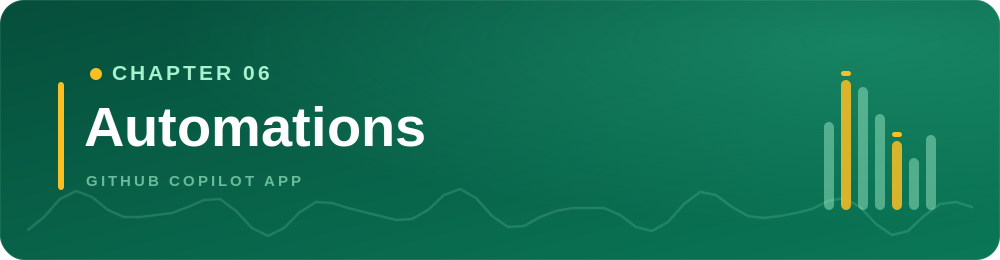
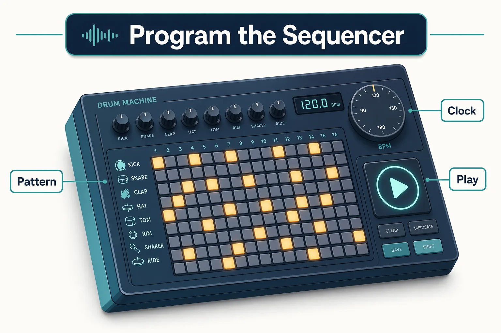
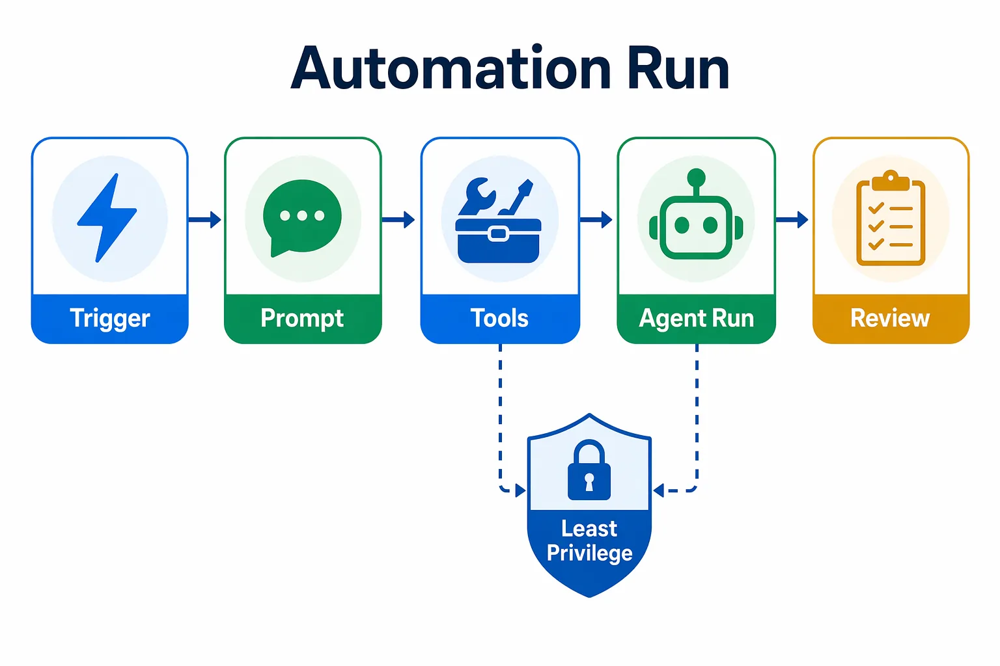
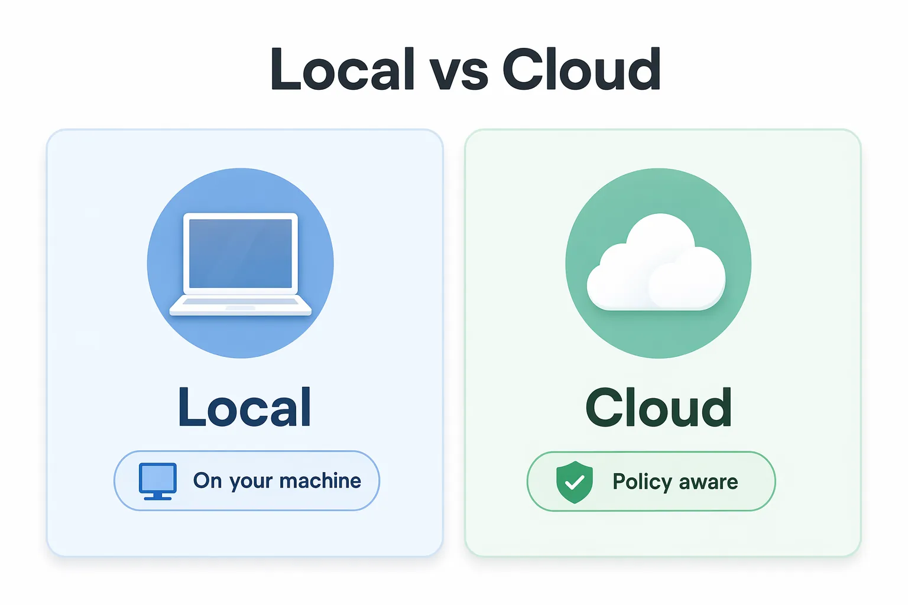

<!--
---
id: CopilotApp-06
title: !translate Automations
description: !translate Turn repeatable Copilot prompts into manual, scheduled, and cloud automations with least-privilege tool selection.
audience: Developers / Students / Desktop users
slug: automations
weight: 7
---
-->



> **What if your recurring Copilot prompt became a reusable button?**

Automations let you save repeatable agent work. You'll start with a manual automation that runs only when you choose. Scheduled, cloud, and issue-triggered automations appear later because they can involve policy, billing, and permission decisions.

## 🎯 Learning Objectives

By the end of this chapter, you'll be able to:

- Explain when to automate recurring agent work instead of starting a manual session
- Create and test an on-demand local automation
- Review automation run history, status, errors, and selected tools
- Apply least-privilege tool selection
- Understand scheduled automations as an intermediate next step
- Recognize cloud and issue-triggered automations as advanced workflows

> ⏱️ **Estimated Time**: ~50 minutes (20 min reading + 30 min hands-on)

---

## ✅ Prerequisites

Before starting:

- Complete Chapter 05
- Open the course repository in the GitHub Copilot App
- Use `samples/book-app-web` for validation examples
- Have a GitHub-backed repository if you want live PR or issue summaries

---

## 🧩 Real-World Analogy: Programming the Sequencer

A producer does not replay the same drum pattern by hand every night. They program it into a sequencer once and let it run when needed:



| Sequencer | App automation |
|---|---|
| Programmed pattern | Saved prompt |
| Hit play | Manual trigger |
| Run on the clock | Schedule |
| Chosen instruments | Selected tools |
| Producer checks the mix | Human reviews the result |

Start with a manual automation so you can test the prompt safely before giving it a schedule or trigger.

---

## Core Concepts

### Automation Is a Saved Agent Run

An automation has four beginner-friendly parts:

| Part | Question |
|---|---|
| Trigger | What starts it? |
| Prompt | What should the agent do? |
| Tools | What is the least access needed? |
| Review path | Where do I inspect the result? |



### Start Manual

Manual automations run on demand. They're the safest first step because you can:

- test the prompt
- inspect output
- adjust scope
- avoid surprise runs
- confirm tools are minimal

---

## Hands-On Exercises

In these exercises, you'll:

- Create a manual PR summary automation
- Run it and inspect its history
- Create a manual validation reminder automation

### 1. Create a Manual PR Summary Automation

This exercise works best after Chapter 03 has created at least one PR. If your training repository has no open PRs yet, skip to the local validation reminder in Exercise 3, then come back later.

Create an automation named:

```text
Book app PR summary
```

Use a manual trigger.

Use this UI path if your app exposes automation creation: Open **Automations**, choose **New automation**, select **Manual trigger**, paste the prompt, select the smallest read-only tool set, save, then run it.

<!-- app-screenshot: New automation form showing trigger choices such as Manual, On a schedule, and When an issue is created. -->

Use this prompt:

```text
Summarize open pull requests for this training repository. Focus on PR title, current status, failing checks if visible, and the next human review action. Do not modify files, create comments, approve reviews, or merge anything.
```

Tool guidance:

- Allow read-only repository or GitHub context if available.
- Do not grant write-capable tools for this beginner exercise.
- Keep the automation local if local automations are available in your setup.

#### Expected Output

The run should produce a short PR summary and a suggested next human action.

Demo output varies. Repository state, permissions, and available tools will change the result.

#### How It Works

The automation saves the prompt and trigger so you can run the same bounded task again later. The selected tools control what the agent can inspect or do.

---

### 2. Run It and Inspect History

Run the automation manually. Then open the run details.

<!-- app-screenshot: Automations tab showing saved automations with name, schedule, repository, and last run status. -->

Look for:

- run status
- timestamp
- prompt used
- selected tools
- result summary
- error text if the run failed

<!-- app-screenshot: Automation run detail or error state with copyable error text visible, using a safe sample workflow. -->

#### Pause Point

Before editing the automation, ask:

1. Did the prompt ask for one bounded task?
2. Did the automation have only the tools it needed?
3. Did the result need human review?
4. Would this be safe to run again?

---

### 3. Create a Manual Validation Reminder

Create another manual automation for local project validation:

```text
Book app validation reminder
```

Prompt:

```text
Create a validation checklist for the current session before a pull request is opened. Include these commands exactly:

cd samples/book-app-web
npm install
npm test -- --run
npm run build

If browser validation is needed, include:

cd samples/book-app-web
npm run dev -- --host 127.0.0.1 --port 5173

Do not run commands or edit files. Return the checklist only.
```

#### Expected Output

The automation should return a checklist. It should not modify files or run commands.

Demo output varies, but the commands should remain exact.

---

<details>
<summary>Intermediate: Scheduled automations</summary>

After a manual automation works reliably, you can consider a schedule.

Good candidates:

- daily PR summary
- weekly dependency review summary
- morning issue triage summary

Use a schedule only when the prompt is bounded and the result has a review path.

Before scheduling, narrow:

- repository scope
- branch or label filters
- read/write tools
- expected output format

</details>

<details>
<summary>Advanced: Cloud automations</summary>

Cloud automations can run when your machine is off, but they can depend on:

- organization policy
- repository cloud-agent settings
- billing
- selected tools
- permissions

Use cloud automations only after the manual version works and after you understand the permission model.



<!-- app-screenshot: ADVANCED: Cloud automation tool selection area showing least-privilege tool choices, with any repository details anonymized. -->

</details>

<details>
<summary>Advanced: Issue-created triggers</summary>

Issue-triggered automations can respond when an issue is created. This is advanced because a broad trigger can run too often or act on untrusted input.

Safer pattern:

1. Start read-only.
2. Limit repository scope.
3. Filter by label.
4. Avoid write tools until the summary is reliable.
5. Review run history before expanding permissions.

If an issue-triggered automation fires too often, narrow the issue search query, label filter, or repository scope before adding write-capable tools.

</details>

---

## Troubleshooting

<details>
<summary>Automation issues</summary>

| Problem | What to check |
|---|---|
| Local automation does not run | App availability, project still connected, local tools and credentials |
| PR summary is empty | Repository permissions, filters, whether there are open PRs |
| Cloud automation unavailable | Organization policy, repository settings, billing, selected tools |
| Scheduled run is noisy | Prompt scope, schedule frequency, repository or label filters |
| Automation made surprising suggestions | Remove tools, make the prompt more bounded, add explicit non-goals |

</details>

---

## 🔑 Key Takeaways

1. Automations turn repeatable prompts into reusable runs.
2. Manual automations are the safest first step.
3. Every automation needs a trigger, prompt, tool set, and review path.
4. Scheduled automations are intermediate because they run without you clicking each time.
5. Cloud and issue-triggered automations are advanced because policy, billing, and permissions matter.
6. Apply least privilege: give an automation only the tools it needs, and keep write actions out of early automations that read issue content, which can carry prompt-injection risk.

---

## 📝 Assignment


Create one manual automation for your own workflow:

1. Name it clearly.
2. Use a manual trigger.
3. Write a prompt with one bounded task.
4. Give it only read-only tools if possible.
5. Run it once.
6. Inspect the run history and revise the prompt.

Success criteria: You're able to explain why the automation is safe to run again.

---

## 🎓 Course Complete

That's the full course. You've gone from setup and orientation through sessions, worktrees, and context; the development-and-GitHub workflow loop; skills, MCP servers, and plugins; canvases; and automations — always keeping a human in control of quality and delivery.

For a recap of everything you practiced, see [Wrapping Up](../README.md#wrapping-up) on the course home page.

**[← Back to Chapter 05](../05-canvases/README.md)** | **[Return to Course Home →](../README.md)**

---

## Source References

- [Using automations in the GitHub Copilot App](https://docs.github.com/en/copilot/how-tos/github-copilot-app/using-automations)
- [GitHub Copilot App generally available](https://github.blog/changelog/2026-06-17-github-copilot-app-generally-available/)
- [GitHub Copilot App product blog](https://github.blog/news-insights/product-news/github-copilot-app-the-agent-native-desktop-experience/)
