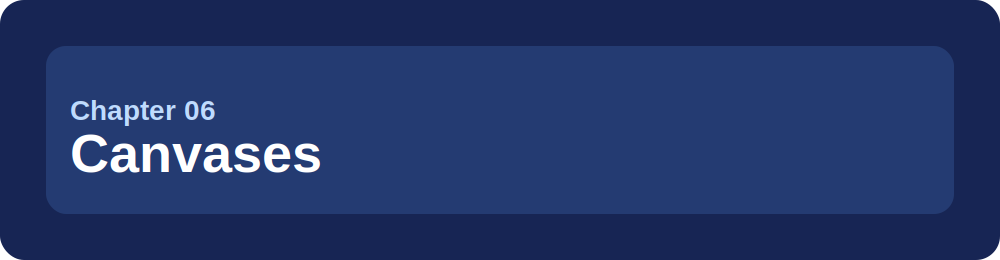
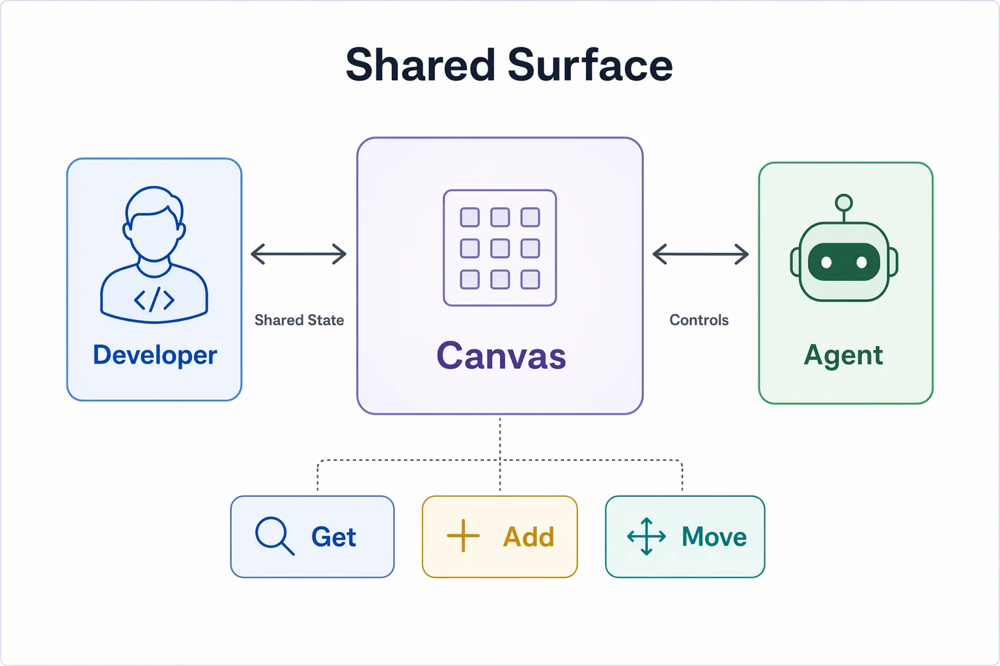
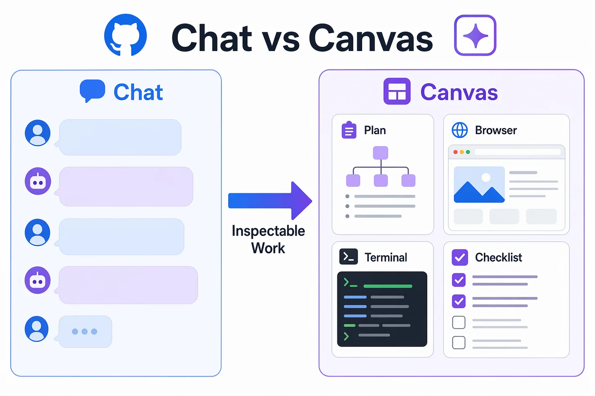

> **What if the agent's work was not trapped in a chat transcript?**

Chat works well for conversation. Some work is easier to understand when it lives on a visible surface: a checklist, browser preview, terminal output, release board, or plan that both you and Copilot can update.

That shared surface is a canvas. In this chapter, you'll inspect a prepared canvas concept first. Creating new canvas extensions is advanced and optional.

## 🎯 Learning objectives

By the end of this chapter, you'll be able to:

- Explain why canvases exist and when chat is the wrong shape for the job
- Use a prepared canvas concept for a release checklist or issue triage workflow
- Recognize canvases as shared surfaces for plans, browser sessions, terminals, dashboards, documents, and structured workflows
- Use canvas controls when your app supports them, or simulate canvas state with a checklist when it does not
- Explain the difference between chat history and shared canvas state

> ⏱️ **Estimated time**: ~45 minutes (15 min reading + 30 min hands-on)

---

## ✅ Prerequisites

Before starting:

- Complete Chapter 05
- Open the course repository in the GitHub Copilot app
- Confirm the repository includes the prepared release checklist concept under `.github/extensions/release-checklist`
- Use `samples/book-app-web` as the sample app path

---

## 🧩 Real-world analogy: a whiteboard in a team room

Imagine a team planning a release. They could discuss every task in a chat thread, but a whiteboard works better:

| Chat thread | Whiteboard |
|---|---|
| Good for discussion | Good for shared state |
| Hard to scan later | Easy to inspect at a glance |
| Mostly linear | Can show boards, lists, previews, and controls |
| Updates are buried | Updates are visible |

A canvas is the app's whiteboard for human-agent work.

---

## Core concepts

### A canvas is shared state plus controls

A canvas can be more than a prettier response. It can include:

- visible state
- UI controls
- agent-callable capabilities
- artifacts such as plans, checklists, dashboards, browser previews, terminals, or documents



### When to use a canvas

| Use chat when... | Use a canvas when... |
|---|---|
| You need a quick answer | You need visible state |
| The task is short | The task has multiple steps |
| The result can be text | The result needs controls or inspection |
| You don't need to revisit it | You want a reusable work surface |



---

## Hands-on example 1: inspect the prepared release checklist concept

Use the prepared canvas concept included with this repository. Do not create a new canvas yet.

1. Open `.github/extensions/release-checklist/README.md`.
2. Read the checklist items and the expected canvas behavior described in the concept.
3. Compare the checklist with the validation commands in `samples/book-app-web/README.md`.
4. Decide which items should be checked manually before a pull request.
5. This folder is a design concept, not a loadable extension. If your instructor provides a working release checklist canvas, open it from the canvas panel. Otherwise, continue with the markdown simulation.

- [app-screenshot: Right-side canvas panel showing a plan, checklist, browser session, terminal session, or markdown artifact open inside the GitHub Copilot App.]

### Release checklist concept

Use this checklist shape to simulate the shared state a canvas would track for `samples/book-app-web`:

```text
Release checklist for samples/book-app-web:

- Install dependencies
- Run tests
- Build the app
- Start browser preview
- Inspect empty state copy
- Review diff before PR
```

### Expected result

You'll want to understand what the prepared canvas is meant to show before you simulate it or try it in the app. If your app build supports project-scoped canvas extensions, the same checklist becomes visible state learners can inspect and update.

### How it works

The course starts with the concept because canvas extension support and app packaging can change. The beginner idea is stable: shared state is easier to inspect than a long chat thread.

---

## Hands-on example 2: simulate canvas state while validating the sample app

Run the sample app commands and update the checklist state as you go. If your app build supports project-scoped canvas extensions, you can use the visible canvas. If it doesn't, keep the checklist in the conversation or in a scratch note.

```bash
cd samples/book-app-web
npm install
npm test -- --run
npm run build
```

For browser validation:

```bash
cd samples/book-app-web
npm run dev -- --host 127.0.0.1 --port 5173
```

Prompt Copilot:

```text
Use the release checklist concept to track validation for samples/book-app-web. Mark only the steps that have evidence from terminal or browser output. If a visible canvas is not available, return the checklist as markdown.
```

- [app-screenshot: Canvas controls being used to update shared state, such as moving a card or checking an item.]

Demo output varies. What matters is that the checklist state matches evidence you're able to inspect.

### Expected output

- Terminal output shows install, test, and build evidence
- Browser preview runs at `127.0.0.1:5173`
- Checklist or canvas state matches what you actually verified

---

## Hands-on example 3: use a canvas concept as a planning surface

Ask Copilot:

```text
Create a short plan using the release checklist concept for improving empty-state copy in @samples/book-app-web. Include a pause point before any code changes. If a visible canvas is available, put the plan there. Otherwise, return the plan as a small markdown checklist.
```

Before approving implementation, check that the plan includes:

1. The file or component to inspect
2. A small proposed copy improvement
3. Validation commands
4. A pause point before editing files

### Why this matters

Canvas-style planning keeps the control points visible. You don't have to scroll through the full chat to find the current state.

---

<details>
<summary>Advanced: project-scoped and user-scoped canvases</summary>

Prepared canvases can live in different places:

| Location | Scope | Best for |
|---|---|---|
| `.github/extensions` | Project or team | Shared course and team workflows |
| `~/.copilot/extensions` | User | Personal experiments |

Project-scoped canvases can become team assets. User-scoped canvases are better for experiments that should not be committed.

</details>

<details>
<summary>Advanced: canvas authoring and `/create-canvas`</summary>

Create or revise a canvas only after you're comfortable with the prepared canvas concept.

Optional stretch prompt:

```text
/create-canvas Create a simple release checklist canvas for samples/book-app-web with items for install, test, build, browser preview, and PR review.
```

- [app-screenshot: ADVANCED: `/create-canvas` prompt or resulting canvas extension workflow, using a simple issue triage or release checklist example.]

Pause before accepting generated extension code. Inspect:

- capability names
- input schemas
- stored state
- UI controls
- whether any private data is included

If a canvas fails to open after edits, check extension dependencies, reload requirements, syntax errors, and whether the app is reading the project-scoped or user-scoped extension.

</details>

---

## Notes and tips

- Treat canvas contents as potentially shareable artifacts.
- Do not put secrets, customer data, private repository names, tokens, or unreleased business details in course canvases.
- A canvas action should match visible state. If the UI says an item moved, verify it moved.
- Use canvases when you need progress to stay visible over time.

### Common beginner mistakes

- Using a long chat thread when a checklist or plan surface would be easier to inspect
- Assuming a canvas changed state without checking the visible result
- Putting private data into a reusable canvas artifact or screenshot

<details>
<summary>🔧 Troubleshooting</summary>

| Problem | What to check |
|---|---|
| Canvas does not open | Extension location, app reload, syntax errors, dependencies |
| Button updates the wrong state | Capability name, input schema, stored state mapping |
| Agent says it updated the canvas but UI did not change | Refresh the canvas, inspect visible state, ask for evidence |
| Sensitive data appears | Remove it, regenerate safe sample data, retake screenshots |
| Browser or terminal validation is stale | Confirm the command ran in the correct `samples/book-app-web` worktree |

</details>

---

## 🔑 Key takeaways

1. Chat is for conversation. Canvases are for visible, shared work.
2. A canvas combines state, UI controls, and optional agent-callable capabilities.
3. Start with prepared canvas concepts before authoring your own.
4. Use canvases to expose pause points and validation evidence.
5. Keep private data out of reusable canvas artifacts.

---

## 📝 Assignment

Use the prepared canvas concept to run a validation checklist:

1. Add checklist items for `npm install`, `npm test -- --run`, `npm run build`, and browser preview.
2. Run the commands for `samples/book-app-web`.
3. Mark each item only after you've got evidence.
4. Ask Copilot to summarize what remains unchecked.

Success criteria: You're able to explain the difference between a chat answer and shared canvas state.

---

## ➡️ What's next

In Chapter 07, you'll turn repeatable prompts into automations. You'll start with manual automations before trying schedules or cloud/event-triggered workflows.

**[← Back to Chapter 05](../05-skills-mcp-plugins/README.md)** | **[Next: Automations →](../07-automations/README.md)**

---

## Source references

- [Working with canvas extensions](https://docs.github.com/en/copilot/how-tos/github-copilot-app/working-with-canvas-extensions)
- [GitHub Copilot app generally available](https://github.blog/changelog/2026-06-17-github-copilot-app-generally-available/)
- [GitHub Copilot app product blog](https://github.blog/news-insights/product-news/github-copilot-app-the-agent-native-desktop-experience/)
