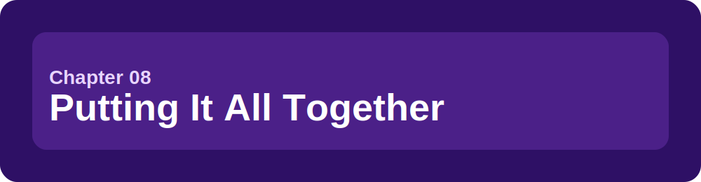
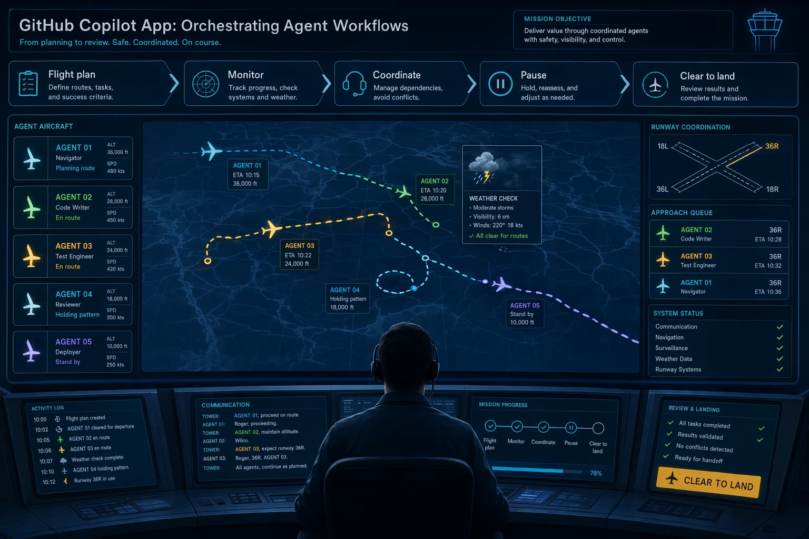
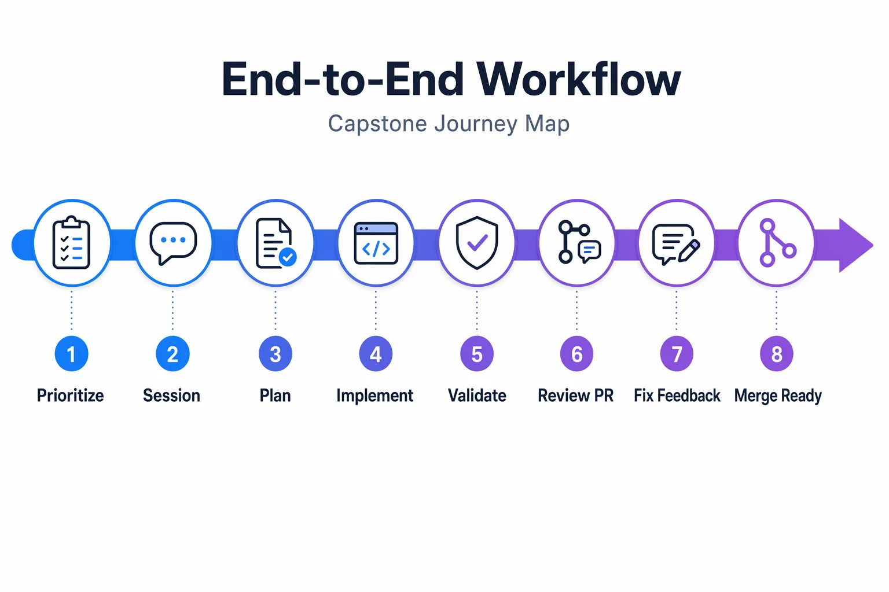

> **Now you get to run the whole workflow without losing control.**

You've worked through the pieces: Settings orientation, sessions, worktrees, context, development loops, GitHub workflows, skills, canvases, and automations. This final chapter combines them into a capstone workflow from issue triage to pull request readiness.

The beginner path uses one session first. Parallel sessions, Model Context Protocol (MCP), automations, and Agent Merge appear inside advanced or capstone sections with explicit pause points.

## 🎯 Learning objectives

By the end of this chapter, you'll be able to:

- Move from issue triage to implementation to review to merge readiness
- Delegate independent work safely when appropriate
- Use instructions, rubber duck, canvases, and GitHub integration together
- Use `/chronicle` to summarize work and understand cost tips
- Recognize pause points where you'll inspect before increasing autonomy
- Explain when advanced orchestration is helpful and when it adds risk

> ⏱️ **Estimated time**: ~75 minutes (20 min reading + 55 min hands-on)

---

## ✅ Prerequisites

Before starting:

- Complete Chapters 00 through 07
- Use the course repository in the GitHub Copilot app
- Use `samples/book-app-web` as the sample app path
- Have the repo-local skill from Chapter 05 available if you completed that exercise
- Use a GitHub-backed training repository for PR and issue work. Self-paced learners should follow the [Training GitHub Scenarios setup guide](../appendices/training-github-scenarios.md) first.

---

## 🧩 Real-world analogy: Air traffic control

Air traffic control does more than launch planes. It monitors each route, checks weather, coordinates runways, and pauses takeoffs when conditions change.



The Copilot app is similar when you run agent work:

| Air traffic control | Copilot app workflow |
|---|---|
| Flight plan | Plan-mode session |
| Separate routes | Separate branches and worktrees |
| Radar | Session sidebar, diffs, terminal, browser, PR checks |
| Hold short | Pause points before editing, PR creation, or merge |
| Landing clearance | Human review and merge readiness |

---

## Core concepts

### The control loop

Use this loop whenever agent work becomes more than a quick question:

1. Prioritize work
2. Start a scoped session
3. Approve or revise the plan
4. Let the agent implement
5. Validate with tests and browser behavior
6. Inspect the diff
7. Create or update the PR
8. Fix feedback
9. Decide merge readiness



### Pause points

Pause before:

- implementation starts
- a second session edits related files
- tests are considered passing
- browser behavior is accepted
- a PR is opened
- review comments are marked resolved
- merge automation is enabled

These pause points keep you in control.

---

## Capstone part 1: Prioritize one issue

Use Quick chat or My Work to identify one small task. For this course, choose a seeded issue like:

```text
Empty-state copy is unclear and not accessible enough in samples/book-app-web.
```

Ask:

```text
Summarize the issue and identify the smallest safe improvement in samples/book-app-web. Do not edit files yet.
```

Demo output varies.

### Expected result

You've got one clear task, one likely area of the app, and no code changes yet.

### Pause point 1

Don't start implementation until you can answer:

- What behavior or UI copy is changing?
- Which files are likely involved?
- How will I validate it?

---

## Capstone part 2: Start one Plan-mode session

Start a session from the issue or prompt in Plan mode:

```text
Plan a small improvement to the empty-state copy in @samples/book-app-web. Include files to inspect, validation commands, and a pause before implementation.
```

If you created the Chapter 05 skill, ask:

```text
Use the book-app-reviewer skill while planning this change.
```

### Expected result

The plan should include:

- likely component or copy location
- small accessibility-minded copy change
- validation commands
- no unrelated edits

Demo output varies.

### Pause point 2

Approve the plan only if it is small, understandable, and testable.

---

## Capstone part 3: Implement and validate

After approving the plan, let Copilot make the change. Then validate with the exact sample app commands:

```bash
cd samples/book-app-web
npm install
npm test -- --run
npm run build
```

For browser validation:

```bash
cd samples/book-app-web
npm run dev -- --host 127.0.0.1 --port 5173
```

### Expected result

- Tests pass or failures are clearly understood
- Build passes
- Browser preview shows the intended empty-state change
- Diff only includes files needed for the issue

- [app-screenshot: Capstone session conversation with plan, tasks, changes, terminal/browser validation, and PR context visible in a single workspace.]

### Pause point 3

Before creating a PR, inspect:

- diff
- terminal output
- browser behavior
- whether the change matches the issue

---

## Capstone part 4: Create and review the PR

Ask Copilot to draft a PR only after validation:

```text
Draft a pull request summary for this change. Include summary, validation performed, and screenshots needed. Do not merge.
```

If your training repository supports PR creation, create the PR in the app and inspect it in My Work.

### Expected result

The PR description should mention:

- what changed
- why it changed
- validation commands run
- any browser screenshot needed

- [app-screenshot: Final PR summary, checks, and diff ready for human review in a safe repository.]

Demo output varies.

### Pause point 4

Before asking Copilot to fix feedback, read the review comment or failing check yourself. Confirm the fix is relevant.

---

## Capstone part 5: Respond to feedback

Use the app to inspect review comments or failing checks. Then ask:

```text
Explain the review comment or failing check in beginner-friendly language. Propose the smallest fix. Do not edit files yet.
```

If you don't have a real review comment or failing check, use this fallback prompt:

```text
Simulate one realistic review comment for this change. Then explain the smallest safe fix. Do not edit files yet.
```

After you approve the plan, let Copilot implement the fix and rerun validation:

```bash
cd samples/book-app-web
npm test -- --run
npm run build
```

### Expected result

You'll see a tighter diff that addresses the feedback without expanding scope.

---

<details>
<summary>Intermediate: Delegate independent work safely</summary>

Delegation is useful when tasks are independent. For example:

- one session improves empty-state copy
- another session drafts documentation

Do not delegate two sessions to edit the same component at the same time.

Safe delegation checklist:

1. Separate files or clearly separate responsibilities.
2. Separate branches or worktrees.
3. Clear session names.
4. Distinct validation steps.
5. Human review before combining work.

- [app-screenshot: App sidebar showing multiple active sessions under the same repository or across repositories.]

</details>

<details>
<summary>Advanced: Parallel sessions and `/orchestrate` with explicit pause points</summary>

Parallel sessions can save time, but they can collide. The `/orchestrate` command, when available, lets the agent coordinate multi-session or multi-repo work by delegating tasks to child sessions instead of doing everything inline.


Use this pattern:

1. Start the feature session in Plan mode.
2. Pause and approve its file scope.
3. Start a second session only for tests or docs.
4. Pause before either session edits overlapping files.
5. Validate each worktree separately.
6. Compare diffs before combining.

If two sessions modify the same files, expect merge conflicts or duplicated work. Pause one session, review diffs, and decide which branch is the source of truth.

Optional advanced prompt:

```text
/orchestrate Split this capstone into two independent child sessions: one session may inspect empty-state copy, and one session may draft documentation notes. Do not let either child session edit files until I approve the scopes.
```

Use `/orchestrate` only after you can describe the child-session boundaries yourself. If the command is not available, create separate sessions manually and keep the same pause points.

</details>

<details>
<summary>Advanced: Model Context Protocol (MCP) and automations in the capstone</summary>

Add MCP or automations only after the core flow works.

MCP can help when you need live GitHub data or external documentation. Automations can help when a prompt becomes repeatable, such as a PR summary or validation checklist.

Pause before adding either:

- What external data is needed?
- Is read-only access enough?
- Does this task need to run more than once?
- Where will the result be reviewed?

Do not add broad tool access just because it is available.

</details>

<details>
<summary>Advanced: Agent Merge after human review</summary>

Agent Merge is a finishing workflow, not a replacement for understanding the work. Some app builds expose `/agent-merge` as a command for enabling the Agent Merge loop. Treat it as an advanced entry point, not as permission to merge.

Use it only after:

- you inspected the diff
- tests and build pass
- browser behavior is validated
- PR checks are understood
- required reviews and branch protection are clear

Pause before enabling it. If the final PR is blocked, triage in this order:

1. failing checks
2. merge conflicts
3. required reviews
4. branch protection
5. Agent Merge configuration

If you use `/agent-merge`, type it only after the checks above are true and your training repository is safe for the exercise.

</details>

<details>
<summary>Optional: Summarize the capstone with `/chronicle`</summary>

At the end of the capstone, use `/chronicle` to reflect on what happened:

If `/chronicle` appears in your slash command palette, try these prompts. If it does not, summarize the capstone manually.

```text
/chronicle standup
```

If you'd like to understand expensive patterns in your session usage, try:

```text
/chronicle cost tips
```

These summaries help you spot long-running sessions, repeated rework, and places where tighter context would have helped.

</details>

---

## Notes and tips

- Parallel sessions are useful only when the tasks are independent.
- Multiple running web surfaces need distinct ports and clear labels.
- A canvas can help track pause points, but it does not replace validation.
- If browser validation is required, confirm the dev server is running in the correct worktree.

### Common beginner mistakes

- Trying parallel sessions before completing the same workflow with one session
- Treating a capstone PR as merge-ready before checking diff, tests, build, browser behavior, and review feedback
- Adding MCP, automations, or Agent Merge because they are available rather than because the workflow needs them

<details>
<summary>🔧 Troubleshooting</summary>

| Problem | What to check |
|---|---|
| Two sessions edited the same files | Pause, compare diffs, choose a source branch |
| Tests pass in one worktree but fail in another | Dependencies, branch contents, generated files, environment variables |
| Browser preview shows old behavior | Correct port, correct worktree, hot reload status |
| PR remains blocked | Checks, merge conflicts, reviews, branch protection, Agent Merge setup |
| The capstone feels too large | Return to one session and one small issue |

</details>

---

## 🔑 Key takeaways

1. The complete workflow is issue, plan, implement, validate, review, and merge readiness.
2. Pause points are the main safety feature.
3. Start with one session before adding parallel work.
4. MCP, automations, and Agent Merge are advanced additions, not prerequisites.
5. Human judgment stays in the loop at every major control point.

---

## 📝 Assignment

Complete the capstone with a small issue in `samples/book-app-web`:

1. Pick one issue or small improvement.
2. Start in Plan mode.
3. Approve a small plan.
4. Implement the change.
5. Validate with:
   - `cd samples/book-app-web`
   - `npm install`
   - `npm test -- --run`
   - `npm run build`
6. Preview in the browser when relevant:
   - `npm run dev -- --host 127.0.0.1 --port 5173`
7. Inspect the diff.
8. Draft or create a PR.
9. Respond to one review comment or simulated feedback item.

Success criteria: You're able to walk from issue triage to validated PR readiness without losing the pause points.

---

## 🎓 Course complete

You now know how to use the GitHub Copilot app as an agent-driven development control center:

| Area | What you practiced |
|---|---|
| Sessions | Work in scoped branches and worktrees |
| Context | Use prompts, files, issues, and instructions intentionally |
| Development | Validate with tests, builds, browser previews, and diffs |
| GitHub | Review issues, PRs, checks, and feedback |
| Customization | Use settings orientation, repository instructions, and skills |
| Visibility | Use canvases for shared state |
| Repetition | Use manual automations safely |
| Capstone | Combine the workflow without giving up control |

## ➡️ What's next

Practice on small real issues first. Then gradually add advanced workflows when the work is independent, validated, and reviewable.

**[← Back to Chapter 07](../07-automations/README.md)** | **[Return to Course Home →](../README.md)**

---

## Source references

- [About the GitHub Copilot app](https://docs.github.com/en/copilot/concepts/agents/github-copilot-app)
- [Working with agent sessions](https://docs.github.com/en/copilot/how-tos/github-copilot-app/agent-sessions)
- [Managing issues and pull requests](https://docs.github.com/en/copilot/how-tos/github-copilot-app/managing-issues-and-pull-requests)
- [Working with canvas extensions](https://docs.github.com/en/copilot/how-tos/github-copilot-app/working-with-canvas-extensions)
- [Using automations](https://docs.github.com/en/copilot/how-tos/github-copilot-app/using-automations)
- [Customizing the GitHub Copilot app](https://docs.github.com/en/copilot/how-tos/github-copilot-app/customize-github-copilot-app)
- [GitHub Copilot app product blog](https://github.blog/news-insights/product-news/github-copilot-app-the-agent-native-desktop-experience/)
