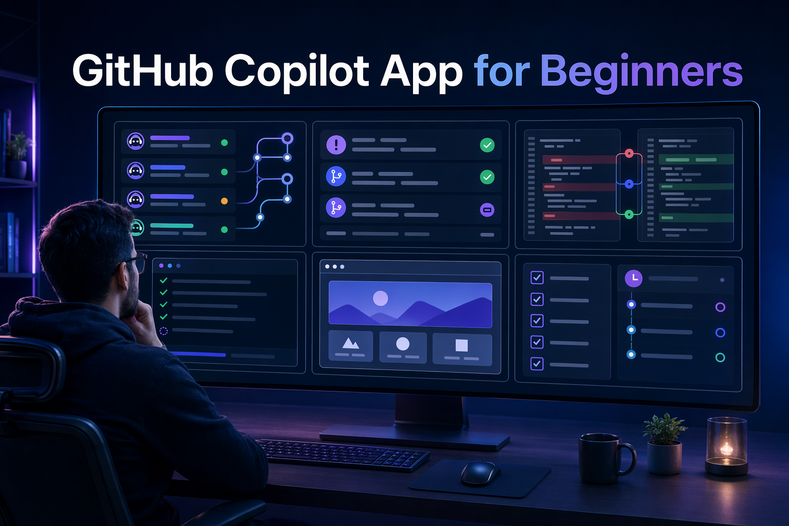
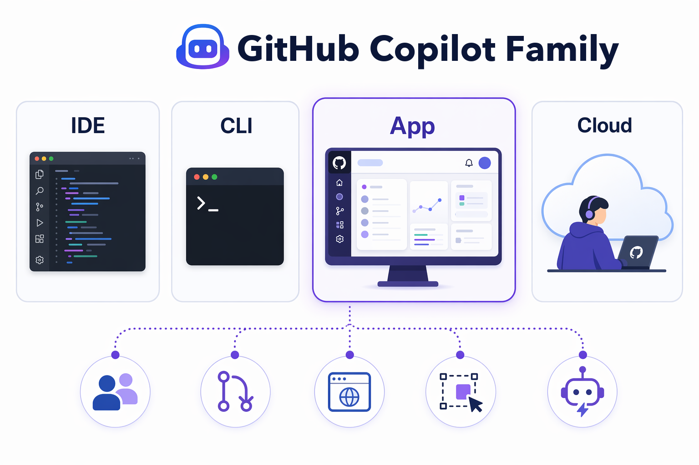

[](./LICENSE)&ensp;
[](https://docs.github.com/en/copilot/concepts/agents/github-copilot-app)&ensp;
[](#target-audience)

🎯 [What you'll learn](#what-youll-learn) &ensp; 🤖 [Copilot family](#understanding-the-github-copilot-family) &ensp; 📚 [Course structure](#course-structure) &ensp; 🙋 [Getting help](#getting-help)

# GitHub Copilot App for Beginners

> Learn to direct AI coding agents from one desktop app.

Think of the GitHub Copilot App as a desktop cockpit for agent work. It brings together sessions, plans, diffs, tests, browser previews, AI chats, issues, and pull requests so you can supervise the work without bouncing between tools.

This course treats the app as a place to guide and review work, not a magic code button. You will practice choosing context, picking a session mode, checking evidence, and deciding when automation is safe.

- [app-screenshot: GitHub Copilot App home or sidebar showing the main navigation areas such as My Work, Automations, Search, Sessions, and Quick chats. Use this near the README introduction to orient learners to the app as a control center.]

## Target audience

This course is designed for:

- Developers who want to use agent-driven coding tools
- Students and self-taught learners who want a guided path
- Teams evaluating how to keep humans in control while agents do more work
- Copilot CLI or IDE Copilot users who want to understand where the desktop app fits

No agentic development experience is required. Basic GitHub, Git, and JavaScript project familiarity will help.

## 🎯 What you'll learn

By the end of the course, you will be able to:

- Install and sign in to the GitHub Copilot App
- Connect a repository and use Quick chats for safe exploration
- Start sessions from prompts, issues, and pull requests
- Explain Interactive, Plan, and Autopilot modes
- Use worktree-backed sessions without colliding with your main branch
- Attach useful context with `@`, `#`, and `/`
- Review diffs, run tests, preview a web app, and validate changes
- Use My Work for issues, PRs, review comments, and failing checks
- Understand where settings, instructions, skills, canvases, automations, and Agent Merge fit

The main sample used throughout the course can be found at:

```text
samples/book-app-web
```

## 🤖 Understanding the GitHub Copilot family

| Product | Where it runs | Best for |
|---|---|---|
| GitHub Copilot in IDEs | VS Code, Visual Studio, JetBrains, and other editors | Inline suggestions, chat, and editor-centered coding |
| GitHub Copilot CLI | Terminal | Terminal-native agent work and command-line workflows |
| Copilot cloud agent | GitHub-hosted environment | Background work on issues and cloud sessions when enabled |
| GitHub Copilot App | Desktop app | Supervising sessions, plans, diffs, browser validation, PRs, canvases, and automations |



This course focuses on the GitHub Copilot App. Along the way, you will see how it connects to GitHub, local tools, browser previews, terminal output, and cloud capabilities when available.

## 📚 Course structure

| Chapter | Title | What learners do |
|:--:|---|---|
| 00 | 🚀 [Quick Start](./00-quick-start/README.md) | Prepare the course environment and verify a Quick chat |
| 01 | 👋 [First Steps](./01-first-steps/README.md) | Learn the UI, Quick chats, sessions, modes, and model controls |
| 02 | 🌳 [Sessions, Worktrees, and Context](./02-sessions-worktrees-context/README.md) | Start isolated sessions and use `@`, `#`, and `/` for context |
| 03 | ⚡ [Development Workflows](./03-development-workflows/README.md) | Review, debug, test, preview, and polish `samples/book-app-web` |
| 04 | 🔀 [GitHub Workflows](./04-github-workflows/README.md) | Use My Work, issues, PRs, review comments, checks, Fix actions, and advanced Agent Merge |
| 05 | ⚙️ [Settings and Instructions](./05-settings-and-instructions/README.md) | Configure safe app settings and repository guidance |
| 06 | 🧰 [Skills, Model Context Protocol (MCP) Servers, and Plugins](./06-skills-mcp-plugins/README.md) | Add reusable expertise and optional tool integrations |
| 07 | 🖼️ [Canvases](./07-canvases/README.md) | Use shared visual work surfaces |
| 08 | 🔁 [Automations](./08-automations/README.md) | Create manual, scheduled, and advanced cloud automations |
| 09 | 🧭 [Putting It All Together](./09-putting-it-all-together/README.md) | Complete an end-to-end multi-session workflow |

## 📖 How this course works

Each chapter follows the same beginner-friendly pattern:

1. A short hook that explains why the topic matters
2. Learning objectives and estimated time
3. Prerequisites when needed
4. A real-world analogy
5. Core concepts in plain language
6. Hands-on examples using `samples/book-app-web`
7. Contextual images and app screenshot placeholders where they support the lesson
8. Expected output and how it works notes
9. Tips and collapsible troubleshooting
10. Key takeaways, an assignment, and navigation links

When a chapter shows a model response, remember that demo output varies. Your app version, model, reasoning setting, repository context, and enabled tools can change the response.

## Command, reference, and help

- GitHub Copilot App overview: https://docs.github.com/en/copilot/concepts/agents/github-copilot-app
- Getting started with the app: https://docs.github.com/en/copilot/how-tos/github-copilot-app/getting-started
- Working with sessions: https://docs.github.com/en/copilot/how-tos/github-copilot-app/agent-sessions
- Issues and pull requests: https://docs.github.com/en/copilot/how-tos/github-copilot-app/managing-issues-and-pull-requests
- Public app repository: https://github.com/github/app

## Getting help

- Re-read the troubleshooting section in the chapter you are working on
- Check the official GitHub Copilot App documentation
- Confirm that your GitHub account, repository permissions, and organization policies allow the feature you are trying to use

## Contributing

Course samples are designed to support predictable learning exercises. If you contribute, avoid changing sample behavior unless the course instructions and checks are updated at the same time.

Suggested flow:

1. Fork the repository
2. Create a feature branch
3. Update the relevant course file
4. Verify links and sample commands
5. Open a pull request

## License

This project is licensed under the terms of the MIT open source license. See [LICENSE](./LICENSE) when available.

## Source references

- [About the GitHub Copilot App][about-app]
- [Getting started with the GitHub Copilot App][getting-started]
- [Working with agent sessions][agent-sessions]
- [Managing issues and pull requests][issues-prs]
- [Using automations][automations]
- [Working with canvas extensions][canvas-docs]
- [Customizing the GitHub Copilot App][customizing]
- [GitHub Copilot App repository][app-readme]
- [GitHub Copilot App GA changelog][ga-changelog]
- [GitHub Copilot App product blog][app-blog]

[about-app]: https://docs.github.com/en/copilot/concepts/agents/github-copilot-app
[getting-started]: https://docs.github.com/en/copilot/how-tos/github-copilot-app/getting-started
[agent-sessions]: https://docs.github.com/en/copilot/how-tos/github-copilot-app/agent-sessions
[issues-prs]: https://docs.github.com/en/copilot/how-tos/github-copilot-app/managing-issues-and-pull-requests
[automations]: https://docs.github.com/en/copilot/how-tos/github-copilot-app/using-automations
[canvas-docs]: https://docs.github.com/en/copilot/how-tos/github-copilot-app/working-with-canvas-extensions
[customizing]: https://docs.github.com/en/copilot/how-tos/github-copilot-app/customize-github-copilot-app
[app-readme]: https://github.com/github/app
[ga-changelog]: https://github.blog/changelog/2026-06-17-github-copilot-app-generally-available/
[app-blog]: https://github.blog/news-insights/product-news/github-copilot-app-the-agent-native-desktop-experience/
